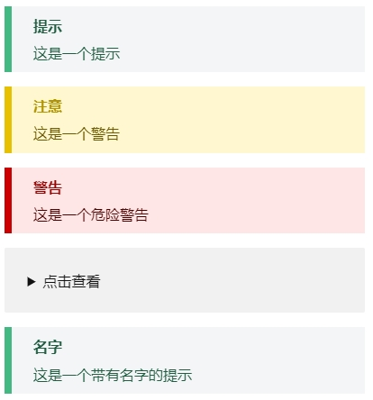
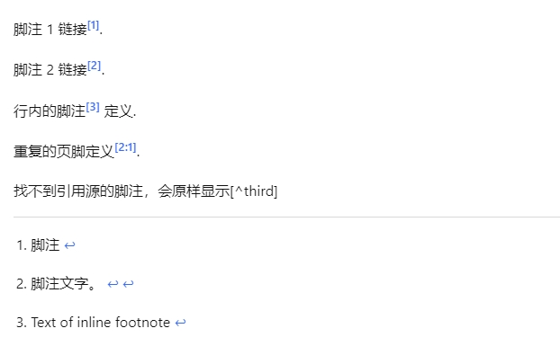

# [DeepFlow-docs](https://deepflow.yunshan.net/deepflow-docs/zh/)

# markdown 编写注意事项

1. HOME 文件不可删除，属于各语言下的首页内容，其 markdown 里面的内容可以调整。
2. 多语言版本文件目录需要一一对应，比如说存在`/test.md`，那么`/zh/test.md`也一定要存在，否则会 404。
3. 文件命名需要增加序列号，比如说`/01-about/01-test.md`，框架会自动把`01`拿去排序，`/about/test/`作为访问地址。
4. markdown 文件一定要写 title 属性，因为文件名是一样的，但是在中英文下左侧目录是不同的，中文下需要显示中文目录，故需要在 md 顶部提前写好 title 属性。格式：（**三**个中划线）

```md
---
title: xxx
---

内容
```

5. 左侧目录翻译写在`/LOCALES`路径对应的语言文件内，支持书写路径，但是需要从头（非语言）开始写。

```md
eg: {
"about": "关于",
"agent": "采集器",
"agent/about": "关于采集器"
}

翻译：

I. /zh/about: 关于
II. /zh/agent: 采集器
III. /zh/agent/about: 采集器/关于采集器

Tip: `zh/agent/about`翻译成`采集器/关于采集器`，是因为需要保留目录结构。
```

6. markdown 内的图片大小控制方案。

```md
 // 无规则，宽高皆自适应
 // 宽度为 120 的图片，高度随比例变化
 // 高度为 120 的图片，宽度随比例变化
 // 宽高都为 120 的图片，比例写死（不建议使用）
 // 图片对齐方式，align 取值分别是 center(居中)，left(靠左)，right(靠右)。默认 left
以上属性可结合使用，多属性用`&`拼接
```

7. 文字块

```md
::: tip
这是一个提示
:::

::: warning
这是一个警告
:::

::: danger
这是一个危险警告
:::

::: details
这是一个详情块，在 IE / Edge 中不生效
:::

::: tip 名字
这是一个带有名字的提示
:::
```

输出



8. 关于 markdown 内图片 url 资源引用问题，目前新模式下，图片 url 资源不参与编译，故直接使用编译后的地址即可。（编译会去掉序号）

```md
旧版: 
新版: 
```

9. 文档脚注

a. 2 种写法，内联+非内联

b. 脚注会统一在文档底部排版

c. 引用源的分号是英文分号

d. 找不到引用源的脚注会原样显示，不做任何修改

```md
脚注 1 链接[^first].

脚注 2 链接[^second].

行内的脚注^[Text of inline footnote] 定义.

重复的页脚定义[^second].

找不到引用源的脚注，会原样显示[^third]

[^first]: 脚注
[^second]: 脚注文字。
```



10. 代码块分组

````
::: code-tabs#shell

@tab pnpm

```bash
pnpm install
```

@tab npm

```bash
npm install
```

@tab yarn

```bash
yarn install
```

:::

````
