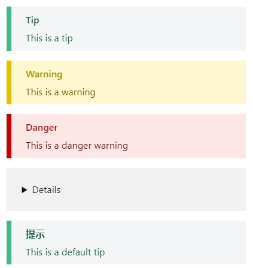

# [MetaFlow-docs](https://deepflow.yunshan.net/metaflow-docs/)

# Notes for writing markdown

1. The HOME file cannot be deleted. It belongs to the content of the home page in each language, and the content in its markdown can be adjusted.
2. Multi language version file directories need to be mapped one by one. For example, there is `/test.md`, then `/zh/test.md` must also exist, otherwise it will 404.
3. For file naming, you need to add a serial number, such as `/01-about/01-test.md`, the framework will automatically sort `01` and use `/about/test/` as the access address
4. The markdown file must write the title attribute, because the file name is the same, but the directory on the left is different in Chinese and English. The Chinese Directory needs to be displayed in Chinese, so the title attribute needs to be written at the top of MD in advance. Format: (**three** middle dashes)

```md
---
title: xxx
---

Content
```

5. The left directory translation is written in the language file corresponding to the `/LOCALES' path. It supports writing paths, but it needs to be written from scratch (non language).

```md
eg: {
"about": "about",
"agent": "agent",
"agent/about": "about agent"
}

translate:

I. /about: about
II. /agent: agent
III. /agent/about: agent/about agent

Tip: `agent/about`translate to`agent/about agent`，Because the directory structure needs to be preserved。
```

6. Picture size control scheme in markdown.

```md
 // Irregular, adaptive in width and height
 // For a picture with a width of 120, the height changes with scale
 // For a picture with a height of 120, the width changes with scale
 // For pictures with width and height of 120, the proportion is written dead (not recommended)
 // The values of image alignment are center, left and right respectively. Default left
The above attributes can be used in combination, and multiple attributes can be spliced with `&'
```

7. text block

```md
::: tip Tip
This is a tip
:::

::: warning Warning
This is a warning
:::

::: danger Danger
This is a danger warning
:::

::: details Details
This is a detail block, which does not take effect in IE / edge
:::

::: tip
This is a default tip
:::
```

output



8. As for the reference of image URL resources in markdown, Under the current new mode, image URL resources do not participate in compilation, so the compiled address can be used directly。(Compilation will remove the sequence number)

```md
old: 
new: 
```