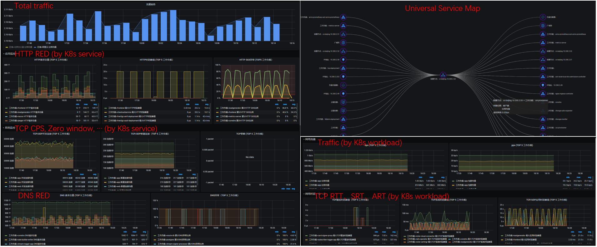

<mark>Attention: This page is translated by Google. Your contributions are welcome!</mark>

# Any Stack

The traditional method of obtaining performance indicators must actively insert statistical code through SDK, bytecode enhancement or manual embedding, which brings a heavy burden to application developers, who need to adapt to various development languages and frameworks. The way of manual code insertion in the cloud native environment has ushered in more challenges. Any application call needs to traverse complex paths from microservices, sidecars, iptables/ipvs container networks, virtual machine vsiwtch, cloud networks, and NFV gateways. Observability construction should cover the full stack from applications to infrastructure in a cloud-native environment.

DeepFlow's eBPF-based **AutoMetrics** capability can automatically obtain performance data of system calls, application functions, and network communications, and extend these capabilities to a wider range of Linux kernel versions and Windows operating systems through BPF and AF\_PACKET/winpcap.

As can be seen from the way of data collection, DeepFlow can automatically collect performance indicators of any software technology stack:
- Any Dev Stack
  - any frame
  - any development language
- Any Infra Stack
  - Linux, Windows, Android and other operating systems
  - Layer 7 gateways such as Envoy, Nginx, and HAProxy
  - Layer 4 gateways such as NLB and NATGW
  - Databases such as MySQL and Redis
  - Message queues such as Kafka

At present, DeepFlow has already supported the parsing of mainstream application protocols through eBPF, including HTTP 1/2/S, Dubbo, MySQL, Redis, Kafka, MQTT, DNS, and will expand the support of more application protocols in the future. Based on the AutoMetrics capability of DeepFlow, it can acquire application RED (Request, Error, Delay) indicators, network protocol stack throughput, delay, abnormal connection establishment, retransmission, zero window and other indicators with zero intrusion. DeepFlow Agent will maintain the session state of each TCP connection and each application protocol Request, which is called `Flow`. All raw performance indicator data is refined to Flow granularity, and additionally automatically aggregated into 1s and 1min indicator data. Through these metrics data, we can present performance data of any service, workload, and API, and draw a topology map of the call relationship between any service, `Universal Service Map`.

On this basis, DeepFlow's **AutoTagging** capability can also inject unified attribute tags into Request-scoped indicator data obtained from different software stacks, including:
- Resource related: region, availability zone, host, cloud server, VPC, subnet, NATGW, ALB
- Service related: Cluster, Node, Namespace, Service, Ingress, Deployment/StatefulSet, Pod, Label

The data collected by different agents will be injected into a unified label, which enables us to observe the performance changes of a Request from a full-stack perspective and quickly find the problem.

In addition, DeepFlow fully embraces the open source community and supports receiving observation data from open source agents or SDKs. By integrating the indicator data acquisition capabilities of various Dev/Infra Stacks that have been accumulated by the Prometheus and Telegraf communities, the full stack advantages of DeepFlow will be brought into full play. The advantage of sending observation data to DeepFlow is that the same AutoTagging mechanism can completely break down data silos and enhance the ability to drill down and segment data.

# End to End

With the microservice of applications, distributed link tracking has gradually become a necessary observability capability. But developers need to spend a lot of time thinking about how to plug in code in their own language and framework, how to pass context, etc.

DeepFlow does not simply use eBPF. Through a series of technological innovations, we relate eBPF Event, BPF Packet, Thread ID, Coroutine ID, Request arrival timing, and TCP sending timing to achieve a highly automated, distributed call chain **AutoTracing** capability. Currently AutoTracing supports all synchronous Blocking-IO (BIO) scenarios, some synchronous Non-blocking-IO (NIO) scenarios, and supports kernel thread scheduling ([kernel-level threading](https://en.wikipedia. org/wiki/Thread_(computing))) scenarios, which support tracing of distributed call chains composed of arbitrary services. In addition, by parsing fields such as X-Request-ID in the request, it also supports tracking the call chain before and after the gateway in NIO mode (such as Envoy).

By combining with Span data sources such as OpenTelemetry, such AutoTracing capabilities will be more complete and can eliminate any blind spots in the distributed call chain. In the flame graph in the image below we can see:
- The upstream and downstream calls of any microservice can be tracked, including DNS and other calls that developers tend to ignore, including services such as MySQL that cannot be inserted
- The network path between any two microservices can be traced, from application code to system calls, sidecars, container networks, virtual machine networks, cloud networks

In addition, we are also exploring more tracing possibilities, such as implementing Tracer through eBPF only by using the OpenTelmetry API, so as to give compiled languages zero-intrusive Trace interpolation capabilities. With the open source code, we will gradually decrypt the implementation principle of AutoTracing.

# High Performance

DeepFlow has the ultimate pursuit of performance.

Since 2016, DeepFlow's commercial products have used Golang to implement Agent, and it has continued to iterate until now. Starting in 2021, we decided to refactor the Agent to use Rust. This decision enables us to consume lower resources when processing massive eBPF/BPF data, usually equivalent to 1%~5% of the application itself. Rust has extreme memory safety and performance close to C, especially in terms of memory consumption, GC, etc., it has significant advantages over Golang.

DeepFlow Server is implemented in Golang. Thanks to our deep accumulation in the Golang version of the Agent, our rewritten high-performance map and high-performance pool have achieved a ten-fold performance improvement, which can significantly reduce the resource consumption of the server. In a production environment that writes 1M Flow per second, the resources consumed by the Server are generally 1% of the business.

The performance optimization directly related to the observation data is reflected in the SmartEncoding mechanism. The Agent obtains labels in string format through information synchronization, and summarizes them on the Server. Server encodes all tags, injects Int tags for all data uniformly and stores them in the database. At the same time, Grafana can directly filter and group query with tags in string format. This encoding mechanism can improve the performance of tag writing by 10 times, greatly reducing the resource overhead of data storage. In addition, the server will also store the K8s tags separately from the observation data in the form of metadata, so there is no need to store all the tags in each line of observation data, which further reduces resource consumption by half. Finally, such an encoding mechanism can also reduce the amount of disk scanning during data query and improve search performance.
