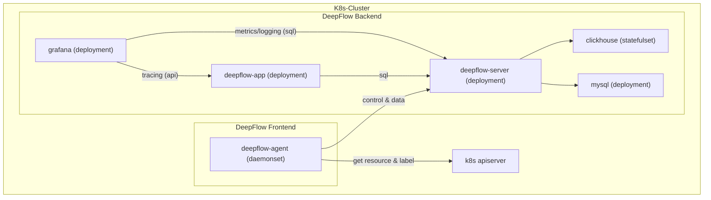

# Introduction

DeepFlow can automatically collect application and network observation data of all pods(AutoMetrics, AutoTracing),
And automatically inject `K8s resources` and `K8s custom Label` tags for all observation data based on the information obtained by calling apiserver(AutoTagging).

# Preparation

## Deployed physical topology diagram



## Storage Class

We recommend using Persistent Volumes to save MySQL and ClickHouse data to avoid unnecessary maintenance costs.
You can provide default Storage Class or add `--set global.storageClass=<your storageClass>` parameter to choose Storage Class to create PVC.

You can choose [OpenEBS](https://openebs.io/) for creating PVC:
```bash
kubectl apply -f https://openebs.github.io/charts/openebs-operator.yaml
## config default storage class
kubectl patch storageclass openebs-hostpath  -p '{"metadata": {"annotations":{"storageclass.kubernetes.io/is-default-class":"true"}}}'
```

# Deploy DeepFlow

Install DeepFlow using Helm:

::: code-tabs#shell

@tab Use Github and DockerHub

```bash
helm repo add deepflow https://deepflowio.github.io/deepflow
helm repo update deepflow # use `helm repo update` when helm < 3.7.0
helm install deepflow -n deepflow deepflow/deepflow --create-namespace
```

@tab Use Aliyun

```bash
helm repo add deepflow https://deepflow-ce.oss-cn-beijing.aliyuncs.com/chart/stable
helm repo update deepflow # use `helm repo update` when helm < 3.7.0
cat << EOF > values-custom.yaml
global:
  image:
      repository: registry.cn-beijing.aliyuncs.com/deepflow-ce
grafana:
  image:
    repository: registry.cn-beijing.aliyuncs.com/deepflow-ce/grafana
EOF
helm install deepflow -n deepflow deepflow/deepflow --create-namespace \
  -f values-custom.yaml
```

:::

notice:
- storageClass Use helm --set global.storageClass to specify storageClass.
- Use helm --set global.replicas to specify the number of replicas of deepflow-server and clickhouse.
- We recommend saving helm's `--set` parameter content in a separate yaml file, refer to Advanced Configuration.

# Download deepflow-ctl

ddeepflow-ctl is a command-line tool for managing DeepFlow. It is recommended to download it to the K8s Node where deepflow-server is located for subsequent use:
```bash
curl -o /usr/bin/deepflow-ctl https://deepflow-ce.oss-cn-beijing.aliyuncs.com/bin/ctl/stable/linux/$(arch | sed 's|x86_64|amd64|' | sed 's|aarch64|arm64|')/deepflow-ctl
chmod a+x /usr/bin/deepflow-ctl
```

# Visualization in Grafana

The output when running helm to deploy DeepFlow prompts the command to get the URL and password to access Grafana, and prints an example：
```bash
NODE_PORT=$(kubectl get --namespace deepflow -o jsonpath="{.spec.ports[0].nodePort}" services deepflow-grafana)
NODE_IP=$(kubectl get nodes -o jsonpath="{.items[0].status.addresses[0].address}")
echo -e "Grafana URL: http://$NODE_IP:$NODE_PORT  \nGrafana auth: admin:deepflow"
```

An example is displayed after the preceding command is executed：
```text
Grafana URL: http://10.1.2.3:31999
Grafana auth: admin:deepflow
```

# The Next Step

- Microservice Panorama - Experience DeepFlow's AutoMetrics capability based on BPF.
- Automatic Distributed Tracing - Experience DeepFlow's AutoTracing capability based on eBPF.
- Eliminating Data Silos - Learn about AutoTagging and SmartEncoding capabilities for DeepFlow.
- How DeepFlow handle high-cardinality - Integrate Promethes and other metrics data.
- Distributed tracking without blind spots - Integrate tracing data such as OTel.
