# Introduction

This chapter uses a microservices application implemented in four languages: Java, Python, Ruby, and Node.js, to demonstrate DeepFlow's AutoTracing capabilities within a multi-language Istio service mesh environment.

# Deploy Istio Bookinfo Demo

## Deploy Istio

You can refer to the [official Istio documentation](https://istio.io/latest/zh/docs/setup/getting-started/) for deploying Istio. Alternatively, you can use the following command for a quick deployment:
```bash
curl -L https://istio.io/downloadIstio | sh -
cd istio-*
export PATH=$PWD/bin:$PATH
istioctl install --set profile=demo -y
```

Currently, DeepFlow has already supported HTTPS data collection for Golang applications, and support for other languages is still in progress. For this demo, we will temporarily disable Istio mTLS:
```bash
kubectl apply -f - <<EOF
apiVersion: security.istio.io/v1beta1
kind: PeerAuthentication
metadata:
  name: "default"
  namespace: "istio-system"
spec:
  mtls:
    mode: DISABLE
EOF
```

## Deploy Bookinfo Demo

The demo we are using is sourced from [this GitHub repository](https://github.com/istio/istio/tree/master/samples/bookinfo), and its application architecture is as follows:


You can quickly deploy the demo in Kubernetes using the following command:
```bash
kubectl apply -f https://raw.githubusercontent.com/deepflowio/deepflow-demo/main/Istio-Bookinfo/bookinfo.yaml
```

The original GitHub code repository for this demo utilizes Jaeger for active tracing. However, to showcase the AutoTracing capability, we intentionally removed Jaeger from the deployment script mentioned above.

# View Distributed Tracing

Go to Grafana, open the `Distributed Tracing` Dashboard, and select `namespace = deepflow-ebpf-istio-demo`. You can then choose a call for tracing, and the result will be as shown in the following image:


[Access the DeepFlow Online Demo](https://ce-demo.deepflow.yunshan.net/d/Distributed_Tracing/distributed-tracing?var-namespace=deepflow-ebpf-istio-demo&from=deepflow-doc) You can also observe the tracing effect. The topology diagram corresponding to the call chain flame graph in the above image is as follows:

```mermaid
flowchart TD

loadgenerator_curl_send(1-eBPF: loadgenerator curl send):::loadgenerator
loadgenerator_envoy_egress_recv(2-eBPF: loadgenerator envoy egress recv):::loadgenerator
loadgenerator_envoy_egress_send(3-eBPF: loadgenerator envoy egress send):::loadgenerator
loadgenerator_vnic_send(4-BPF: loadgenerator vnic send):::nic

productpage_vnic_recv(5-BPF: productpage vnic recv):::nic
productpage_envoy_ingress_recv(6-eBPF: productpage envoy ingress recv):::productpage_1
productpage_envoy_ingress_send(7-eBPF: productpage envoy ingress send):::productpage_1
productpage_python_recv(8-eBPF: productpage python recv):::productpage_2
productpage_python_send_d("9-eBPF: productpage python send ->details"):::productpage_2
productpage_envoy_egress_recv_d("10-eBPF: productpage envoy egress recv ->details"):::productpage_2
productpage_envoy_egress_send_d("11-eBPF: productpage envoy egress send ->details"):::productpage_2
productpage_vnic_send_d("12-BPF: productpage vnic send ->details"):::nic
node2_nic_send_pd("13-BPF: node2 nic send prod->details"):::nic
node1_nic_recv_pd("14-BPF: node1 nic recv prod->details"):::nic

details_vnic_recv(15-BPF: details vnic recv):::nic
details_envoy_ingress_recv(16-eBPF: details envoy ingress recv):::details_1
details_envoy_ingress_send(17-eBPF: details envoy ingress send):::details_1
details_ruby_recv(18-eBPF: details ruby recv):::details_2

productpage_python_send_r("19-eBPF: productpage python send prod->review"):::productpage_2
productpage_envoy_egress_recv_r("20-eBPF: productpage envoy egress recv prod->review"):::productpage_2
productpage_envoy_egress_send_r("21-eBPF: productpage envoy egress send prod->review"):::productpage_2
productpage_vnic_send_r("22-BPF: productpage vnic send prod->review"):::nic
node2_nic_send_pr("23-BPF: node2 nic send prod->review"):::nic
node1_nic_recv_pr("24-BPF: node1 nic recv prod->review"):::nic

reviews_vnic_recv(25-BPF: reviews vnic recv):::nic
reviews_envoy_ingress_recv(26-eBPF: reviews envoy ingress recv):::reviews_1
reviews_envoy_ingress_send(27-eBPF: reviews envoy ingress send):::reviews_1
reviews_java_recv(28-eBPF: reviews java recv):::reviews_2
reviews_java_send(29-eBPF: reviews java send):::reviews_2
reviews_envoy_egress_recv(30-eBPF: reviews envoy egress recv):::reviews_2
reviews_envoy_egress_send(31-eBPF: reviews envoy egress send):::reviews_2
reviews_vnic_send(32-BPF: reviews vnic send):::nic
node1_nic_send_rr("33-BPF: node1 nic send reviews->ratings"):::nic
node2_nic_recv_rr("34-BPF: node2 nic recv reviews->ratings"):::nic

ratings_vnic_recv(35-BPF: ratings vnic recv):::nic
ratings_envoy_ingress_recv(36-eBPF: ratings envoy ingress recv):::ratings_1
ratings_envoy_ingress_send(37-eBPF: ratings envoy ingress send):::ratings_1
ratings_nodejs_recv(38-eBPF: ratings node.js recv):::ratings_2

subgraph node2-1 [k8s node2]
    subgraph loadgenerator pod
        subgraph loadgenerator curl container
            loadgenerator_curl_send
        end
        subgraph loadgenerator envoy container
            loadgenerator_envoy_egress_recv
            loadgenerator_envoy_egress_send
        end
    end

    loadgenerator_vnic_send
    productpage_vnic_recv

    subgraph productpage pod
        subgraph productpage envoy container
            productpage_envoy_ingress_recv
            productpage_envoy_ingress_send
            productpage_envoy_egress_recv_d
            productpage_envoy_egress_send_d
            productpage_envoy_egress_recv_r
            productpage_envoy_egress_send_r
        end
        subgraph productpage python container
            productpage_python_recv
            productpage_python_send_d
            productpage_python_send_r
        end
    end

    productpage_vnic_send_d
    productpage_vnic_send_r
    node2_nic_send_pd
    node2_nic_send_pr
end

subgraph node2-2 [k8s node2]
    node2_nic_recv_rr
    ratings_vnic_recv

    subgraph ratings pod
        subgraph ratings envoy container
            ratings_envoy_ingress_recv
            ratings_envoy_ingress_send
        end
        subgraph ratings nodejs container
            ratings_nodejs_recv
        end
    end
end

subgraph k8s node1
    node1_nic_recv_pd
    node1_nic_recv_pr
    details_vnic_recv
    reviews_vnic_recv

    subgraph details pod
        subgraph details envoy container
            details_envoy_ingress_recv
            details_envoy_ingress_send
        end
        subgraph details ruby container
            details_ruby_recv
        end
    end
    subgraph reviews pod
        subgraph reviews envoy container
            reviews_envoy_ingress_recv
            reviews_envoy_ingress_send
            reviews_envoy_egress_recv
            reviews_envoy_egress_send
        end
        subgraph reviews java container
            reviews_java_recv
            reviews_java_send
        end
    end

    reviews_vnic_send
    node1_nic_send_rr
end

loadgenerator_curl_send --> loadgenerator_envoy_egress_recv --> loadgenerator_envoy_egress_send --> loadgenerator_vnic_send --> productpage_vnic_recv

productpage_vnic_recv --> productpage_envoy_ingress_recv --> productpage_envoy_ingress_send --> productpage_python_recv
productpage_python_recv --> productpage_python_send_d --> productpage_envoy_egress_recv_d --> productpage_envoy_egress_send_d --> productpage_vnic_send_d --> node2_nic_send_pd -->|IPIP encap| node1_nic_recv_pd --> details_vnic_recv
productpage_python_recv --> productpage_python_send_r --> productpage_envoy_egress_recv_r --> productpage_envoy_egress_send_r --> productpage_vnic_send_r --> node2_nic_send_pr -->|IPIP encap| node1_nic_recv_pr --> reviews_vnic_recv

details_vnic_recv --> details_envoy_ingress_recv --> details_envoy_ingress_send --> details_ruby_recv

reviews_vnic_recv --> reviews_envoy_ingress_recv --> reviews_envoy_ingress_send --> reviews_java_recv
reviews_java_recv --> reviews_java_send --> reviews_envoy_egress_recv --> reviews_envoy_egress_send --> reviews_vnic_send --> node1_nic_send_rr -->|IPIP encap| node2_nic_recv_rr --> ratings_vnic_recv

ratings_vnic_recv --> ratings_envoy_ingress_recv --> ratings_envoy_ingress_send --> ratings_nodejs_recv

classDef loadgenerator fill:#8498d1,color:white;
classDef nic fill:#a1a1a1,color:white;
classDef productpage_1 fill:#9cdbc3,color:black;
classDef productpage_2 fill:#eadb92,color:black;
classDef details_1 fill:#16a9e8,color:white;
classDef details_2 fill:#b38ebc,color:white;
classDef reviews_1 fill:#49b292,color:white;
classDef reviews_2 fill:#ceb961,color:black;
classDef ratings_1 fill:#6aaec6,color:black;
classDef ratings_2 fill:#aa48bc,color:black;
```



Let's summarize this tracing demo:

- Zero Intrusion: The entire tracing process requires no manual insertion of tracking code and no injection of TraceID/SpanID into HTTP Headers.
- Multi-Language: Supports tracing of applications in Java, Python, Ruby, NodeJS, and basic services in C/C++ (curl/envoy) languages.
- End-to-End: Utilizing eBPF and cBPF, automatic tracing encompasses 38 spans for this trace, including 24 eBPF spans and 14 BPF spans.
- Full-Stack: Supports tracing network paths between two pods on the same K8s node, e.g., Span 4-5.
- Full-Stack: Supports tracing network paths between two pods across K8s nodes, even when traversing tunnel encapsulation, e.g., Span 12-15 (IPIP tunnel encapsulation).
- Full-Stack: Supports tracing the complete journey within a single pod, including from Envoy Ingress, service process, to Envoy Egress, e.g., Span 6-11.

