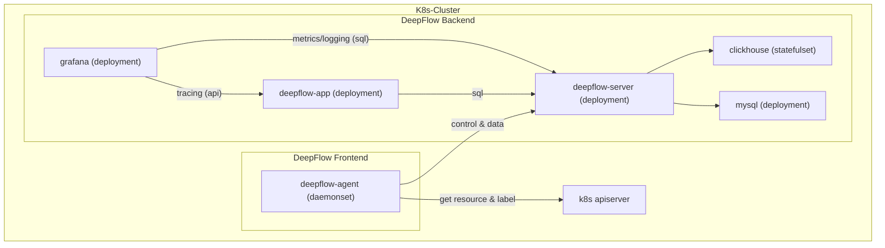

> This document was translated by GPT-4

---

title: Monitoring a Single K8s Cluster
permalink: /ce-install/single-k8s

---

# Introduction

If you have deployed applications in a K8s cluster, this section introduces how to monitor them with DeepFlow.
DeepFlow can non-intrusively collect all Pods' observational signals (AutoMetrics, AutoTracing, AutoProfiling),
and it automatically injects 'K8s resource' and 'K8s custom Label' tags (AutoTagging) into all observational data based on the information calls to the apiserver.

# Preliminaries

## Deployment Topology



## Storage Class

We recommend using Persistent Volumes to store MySQL and ClickHouse data to avoid unnecessary maintenance cost.
You can provide the default Storage Class or add `--set global.storageClass=<your storageClass>` parameter to choose the Storage Class to create PVC.

[OpenEBS](https://openebs.io/) can be chosen for the creation of PVC:

```bash
kubectl apply -f https://openebs.github.io/charts/openebs-operator.yaml
## config default storage class
kubectl patch storageclass openebs-hostpath  -p '{"metadata": {"annotations":{"storageclass.kubernetes.io/is-default-class":"true"}}}'
```

# Deployment of DeepFlow

Deploy DeepFlow with Helm:

::: code-tabs#shell

@tab Use Github and DockerHub

```bash
helm repo add deepflow https://deepflowio.github.io/deepflow
helm repo update deepflow # use `helm repo update` when helm < 3.7.0
helm install deepflow -n deepflow deepflow/deepflow --create-namespace
```

@tab Use Aliyun

```bash
helm repo add deepflow https://deepflow-ce.oss-cn-beijing.aliyuncs.com/chart/stable
helm repo update deepflow # use `helm repo update` when helm < 3.7.0
cat << EOF > values-custom.yaml
global:
  image:
      repository: registry.cn-beijing.aliyuncs.com/deepflow-ce
grafana:
  image:
    repository: registry.cn-beijing.aliyuncs.com/deepflow-ce/grafana
EOF
helm install deepflow -n deepflow deepflow/deepflow --create-namespace \
  -f values-custom.yaml
```

:::

Note:

- Use helm --set global.storageClass to specify storageClass
- Use helm --set global.replicas to specify the number of replicas for deepflow-server and clickhouse
- We recommend saving the contents of helm's `--set` parameter in a separate yaml file. Refer to the chapter [Advanced Config](../best-practice/server-advanced-config/).

# Download deepflow-ctl

Deepflow-ctl is a command-line tool for managing DeepFlow. It's recommended to download it to the K8s Node where deepflow-server is located for future use.

```bash
curl -o /usr/bin/deepflow-ctl https://deepflow-ce.oss-cn-beijing.aliyuncs.com/bin/ctl/stable/linux/$(arch | sed 's|x86_64|amd64|' | sed 's|aarch64|arm64|')/deepflow-ctl
chmod a+x /usr/bin/deepflow-ctl
```

# Access the Grafana Page

The content output when executing helm deployment of DeepFlow prompts the command to get the URL and password to access Grafana. The output example:

```bash
NODE_PORT=$(kubectl get --namespace deepflow -o jsonpath="{.spec.ports[0].nodePort}" services deepflow-grafana)
NODE_IP=$(kubectl get nodes -o jsonpath="{.items[0].status.addresses[0].address}")
echo -e "Grafana URL: http://$NODE_IP:$NODE_PORT  \nGrafana auth: admin:deepflow"
```

Sample output after executing the above command:

```text
Grafana URL: http://10.1.2.3:31999
Grafana auth: admin:deepflow
```

# Next Steps

- [Universal Service Map - Experience DeepFlow's AutoMetrics capabilities](../features/universal-map/auto-metrics/)
- [Distributed Tracing - Experience DeepFlow's AutoTracing capabilities](../features/distributed-tracing/auto-tracing/)
- [Eliminate Data Silos - Understand DeepFlow's AutoTagging and SmartEncoding capabilities](../features/auto-tagging/elimilate-data-silos/)
- [Bid Adieu to High-Cardinality Worries - Integrate Prometheus and other metric data](../integration/input/metrics/metrics-auto-tagging/)
- [Full-Stack Distributed Tracing - Integrate OpenTelemetry and other tracing data](../integration/input/tracing/full-stack-distributed-tracing/)
