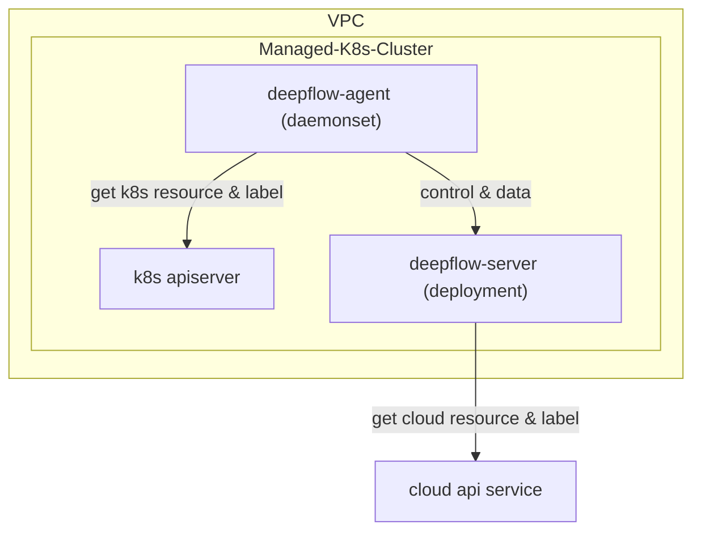

> This document was translated by GPT-4

---

title: Monitoring Managed K8s Clusters
permalink: /ce-install/managed-k8s

---

# Introduction

DeepFlow supports monitoring managed K8s clusters provided by cloud service providers. The only difference from [directly monitoring K8s clusters](./single-k8s/) is that by invoking the cloud provider's API, tags of cloud resources can be automatically injected into observation data (AutoTagging).

# Deployment Topology

# Configuring the DeepFlow Server

TODO

# Deploying the DeepFlow Agent

TODO

# Next Steps

- [Universal service map - Experience DeepFlow's AutoMetrics Feature](../features/universal-map/auto-metrics/)
- [Distributed tracing - Experience DeepFlow's AutoTracing Feature](../features/distributed-tracing/auto-tracing/)
- [Eliminating Data Silos - Understand DeepFlow's AutoTagging and SmartEncoding Capabilities](../features/auto-tagging/elimilate-data-silos/)
- [Say Goodbye to High-Base Worries - Integration with Promethes and Other Metric Data](../integration/input/metrics/metrics-auto-tagging/)
- [Full Stack Distributed Tracing - Integration with OpenTelemetry and Other Tracing Data](../integration/input/tracing/full-stack-distributed-tracing/)
