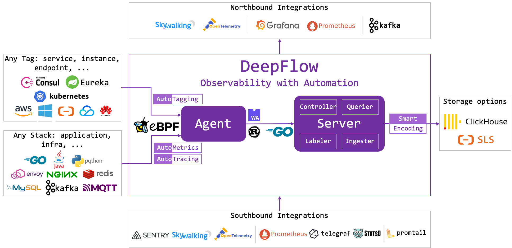
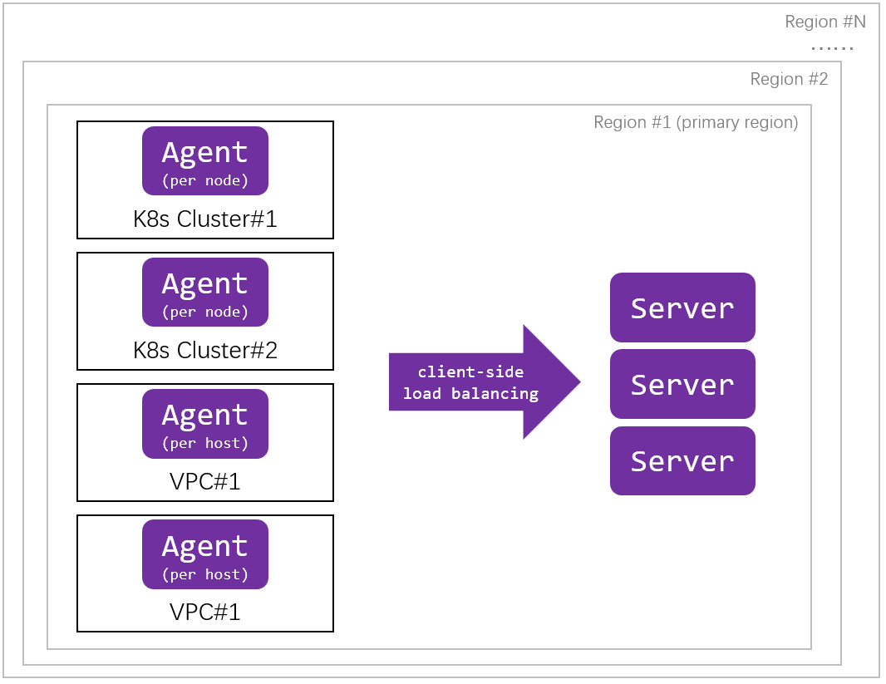

# 软件架构

DeepFlow 由 Agent 和 Server 两个进程组成。每个 K8s 容器节点、虚拟机或物理裸机中运行一个 Agent，负责该服务器上所有应用进程的 AutoMetrics 和 AutoTracing 数据采集。Server 运行在一个 K8s 集群中，提供 Agent 管理、数据标签注入、数据写入、数据查询服务。

# 设计理念

DeepFlow 名称来自对 **Flow** 的**自动化**采集能力。网络中的 Flow 对应一个 TCP/IP 五元组，应用中的 Flow 对应一个应用 Request。DeepFlow 使用 eBPF 等技术自动获取任意软件技术栈的 Request-scoped 数据，包括 Raw data 形态的 Request-scoped events、聚合后形成的 Rquest-scoped metrics、关联后构建的 Trace。这些数据通常用于绘制原始请求表、服务调用拓扑、分布式调用火焰图。

除了能够自动化的获取 Request-scoped 观测数据之外，DeepFlow 通过 Agent 的开放能力集成大量其他开源 SDK 和 Agent 数据源，完整覆盖可观测性的 Tracing、Metrics、Logging 三大支柱。DeepFlow 并不是简单的将这些数据纳入进来，独有的 AutoTagging 和 SmartEncoding 技术能够高性能、自动化的为所有观测数据注入统一的属性标签，消除数据孤岛，并释放数据的下钻切分能力。

# DeepFlow Agent

DeepFlow Agent 使用 Rust 语言实现，有着极致的处理性能和内存安全性。

Agent 采集的数据包括三类：
- **eBPF 数据**
  - 基于 eBPF（Linux Kernel 4.14+）的 **AutoMetrics** 机制采集任意应用 Request 的 RED 性能指标
  - 基于 BPF、AF\_PACKET（Linux Kernel 2.6+）、winpcap（Windows 2008+）的 **AutoMetrics** 机制采集任意应用 Request 的 RED 性能指标、网络吞吐、时延、性能、异常性能指标
  - 基于 eBPF（Linux Kernel 4.14+）的 **AutoTracing** 机制，分析 Raw Request 数据关联性，构建分布式调用链
- 集成的观测数据：接收其他开源 Agent、SDK 的观测数据
- 标签数据：自动同步 K8s apiserver 和服务注册中心中的服务、实例和 API 属性信息

Agent 支持运行于各种工作负载环境中：
- 以 Daemonset Pod 形态运行于 K8s Node 中，采集 Node 中所有 Pod 的数据
- 以进程形态运行于 Linux 服务器中，采集服务器中所有进程的数据
- 以进程形态运行于 Windows 服务器中，采集服务器中所有进程的数据 [^1]
- 以 Sidecar 形态运行于 Serverless Pod 中，采集 Pod 中所有 Container 的数据 [^1]

此外，Agent 支持基于 WASM 向开发者提供可编程接口 [^1]，用于解析 Agent 尚未识别的应用协议，以及构建面向具体场景的业务分析能力。

[^1]: 计划中的路标功能。

# DeepFlow Server

DeepFlow Server 使用 Golang 实现，由 Controller、Labeler、Ingester、Querier 四个模块组成：
- Controller：管理 Agent、均衡调度 Agent 与 Server 的通信关系、同步采集器发现的 Tag 数据。
- Labeler：向观测数据中注入统一的属性标签。
- Ingester：观测数据存储，插件化机制支持替换分析数据库。
- Querier：观测数据查询，提供统一的 SQL 接口查询所有类型的观测数据。

DeepFlow 的关键特性有两点：
- **AutoTagging**：自动为所有观测数据注入统一的属性标签，消除数据孤岛问题，并释放数据的下钻切分能力
- **SmartEncoding**：利用分布式的编码技术，将属性标签编码为整形值，在标签注入阶段直接注入整形标签，在生产环境中的实际运行数据表明 SmartEncoding 可将标签存储性能提升一个数量级。

DeepFlow Server 以 Pod 形态运行在 K8s 集群中，支持水平扩展。Server 集群能够自动根据 Agent 的数据均衡调度Agent 与 Server 之间的通信关系。一个 Server 集群可管理多个异构资源池中的 Agent，并支持跨 Region 统一管理。

DeepFlow 使用的分析数据库是可替换的，目前我们提供 ClickHouse 作为默认选项，未来会增加对更多数据库的支持，另外也计划支持将不同数据存储到不同的数据库中，充分发挥不同数据库的优势。

DeepFlow 提供统一的 SQL 查询接口，默认提供基于 Grafana 的数据能力。开发者可以选择通过 Grafana 可视化数据，也可选择将DeepFlow 集成到自己的可观测性平台中。另外我们也计划在 SQL 之上开发主流的 QL 方言，例如 PromQL 等，使得使用者能将数据无缝迁移到 DeepFlow。
