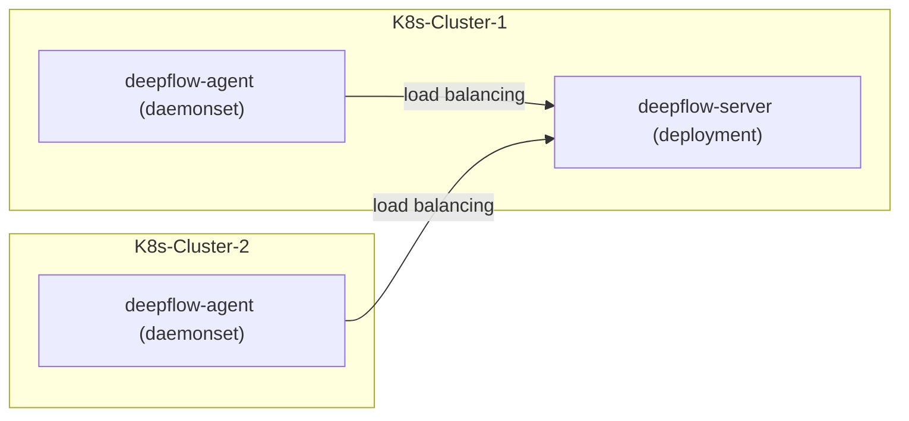

# 简介

DeepFlow Server 可服务于多个 K8s 集群中的 DeepFlow Agent。假设你在一个 K8s 集群中已经部署好了 DeepFlow Server，本章介绍如何监控其他的 K8s 集群。

# 准备工作

## 部署拓扑



## 确保不同 K8s 集群可区分

DeepFlow 使用 K8s 的 CA 文件 MD5 值区分不同的集群，请在不同 K8s 集群的 Pod 中查看 `/run/secrets/kubernetes.io/serviceaccount/ca.crt` 文件，确保不同集群的 CA 文件不同。

假如你的不同 K8s 集群使用了相同的 CA 文件，在多个集群中部署 deepflow-agent 之前，需要利用 `deepflow-ctl domain create` 获取一个 `K8sClusterID`：

注: 多套 K8s 集群的 CA 文件相同，这并不常见，但我们依然建议通过手动对接的方式，把其他 k8s 集群 deepflow-agent 对接到 deepflow-server 集群，手动对接的优势是，可以自定义 Grafana 面板中展示的 k8s 集群名称，操作如下:

```bash
## 通过 deepflow-ctl domain create -f custom-domain.yaml 来创建下面自定义的 cluster domain

# 名称 (自定义集群名称即可，例如 beijing-prod-k8s)
name: $CLUSTER_NAME
# 云平台类型
type: kubernetes
config:
  # 所属区域标识 ()
  region_uuid: ffffffff-ffff-ffff-ffff-ffffffffffff
  # 资源同步控制器 (这里不建议指定，默认即可)
  # controller_ip: 127.0.0.1
  # POD 子网 IPv4 地址最大掩码
  pod_net_ipv4_cidr_max_mask: 16
  # POD 子网 IPv6 地址最大掩码
  pod_net_ipv6_cidr_max_mask: 64
  # 额外对接路由接口
  node_port_name_regex: ^(cni|flannel|vxlan.calico|tunl|en[ospx])
  # 同步间隔, 单位:秒, 输入限制: 最小1,最大86400, 默认60
  sync_timer: 60

## 查看创建后的 domain 具体信息:
deepflow-ctl domain list $CLUSTER_NAME
```

# 部署 deepflow-agent

使用 Helm 安装 deepflow-agent:

::: code-tabs#shell

@tab Use Github and DockerHub

```bash
cat << EOF > values-custom.yaml
deepflowServerNodeIPS:
- 10.1.2.3  # 注: 对应 deepflow-server 集群的 NODE IP(deepflow-server service 为 NodePort)
- 10.4.5.6  # 注: 如果 deepflow-server 使用 lb, 此处可直接写 lb 地址
clusterNAME: $CLUSTER_NAME  # 注: 此处为上面创建的 k8s domain name
deepflowK8sClusterID:       # 注: 此处为 k8s domain name 的 ID
EOF

helm repo add deepflow https://deepflowio.github.io/deepflow
helm repo update deepflow # use `helm repo update` when helm < 3.7.0
helm install deepflow-agent -n deepflow deepflow/deepflow-agent --create-namespace \
    -f values-custom.yaml
```

@tab Use Aliyun

```bash
cat << EOF > values-custom.yaml
image:
  repository: registry.cn-beijing.aliyuncs.com/deepflow-ce/deepflow-agent
deepflowServerNodeIPS:
- 10.1.2.3  # 注: 对应 deepflow-server 集群的 NODE IP(deepflow-server service 为 NodePort)
- 10.4.5.6  # 注: 如果 deepflow-server 使用 lb, 此处可直接写 lb 地址
clusterNAME: $CLUSTER_NAME  # 注: 此处为上面创建的 k8s domain name
deepflowK8sClusterID:       # 注: 此处为 k8s domain name 的 ID
EOF

helm repo add deepflow https://deepflow-ce.oss-cn-beijing.aliyuncs.com/chart/stable
helm repo update deepflow # use `helm repo update` when helm < 3.7.0
helm install deepflow-agent -n deepflow deepflow/deepflow-agent --create-namespace \
  -f values-custom.yaml
```

:::

我们建议上述部署过程中将 deepflow-agent 的 `deepflowServerNodeIps` 配置为 K8s 集群的一个或多个相对固定的 Node IP。


# 下一步

- [服务全景图 - 体验 DeepFlow 的 AutoMetrics 能力](../features/universal-map/auto-metrics/)
- [分布式追踪 - 体验 DeepFlow 的 AutoTracing 能力](../features/distributed-tracing/auto-tracing/)
- [消除数据孤岛 - 了解 DeepFlow 的 AutoTagging 和 SmartEncoding 能力](../features/auto-tagging/eliminate-data-silos/)
- [告别高基烦恼 - 集成 Promethes 等指标数据](../integration/input/metrics/metrics-auto-tagging/)
- [全栈分布式追踪 - 集成 OpenTelemetry 等追踪数据](../integration/input/tracing/full-stack-distributed-tracing/)
