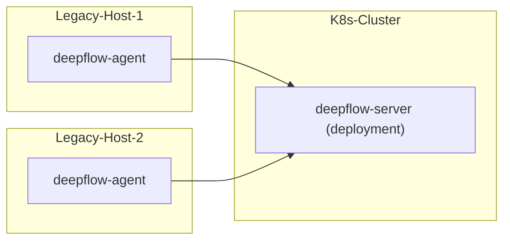

# 简介

DeepFlow 支持监控传统服务器。注意 DeepFlow Server 必须运行在 K8s 之上，如果你没有 K8s 集群，可参考 [All-in-One 快速部署](./all-in-one/)章节先部署 DeepFlow Server。

# 部署拓扑



# 配置 DeepFlow Server

## 更新 deepflow-server 配置

检查服务器所有的网段是否在以下网段列表中
```yaml
local_ip_ranges:
- 10.0.0.0/8
- 172.16.0.0/12
- 192.168.0.0/16
- 169.254.0.0/15
- 224.0.0.0-240.255.255.255
```
若不在，需要在下面自定义配置文件内 `local_ip_ranges` 列表中添加缺失的服务器网段。例如：主机 IP 为 100.42.32.213，则需要把对应的 100.42.32.0/24 网段加入配置

修改 `values-custom.yaml` 自定义配置文件：
```yaml
configmap:
  server.yaml:
    controller:
      genesis:
        local_ip_ranges:
        - 10.0.0.0/8
        - 172.16.0.0/12
        - 192.168.0.0/16
        - 169.254.0.0/15
        - 224.0.0.0-240.255.255.255
        - 100.42.32.0/24  # FIXME
      trisolaris:
        trident-type-for-unkonw-vtap: 3  # required
```

更新 deepflow
```bash
helm upgrade deepflow -n deepflow -f values-custom.yaml deepflow/deepflow
## Restart deepflow-server
kubectl delete pods -n deepflow -l app=deepflow -l component=deepflow-server
```

## 创建 Host Domain

就像监控多个 K8s 集群时，需要创建 K8s domain 一样，此处也需要创建一个专门用于同步服务器的 domain

```bash
unset DOMAIN_NAME
DOMAIN_NAME="legacy-host"  # FIXME: domain name

cat << EOF | deepflow-ctl domain create -f -
name: $DOMAIN_NAME
type: agent_sync
EOF
```

## 创建采集器组

创建采集器组：
```bash
unset AGENT_GROUP
AGENT_GROUP="legacy-host"  # FIXME: domain name

deepflow-ctl agent-group create $AGENT_GROUP
deepflow-ctl agent-group list $AGENT_GROUP # Get agent-group ID
```

创建采集器组配置文件 `agent-group-config.yaml`，指定 `vtap_group_id` 并开启 `platform_enabled` 让 deepflow-agent 将服务器的网络信息同步至 deepflow-server 
```yaml
vtap_group_id: g-ffffff # FIXME
platform_enabled: 1
```

创建采集器组配置：
```bash
deepflow-ctl agent-group-config create -f agent-group-config.yaml
```

# 部署 DeepFlow Agent

下载 deepflow-agent

::: code-tabs#shell

@tab rpm

```bash
curl -O https://deepflow-ce.oss-cn-beijing.aliyuncs.com/rpm/agent/stable/linux/$(arch | sed 's|x86_64|amd64|' | sed 's|aarch64|arm64|')/deepflow-agent-rpm.zip
unzip deepflow-agent-rpm.zip
yum -y localinstall x86_64/deepflow-agent-1.0*.rpm
```

@tab deb

```bash
curl -O https://deepflow-ce.oss-cn-beijing.aliyuncs.com/deb/agent/stable/linux/$(arch | sed 's|x86_64|amd64|' | sed 's|aarch64|arm64|')/deepflow-agent-deb.zip
unzip deepflow-agent-deb.zip
dpkg -i x86_64/deepflow-agent-1.0*.systemd.deb
```

@tab binary file

```bash
curl -O https://deepflow-ce.oss-cn-beijing.aliyuncs.com/bin/agent/stable/linux/$(arch | sed 's|x86_64|amd64|' | sed 's|aarch64|arm64|')/deepflow-agent.tar.gz
tar -zxvf deepflow-agent.tar.gz -C /usr/sbin/

cat << EOF > /etc/systemd/system/deepflow-agent.service
[Unit]
Description=deepflow-agent.service
After=syslog.target network-online.target

[Service]
Environment=GOTRACEBACK=single
LimitCORE=1G
ExecStart=/usr/sbin/deepflow-agent
Restart=always
RestartSec=10
LimitNOFILE=1024:4096

[Install]
WantedBy=multi-user.target
EOF

systemctl daemon-reload
```

@tab docker compose

```bash
touch /etc/deepflow-agent.yaml

cat << EOF > deepflow-agent-docker-compose.yaml
version: '3.2'
services:
  deepflow-agent:
    image: registry.cn-hongkong.aliyuncs.com/deepflow-ce/deepflow-agent:stable
    container_name: deepflow-agent
    restart: always
    cap_add:
      - SYS_ADMIN
      - SYS_RESOURCE
      - SYS_PTRACE
      - NET_ADMIN
      - NET_RAW
      - IPC_LOCK
      - SYSLOG
    volumes:
      - /etc/deepflow-agent.yaml:/etc/deepflow-agent/deepflow-agent.yaml:ro
      - /sys/kernel/debug:/sys/kernel/debug:ro
      - /var/run/docker.sock:/var/run/docker.sock:ro
    network_mode: "host"
    pid: "host"
EOF

docker compose -f deepflow-agent-docker-compose.yaml up -d
```

:::

修改 deepflow-agent 的配置文件 `/etc/deepflow-agent.yaml` ：
```yaml
controller-ips:
  - 10.1.2.3  # FIXME: K8s Node IPs
vtap-group-id-request: "g-fffffff"  # FIXME: agent-group ID
```

启动 deepflow-agent ：

```bash
systemctl enable deepflow-agent
systemctl restart deepflow-agent
```

**注意**：

若 deepflow-agent 因缺少依赖库无法正常启动可下载静态链接编译的 deepflow-agent， 注意静态链接编译的 deepflow-agent 在多线程下有严重的性能问题：
::: code-tabs#shell

@tab rpm

```bash
curl -O https://deepflow-ce.oss-cn-beijing.aliyuncs.com/rpm/agent/stable/linux/static-link/$(arch | sed 's|x86_64|amd64|' | sed 's|aarch64|arm64|')/deepflow-agent-rpm.zip
unzip deepflow-agent-rpm.zip
yum -y localinstall x86_64/deepflow-agent-1.0*.rpm
```

@tab deb

```bash
curl -O https://deepflow-ce.oss-cn-beijing.aliyuncs.com/deb/agent/stable/linux/static-link/$(arch | sed 's|x86_64|amd64|' | sed 's|aarch64|arm64|')/deepflow-agent-deb.zip
unzip deepflow-agent-deb.zip
dpkg -i x86_64/deepflow-agent-1.0*.systemd.deb
```

@tab binary file

```bash
curl -O https://deepflow-ce.oss-cn-beijing.aliyuncs.com/bin/agent/stable/linux/static-link/$(arch | sed 's|x86_64|amd64|' | sed 's|aarch64|arm64|')/deepflow-agent.tar.gz
tar -zxvf deepflow-agent.tar.gz -C /usr/sbin/

cat << EOF > /etc/systemd/system/deepflow-agent.service
[Unit]
Description=deepflow-agent.service
After=syslog.target network-online.target

[Service]
Environment=GOTRACEBACK=single
LimitCORE=1G
ExecStart=/usr/sbin/deepflow-agent
Restart=always
RestartSec=10
LimitNOFILE=1024:4096

[Install]
WantedBy=multi-user.target
EOF

systemctl daemon-reload
```

:::

# 下一步

- [服务全景图 - 体验 DeepFlow 的 AutoMetrics 能力](../features/universal-map/auto-metrics/)
- [分布式追踪 - 体验 DeepFlow 的 AutoTracing 能力](../features/distributed-tracing/auto-tracing/)
- [消除数据孤岛 - 了解 DeepFlow 的 AutoTagging 和 SmartEncoding 能力](../features/auto-tagging/eliminate-data-silos/)
- [告别高基烦恼 - 集成 Promethes 等指标数据](../integration/input/metrics/metrics-auto-tagging/)
- [全栈分布式追踪 - 集成 OpenTelemetry 等追踪数据](../integration/input/tracing/full-stack-distributed-tracing/)
