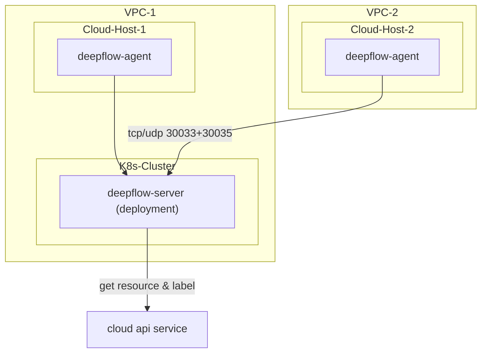

# 简介

DeepFlow 支持监控云服务器，并通过调用云厂商 API 获取云资源信息，自动注入到所有观测数据中（AutoTagging）。
注意 DeepFlow Server 必须运行在 K8s 之上，如果你没有 K8s 集群，可参考 [All-in-One 快速部署](./all-in-one/)章节先部署 DeepFlow Server。

# 部署拓扑



# 创建公有云 Domain

DeepFlow 目前支持如下公有云的资源信息同步（标记为 `TBD` 的正在整理代码中）：
| 云服务商（英文） | 云服务商（中文） | DeepFlow 中使用的类型标识 |
| ---------------- | ---------------- | ------------------------ |
| AWS | AWS | aws |
| Aliyun | 阿里云 | aliyun |
| Baidu Cloud | 百度云 | baidu_bce |
| Huawei Cloud | 华为云 | huawei |
| Microsoft Azure | 微软云 | `TBD` |
| QingCloud | 青云 | qingcloud |
| Tencent Cloud | 腾讯云 | tencent |

可通过 `deepflow-ctl domain example <domain_type>` 命令获取创建公有云 Domain 的配置文件模板。
以阿里云为例：

```bash
deepflow-ctl domain example aliyun > aliyun.yaml
```

修改配置文件 `aliyun.yaml`，填写 AK/SK（需要云资源的只读权限）和资源所在的 Region 信息：

```yaml
name: aliyun
type: aliyun
config:
  # AccessKey Id
  secret_id: xxxxxxxx ## FIXME: your secret_id
  # AccessKey Secret
  secret_key: xxxxxxx ## FIXME: your secret_key
  include_regions: 华北2（北京） ## The region where deepflow is docked, if it is empty, it means all regions, and the regions are separated by commas
```

使用修改好的配置文件创建公有云 Domain：

```bash
deepflow-ctl domain create -f aliyun.yaml
```

# 部署 DeepFlow Agent

下载 deepflow-agent

::: code-tabs#shell

@tab rpm

```bash
curl -O https://deepflow-ce.oss-cn-beijing.aliyuncs.com/rpm/agent/stable/linux/$(arch | sed 's|x86_64|amd64|' | sed 's|aarch64|arm64|')/deepflow-agent-rpm.zip
unzip deepflow-agent-rpm.zip
yum -y localinstall x86_64/deepflow-agent-1.0*.rpm
```

@tab deb

```bash
curl -O https://deepflow-ce.oss-cn-beijing.aliyuncs.com/deb/agent/stable/linux/$(arch | sed 's|x86_64|amd64|' | sed 's|aarch64|arm64|')/deepflow-agent-deb.zip
unzip deepflow-agent-deb.zip
dpkg -i x86_64/deepflow-agent-1.0*.systemd.deb
```

@tab binary file

```bash
curl -O https://deepflow-ce.oss-cn-beijing.aliyuncs.com/bin/agent/stable/linux/$(arch | sed 's|x86_64|amd64|' | sed 's|aarch64|arm64|')/deepflow-agent.tar.gz
tar -zxvf deepflow-agent.tar.gz -C /usr/sbin/

cat << EOF > /etc/systemd/system/deepflow-agent.service
[Unit]
Description=deepflow-agent.service
After=syslog.target network-online.target

[Service]
Environment=GOTRACEBACK=single
LimitCORE=1G
ExecStart=/usr/sbin/deepflow-agent
Restart=always
RestartSec=10
LimitNOFILE=1024:4096

[Install]
WantedBy=multi-user.target
EOF

systemctl daemon-reload
```

@tab docker compose

```bash
touch /etc/deepflow-agent.yaml

cat << EOF > deepflow-agent-docker-compose.yaml
version: '3.2'
services:
  deepflow-agent:
    image: registry.cn-hongkong.aliyuncs.com/deepflow-ce/deepflow-agent:stable
    container_name: deepflow-agent
    restart: always
    #privileged: true  ## Docker version below 20.10.10 requires the opening of the privileged mode, See https://github.com/moby/moby/pull/42836
    cap_add:
      - SYS_ADMIN
      - SYS_RESOURCE
      - SYS_PTRACE
      - NET_ADMIN
      - NET_RAW
      - IPC_LOCK
      - SYSLOG
    volumes:
      - /etc/deepflow-agent.yaml:/etc/deepflow-agent/deepflow-agent.yaml:ro
      - /sys/kernel/debug:/sys/kernel/debug:ro
      - /var/run/docker.sock:/var/run/docker.sock
    network_mode: "host"
    pid: "host"
EOF

docker compose -f deepflow-agent-docker-compose.yaml up -d
```

:::

修改 deepflow-agent 的配置文件 `/etc/deepflow-agent.yaml` ：

```yaml
controller-ips:
  - 10.1.2.3 # FIXME: K8s Node IPs
```

启动 deepflow-agent ：

```bash
systemctl enable deepflow-agent
systemctl restart deepflow-agent
```

**注意**：

若 deepflow-agent 因缺少依赖库无法正常启动可下载静态链接编译的 deepflow-agent， 注意静态链接编译的 deepflow-agent 在多线程下有严重的性能问题：
::: code-tabs#shell

@tab rpm

```bash
curl -O https://deepflow-ce.oss-cn-beijing.aliyuncs.com/rpm/agent/stable/linux/static-link/$(arch | sed 's|x86_64|amd64|' | sed 's|aarch64|arm64|')/deepflow-agent-rpm.zip
unzip deepflow-agent-rpm.zip
yum -y localinstall x86_64/deepflow-agent-1.0*.rpm
```

@tab deb

```bash
curl -O https://deepflow-ce.oss-cn-beijing.aliyuncs.com/deb/agent/stable/linux/static-link/$(arch | sed 's|x86_64|amd64|' | sed 's|aarch64|arm64|')/deepflow-agent-deb.zip
unzip deepflow-agent-deb.zip
dpkg -i x86_64/deepflow-agent-1.0*.systemd.deb
```

@tab binary file

```bash
curl -O https://deepflow-ce.oss-cn-beijing.aliyuncs.com/bin/agent/stable/linux/static-link/$(arch | sed 's|x86_64|amd64|' | sed 's|aarch64|arm64|')/deepflow-agent.tar.gz
tar -zxvf deepflow-agent.tar.gz -C /usr/sbin/

cat << EOF > /etc/systemd/system/deepflow-agent.service
[Unit]
Description=deepflow-agent.service
After=syslog.target network-online.target

[Service]
Environment=GOTRACEBACK=single
LimitCORE=1G
ExecStart=/usr/sbin/deepflow-agent
Restart=always
RestartSec=10
LimitNOFILE=1024:4096

[Install]
WantedBy=multi-user.target
EOF

systemctl daemon-reload
```

:::

# 下一步

- [服务全景图 - 体验 DeepFlow 的 AutoMetrics 能力](../features/universal-map/auto-metrics/)
- [分布式追踪 - 体验 DeepFlow 的 AutoTracing 能力](../features/distributed-tracing/auto-tracing/)
- [消除数据孤岛 - 了解 DeepFlow 的 AutoTagging 和 SmartEncoding 能力](../features/auto-tagging/eliminate-data-silos/)
- [告别高基烦恼 - 集成 Promethes 等指标数据](../integration/input/metrics/metrics-auto-tagging/)
- [全栈分布式追踪 - 集成 OpenTelemetry 等追踪数据](../integration/input/tracing/full-stack-distributed-tracing/)
