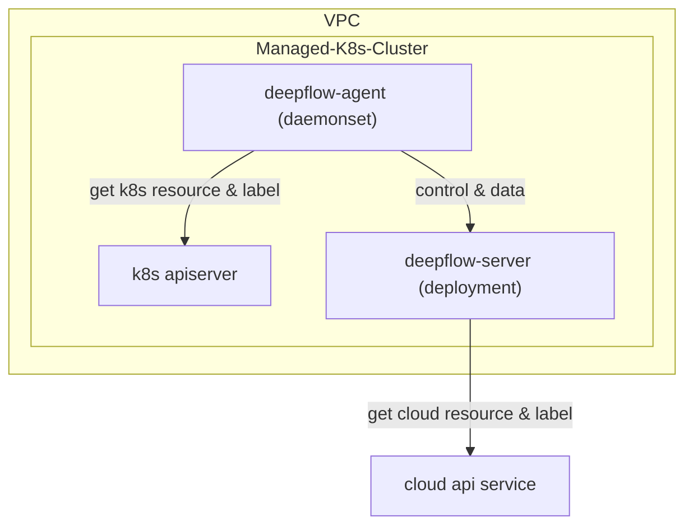

# 简介

DeepFlow 支持监控云服务商的托管 K8s 集群。与[直接监控 K8s 集群](./single-k8s/)的唯一区别是，通过调用云厂商 API，可自动向观测数据中注入云资源的标签（AutoTagging）。

# 部署拓扑



# 配置 DeepFlow Server

本地创建一个 YAML 文件 `your-managed-k8s.yaml`：
```yaml
# 名称
name: sub-domain-test
# 所属云平台的名称 [必填]
domain_name: examle-domain-name
config:
  # 集群所属 VPC UUID [必填]，可以通过 `deepflow-ctl vpc list` 查询
  vpc_uuid: xxxxx-xxxx-xxxx-xxxx-xxxx
  # POD 子网 IPv4 地址最大掩码 [选填]
  #pod_net_ipv4_cidr_max_mask: 16
  # POD 子网 IPv6 地址最大掩码 [选填]
  #pod_net_ipv6_cidr_max_mask: 64
  # 输入正则表达式，指定需要额外对接路由接口 [选填]
  #port_name_regex: ^(cni|flannel|vxlan.calico|tunl|en[ospx])
```

创建托管集群：
```bash
deepflow-ctl subdomain create -f your-managed-k8s.yaml
```

查询 DeepFlow Server 生成的托管集群 ClusterID：
```bash
deepflow-ctl subdomain list
```

# 部署 DeepFlow Agent

使用生成的 ClusterID 部署 DeepFlow Agent：
```bash
echo "deepflowK8sClusterID: "fffffff"  # FIXME: Generate by `deepflow-ctl  subdomain list`" >> values-custom.yaml
helm upgrade deepflow-agent -n deepflow deepflow/deepflow-agent  \
    -f values-custom.yaml
```

# 下一步

- [服务全景图 - 体验 DeepFlow 的 AutoMetrics 能力](../features/universal-map/auto-metrics/)
- [分布式追踪 - 体验 DeepFlow 的 AutoTracing 能力](../features/distributed-tracing/auto-tracing/)
- [消除数据孤岛 - 了解 DeepFlow 的 AutoTagging 和 SmartEncoding 能力](../features/auto-tagging/eliminate-data-silos/)
- [告别高基烦恼 - 集成 Promethes 等指标数据](../integration/input/metrics/metrics-auto-tagging/)
- [全栈分布式追踪 - 集成 OpenTelemetry 等追踪数据](../integration/input/tracing/full-stack-distributed-tracing/)
