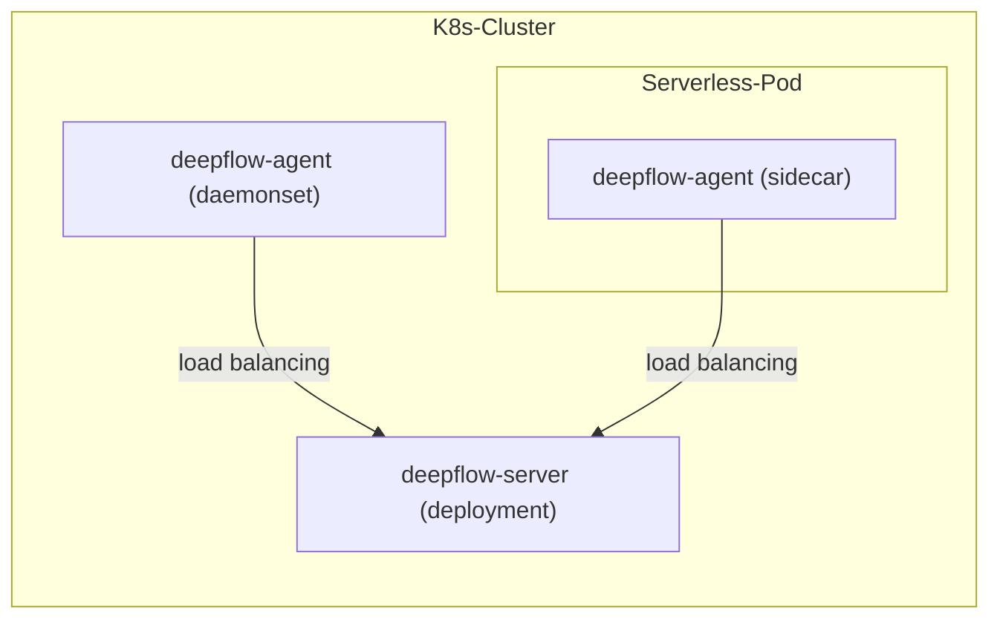

# 简介

DeepFlow Agent 可作为 Sidecar 部署于 Serverless Pod 内。假设你在一个 K8s 集群中已经部署好了 DeepFlow Server，本章介绍如何监控 Serverless Pod 内的应用。

# 部署拓扑



# 部署 deepflow-agent

更改 value 文件，以 daemonset 部署 deepflow-agent 并注入 sidecar，并通过 `deepflow-ctl domain list` 获取 `clusterNAME`：

```bash
cat << EOF > values-custom.yaml
deployComponent:
- "watcher"
- "daemonset"
tkeSidecar: true
daemonsetWatchDisabled: true
clusterNAME: $clusterNAME  # FIXME: domain name
EOF

helm install deepflow-agent -n deepflow deepflow/deepflow-agent --version 6.6.018 --create-namespace -f values-custom.yaml
```

上述命令将会部署两组 deepflow-agent：
- watcher：一个 deepflow-agent 的 deployment，用于同步 K8s 资源。
  - 部署时会自动注入 `K8S_WATCH_POLICY=watch-only` 的环境变量，此时 deepflow-agent 仅会同步 K8s 资源，不会采集可观测性数据。
- daemonset：在每个 serverless pod 中以 sidecar 的方式注入 deepflow-agent，用于采集可观测性数据。
  - 注意：当没有运行 watcher 类型的 deepflow-agent 时，deepflow-server 会选举一个 daemonset 类型的 deepflow-agent 用于同步 K8s 资源。
  - 因此，为了确保此类 deepflow-agent 不要因为被选举用于同步 K8s 资源而消耗更多资源，自动为他们注入了 `K8S_WATCH_POLICY=watch-disabled` 的环境变量。

# 下一步

- [服务全景图 - 体验 DeepFlow 的 AutoMetrics 能力](../features/universal-map/auto-metrics/)
- [分布式追踪 - 体验 DeepFlow 的 AutoTracing 能力](../features/distributed-tracing/auto-tracing/)
- [消除数据孤岛 - 了解 DeepFlow 的 AutoTagging 和 SmartEncoding 能力](../features/auto-tagging/eliminate-data-silos/)
- [告别高基烦恼 - 集成 Promethes 等指标数据](../integration/input/metrics/metrics-auto-tagging/)
- [全栈分布式追踪 - 集成 OpenTelemetry 等追踪数据](../integration/input/tracing/full-stack-distributed-tracing/)
