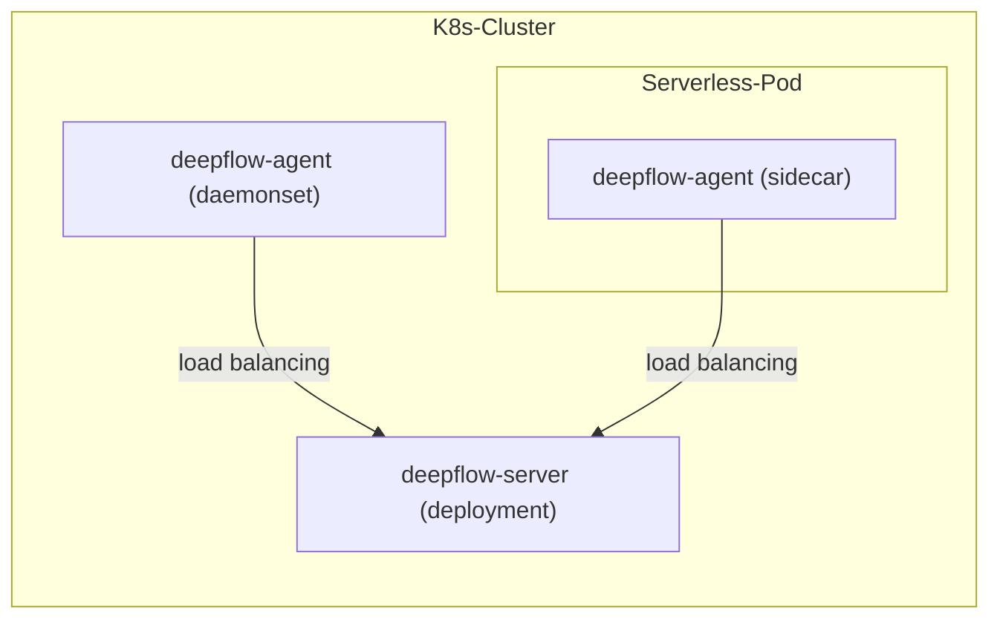

# 简介

DeepFlow Agent 可作为 Sidecar 部署于 Serverless Pod 内。假设你在一个 K8s 集群中已经部署好了 DeepFlow Server，本章介绍如何监控 Serverless Pod 内的应用。

# 部署拓扑



# 部署 deepflow-agent

以 daemonset 部署 deepflow-agent 并注入 sidecar：

```bash
cat << EOF > values-custom.yaml
deployComponent:
- "daemonset"
- "watcher"
tke_sidecar: true
clusterNAME: your-cluster-name  # Note: Corresponds to the domain name obtained by deepflow-ctl domain list
EOF

helm install deepflow-agent -n deepflow deepflow/deepflow-agent --create-namespace \
  -f values-custom.yaml
```

如果不希望 sidecar 形式的 deepflow-agent 承担 list-watch apiserver 的角色，建议部署一个单独的 deepflow-agent deployment 来同步 K8s 资源，具体方法可参考[部署 deployment 模式 DeepFlow Agent](../best-practice/special-environment-deployment/#部署-deployment-模式-deepflow-agent)。

# 下一步

- [服务全景图 - 体验 DeepFlow 的 AutoMetrics 能力](../features/universal-map/auto-metrics/)
- [分布式追踪 - 体验 DeepFlow 的 AutoTracing 能力](../features/distributed-tracing/auto-tracing/)
- [消除数据孤岛 - 了解 DeepFlow 的 AutoTagging 和 SmartEncoding 能力](../features/auto-tagging/eliminate-data-silos/)
- [告别高基烦恼 - 集成 Promethes 等指标数据](../integration/input/metrics/metrics-auto-tagging/)
- [全栈分布式追踪 - 集成 OpenTelemetry 等追踪数据](../integration/input/tracing/full-stack-distributed-tracing/)
