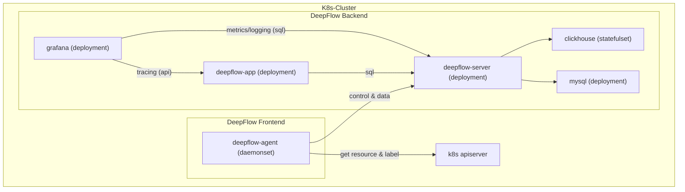

# 简介

假如你在一个 K8s 集群中部署了应用，本章介绍如何使用 DeepFlow 进行监控。
DeepFlow 能够零侵扰采集所有 Pod 的观测信号（AutoMetrics、AutoTracing、AutoProfiling），
并基于调用 apiserver 获取的信息自动为所有观测数据注入`K8s 资源`和`K8s 自定义 Label`标签（AutoTagging）。

# 准备工作

## 部署拓扑



## Storage Class

我们建议使用 Persistent Volumes 来保存 MySQL 和 ClickHouse 的数据，以避免不必要的维护成本。
你可以提供默认 Storage Class 或添加 `--set global.storageClass=<your storageClass>` 参数来选择 Storage Class 以创建 PVC。

可选择 [OpenEBS](https://openebs.io/) 用于创建 PVC：
```bash
kubectl apply -f https://openebs.github.io/charts/openebs-operator.yaml
## config default storage class
kubectl patch storageclass openebs-hostpath  -p '{"metadata": {"annotations":{"storageclass.kubernetes.io/is-default-class":"true"}}}'
```

# 部署 DeepFlow

使用 Helm 安装 DeepFlow：

::: code-tabs#shell

@tab Use Github and DockerHub

```bash
helm repo add deepflow https://deepflowio.github.io/deepflow
helm repo update deepflow # use `helm repo update` when helm < 3.7.0
helm install deepflow -n deepflow deepflow/deepflow --create-namespace
```

@tab Use Aliyun

```bash
helm repo add deepflow https://deepflow-ce.oss-cn-beijing.aliyuncs.com/chart/stable
helm repo update deepflow # use `helm repo update` when helm < 3.7.0
cat << EOF > values-custom.yaml
global:
  image:
      repository: registry.cn-beijing.aliyuncs.com/deepflow-ce
grafana:
  image:
    repository: registry.cn-beijing.aliyuncs.com/deepflow-ce/grafana
EOF
helm install deepflow -n deepflow deepflow/deepflow --create-namespace \
  -f values-custom.yaml
```

:::

注意：
- 使用 helm --set global.storageClass 可指定 storageClass
- 使用 helm --set global.replicas 可指定 deepflow-server 和 clickhouse 的副本数量
- 我们建议将 helm 的 `--set` 参数内容保存一个独立的 yaml 文件中，参考[高级配置](../best-practice/server-advanced-config/)章节。

# 下载 deepflow-ctl

deepflow-ctl 是管理 DeepFlow 的一个命令行工具，建议下载至 deepflow-server 所在的 K8s Node 上，用于后续使用：
```bash
curl -o /usr/bin/deepflow-ctl https://deepflow-ce.oss-cn-beijing.aliyuncs.com/bin/ctl/stable/linux/$(arch | sed 's|x86_64|amd64|' | sed 's|aarch64|arm64|')/deepflow-ctl
chmod a+x /usr/bin/deepflow-ctl
```

# 访问 Grafana 页面

执行 helm 部署 DeepFlow 时输出的内容提示了获取访问 Grafana 的 URL 和密码的命令，输出示例：
```bash
NODE_PORT=$(kubectl get --namespace deepflow -o jsonpath="{.spec.ports[0].nodePort}" services deepflow-grafana)
NODE_IP=$(kubectl get nodes -o jsonpath="{.items[0].status.addresses[0].address}")
echo -e "Grafana URL: http://$NODE_IP:$NODE_PORT  \nGrafana auth: admin:deepflow"
```

执行上述命令后的输出示例：
```text
Grafana URL: http://10.1.2.3:31999
Grafana auth: admin:deepflow
```

# 下一步

- [服务全景图 - 体验 DeepFlow 的 AutoMetrics 能力](../features/universal-map/auto-metrics/)
- [分布式追踪 - 体验 DeepFlow 的 AutoTracing 能力](../features/distributed-tracing/auto-tracing/)
- [消除数据孤岛 - 了解 DeepFlow 的 AutoTagging 和 SmartEncoding 能力](../features/auto-tagging/elimilate-data-silos/)
- [告别高基烦恼 - 集成 Promethes 等指标数据](../integration/input/metrics/metrics-auto-tagging/)
- [全栈分布式追踪 - 集成 OpenTelemetry 等追踪数据](../integration/input/tracing/full-stack-distributed-tracing/)
