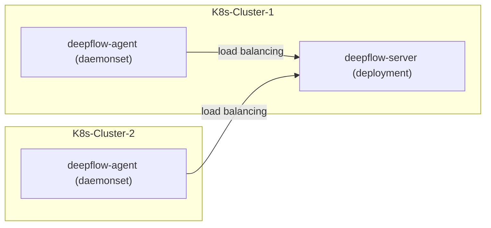

# 简介

DeepFlow Server 可服务于多个 K8s 集群中的 DeepFlow Agent。假设你在一个 K8s 集群中已经部署好了 DeepFlow Server，本章介绍如何监控其他的 K8s 集群。

# 准备工作

## 部署拓扑



## 确保不同 K8s 集群可区分

DeepFlow 使用 K8s 的 CA 文件 MD5 值区分不同的集群，请在不同 K8s 集群的 Pod 中查看 `/run/secrets/kubernetes.io/serviceaccount/ca.crt` 文件，确保不同集群的 CA 文件不同。

假如你的不同 K8s 集群使用了相同的 CA 文件，在多个集群中部署 deepflow-agent 之前，需要利用 `deepflow-ctl domain create` 获取一个 `K8sClusterID`：
```bash
unset CLUSTER_NAME
CLUSTER_NAME="k8s-1"  # FIXME: K8s cluster name
cat << EOF | deepflow-ctl domain create -f -
name: $CLUSTER_NAME
type: kubernetes
EOF
deepflow-ctl domain list $CLUSTER_NAME  # Get K8sClusterID
```

# 部署 deepflow-agent

使用 Helm 安装 deepflow-agent：

::: code-tabs#shell

@tab Use Github and DockerHub

```bash
cat << EOF > values-custom.yaml
deepflowServerNodeIPS:
- 10.1.2.3  # FIXME: K8s Node IPs
- 10.4.5.6  # FIXME: K8s Node IPs
clusterNAME: k8s-1  # FIXME: name of the cluster in deepflow
EOF

helm repo add deepflow https://deepflowio.github.io/deepflow
helm repo update deepflow # use `helm repo update` when helm < 3.7.0
helm install deepflow-agent -n deepflow deepflow/deepflow-agent --create-namespace \
    -f values-custom.yaml
```

@tab Use Aliyun

```bash
cat << EOF > values-custom.yaml
image:
  repository: registry.cn-beijing.aliyuncs.com/deepflow-ce/deepflow-agent
deepflowServerNodeIPS:
- 10.1.2.3  # FIXME: K8s Node IPs
- 10.4.5.6  # FIXME: K8s Node IPs
clusterNAME: k8s-1  # FIXME: name of the cluster in deepflow
EOF

helm repo add deepflow https://deepflow-ce.oss-cn-beijing.aliyuncs.com/chart/stable
helm repo update deepflow # use `helm repo update` when helm < 3.7.0
helm install deepflow-agent -n deepflow deepflow/deepflow-agent --create-namespace \
  -f values-custom.yaml
```

:::

我们建议上述部署过程中将 deepflow-agent 的 `deepflowServerNodeIps` 配置为 K8s 集群的一个或多个相对固定的 Node IP。

**注意**：

若不同 K8s 集群的 CA 文件一样，部署时需要传入使用 `deepflow-ctl` 获取到的 `kubernetesClusterId`：
```bash
echo "deepflowK8sClusterID: "fffffff"  # FIXME: Generate by `deepflow-ctl  domain create`" >> values-custom.yaml
helm upgrade deepflow-agent -n deepflow deepflow/deepflow-agent  \
    -f values-custom.yaml
```

# 以进程形态部署 DeepFlow Agent

当无法直接在 Kubernetes 集群中以 Daemonset 形式部署 DeepFlow Agent 时，但可在宿主机上直接部署二进制时，可使用该方法实现流量采集。

- 以 deployment 形态部署一个 deepflow-agent
  - 通过设置环境变量 ONLY_WATCH_K8S_RESOURCE，该 agent 仅实现对 K8s 资源的 list-watch 及上送控制器的功能
  - 这个 agent 的其他所有功能均会自动关闭
  - agent 请求 server 时告知自己在 watch_k8s，server 会将此信息更新到 MySQL 数据库中
  - 用做 Watcher 的采集器将不会出现在采集器列表中

- 在这个 K8s 集群中，以 Linux 进程的形态在所有 K8s Node 上运行一个 deepflow-agent，执行正常的 agent 功能
  - 由于这些 agent 没有 IN_CONTAINER 环境变量，不会 list-watch K8s 资源
  - 这些 agent 依然会获取 POD 的 IP 和 MAC
  - 这些 agent 完成所有的数据采集功能
  - server 向这些 agent 下发的采集器类型为 K8s

## 部署方法

### 部署 deployment 模式 DeepFlow Agent
  ```bash
  cat << EOF > values-custom.yaml
  deployMode: process
  clusterNAME: process-example
  EOF
  helm install deepflow -n deepflow deepflow/deepflow-agent --create-namespace \
    -f values-custom.yaml
  ```
  - 部署后，将自动创建 Domain（对应此 K8s 集群），通过`deepflow-ctl domain list`中获取 `process-example` cluster 的 `kubernetes-cluster-id`，再继续下面的二进制安装

### 部署二进制模式 DeepFlow Agent
  - 参考[传统服务器部署 DeepFlow Agent](./legacy-host/)，但无需创建 Domain
  - 修改 agent 配置文件 `/etc/deepflow-agent/deepflow-agent.yaml`，`kubernetes-cluster-id` 填写上一步获取的 ID

# 下一步

- [微服务全景图 - 体验 DeepFlow 基于 BPF 的 AutoMetrics 能力](../auto-metrics/metrics-without-instrumentation/)
- [自动分布式追踪 - 体验 DeepFlow 基于 eBPF 的 AutoTracing 能力](../auto-tracing/tracing-without-instrumentation/)
- [消除数据孤岛 - 了解 DeepFlow 的 AutoTagging 和 SmartEncoding 能力](../auto-tagging/elimilate-data-silos/)
- [告别高基烦恼 - 集成 Promethes 等指标数据](../agent-integration/metrics/metrics-auto-tagging/)
- [无盲点分布式追踪 - 集成 OpenTelemetry 等追踪数据](../agent-integration/tracing/tracing-without-blind-spot/)
