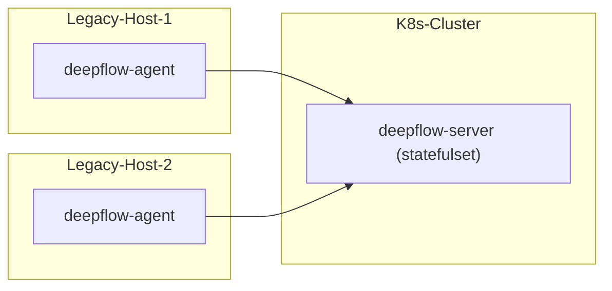

# 简介

DeepFlow 支持监控传统服务器。注意 DeepFlow Server 必须运行在 K8s 之上，如果你没有 K8s 集群，可参考 [All-in-One 快速部署](./all-in-one/)章节先部署 DeepFlow Server。

# 部署拓扑



# 配置 DeepFlow Server

## 更新 deepflow-server 配置

修改 `values-custom.yaml` 自定义配置文件：
```yaml
# add
config:
  tridentTypeForUnkonwVtap: 3
```

更新 deepflow
```bash
helm upgrade deepflow -n deepflow -f values-custom.yaml deepflow/deepflow
## Restart deepflow-server
kubectl delete pods -n deepflow -l app=deepflow -l component=deepflow-server
```

## 创建 Host Domain

```bash
unset DOMAIN_NAME
DOMAIN_NAME="legacy-host"  # FIXME: domain name

cat << EOF | deepflow-ctl domain create -f -
name: $DOMAIN_NAME
type: agent_sync
EOF
```

## 创建采集器组

创建采集器组：
```bash
unset AGENT_GROUP
AGENT_GROUP="legacy-host"  # FIXME: domain name

deepflow-ctl agent-group create $AGENT_GROUP
deepflow-ctl agent-group list $AGENT_GROUP # Get agent-group ID
```

创建采集器组配置文件 `agent-group-config.yaml`：
```yaml
vtap_group_id: g-ffffff # FIXME: agent-group ID
platform_enabled: 1
```

创建采集器组配置：
```bash
deepflow-ctl agent-group-config create -f agent-group-config.yaml
```

# 部署 DeepFlow Agent

下载 deepflow-agent

::: code-tabs#shell

@tab rpm

```bash
curl -O https://deepflow-ce.oss-cn-beijing.aliyuncs.com/rpm/agent/stable/linux/amd64/deepflow-agent-rpm.zip
unzip deepflow-agent-rpm.zip
yum -y localinstall x86_64/deepflow-agent-1.0*.rpm
```

@tab deb

```bash
curl -O https://deepflow-ce.oss-cn-beijing.aliyuncs.com/deb/agent/stable/linux/amd64/deepflow-agent-deb.zip
unzip deepflow-agent-deb.zip
dpkg -i x86_64/deepflow-agent-1.0-6447.systemd.deb
```

@tab binary file

```bash
curl -O https://deepflow-ce.oss-cn-beijing.aliyuncs.com/bin/agent/stable/linux/amd64/deepflow-agent.tar.gz
tar -zxvf deepflow-agent.tar.gz -C /usr/sbin/

cat << EOF > /etc/systemd/system/deepflow-agent.service
[Unit]
Description=deepflow-agent.service
After=syslog.target network-online.target

[Service]
Environment=GOTRACEBACK=single
LimitCORE=1G
ExecStart=/usr/sbin/deepflow-agent
Restart=always
RestartSec=10
LimitNOFILE=1024:4096

[Install]
WantedBy=multi-user.target
EOF

systemctl daemon-reload
```

:::

修改 deepflow-agent 的配置文件 `/etc/deepflow-agent.yaml` ：
```yaml
controller-ips:
  - 10.1.2.3  # FIXME: K8s Node IPs
vtap-group-id-request: "g-fffffff"  # FIXME: agent-group ID
```

启动 deepflow-agent ：

```bash
systemctl enable deepflow-agent
systemctl restart deepflow-agent
```

# 下一步

- [微服务全景图 - 体验 DeepFlow 基于 BPF 的 AutoMetrics 能力](../auto-metrics/metrics-without-instrumentation/)
- [自动分布式追踪 - 体验 DeepFlow 基于 eBPF 的 AutoTracing 能力](../auto-tracing/tracing-without-instrumentation/)
- [消除数据孤岛 - 了解 DeepFlow 的 AutoTagging 和 SmartEncoding 能力](../auto-tagging/elimilate-data-silos/)
- [告别高基烦恼 - 集成 Promethes 等指标数据](../agent-integration/metrics/metrics-auto-tagging/)
- [无盲点分布式追踪 - 集成 OpenTelemetry 等追踪数据](../agent-integration/tracing/tracing-without-blind-spot/)
