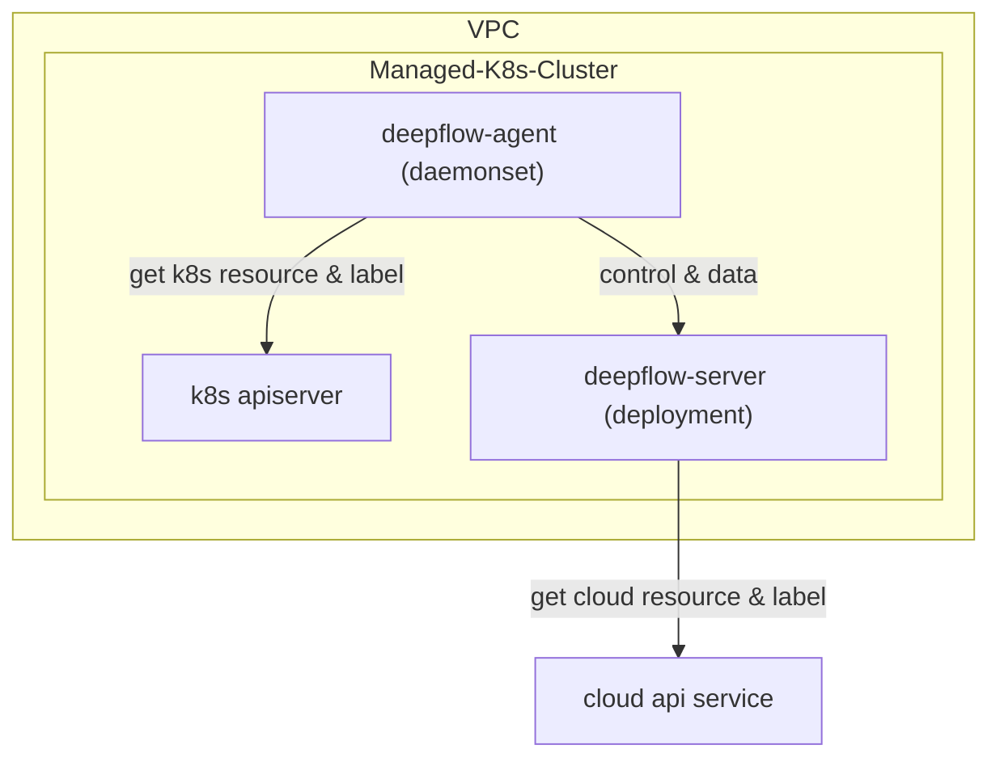

# 简介

DeepFlow 支持监控云服务商的托管 K8s 集群。与[直接监控 K8s 集群](./single-k8s/)的唯一区别是，通过调用云厂商 API，可自动向观测数据中注入云资源的标签（AutoTagging）。

# 部署拓扑

# 配置 DeepFlow Server

TODO

# 部署 DeepFlow Agent

TODO

# 下一步

- [服务全景图 - 体验 DeepFlow 的 AutoMetrics 能力](../features/universal-map/auto-metrics/)
- [分布式追踪 - 体验 DeepFlow 的 AutoTracing 能力](../features/distributed-tracing/auto-tracing/)
- [消除数据孤岛 - 了解 DeepFlow 的 AutoTagging 和 SmartEncoding 能力](../features/auto-tagging/elimilate-data-silos/)
- [告别高基烦恼 - 集成 Promethes 等指标数据](../integration/input/metrics/metrics-auto-tagging/)
- [全栈分布式追踪 - 集成 OpenTelemetry 等追踪数据](../integration/input/tracing/full-stack-distributed-tracing/)
