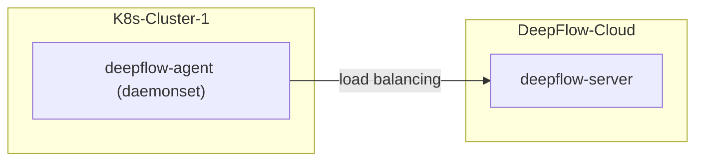

# 简介

假如你要使用 DeepFlow 监控一个新的 K8s 集群。
DeepFlow 能够零侵扰采集所有 Pod 的观测信号（AutoMetrics、AutoTracing、AutoProfiling），
并基于调用 apiserver 获取的信息自动为所有观测数据注入`K8s 资源`和`K8s 自定义 Label`标签（AutoTagging）。

- **部署拓扑**



# 准备工作

## 获取采集器安装包

获取 DeepFlow Agent 镜像地址和镜像 tag，V6.5 版本最新镜像为 `hub.deepflow.yunshan.net/public/deepflow-agent:v6.5`（注意此仓库位于阿里云北京 Region）

## 获取部署 DeepFlow Agent 必需的信息

部署 DeepFlow Agent 前需在 DeepFlow Cloud 中获取两个 ID，并配置到 DeepFlow Agent 的配置文件中：

- **获取 `团队 ID / team-id`**
  
  操作步骤参考下图：

   

- **新建采集器组并获取 `agent-group-id`**

  操作步骤参考下图：

   

> 注：创建采集器组的目的是为了配置不同的运行策略，以便于对 DeepFlow Agent 进行运行策略的分组管理。当 DeepFlow Agent 配置的`agent-group-id`在平台中无法找到时，平台会下发 default 组的运行策略。

# 准备工作

依次修改下方 `values-custom.yaml` 文件中的 `agentGroupID`、`teamId`、`clusterNAME`

```bash
cat << EOF > values-custom.yaml
deepflowServerNodeIPS:
- agent.cloud.deepflow.yunshan.net
agentGroupID: "g-xxxxxxxxxx"  # FIXME: agent-group-id
teamId: "t-xxxxxxxxxx"  # FIXME: team-id
clusterNAME: "k8s-cluster-1" # FIXME: cluster name in the DeepFlow Cloud
image:
  repository: hub.deepflow.yunshan.net/public/deepflow-agent
  pullPolicy: Always
  tag: v6.5
EOF
```

# 部署 deepflow-agent

使用 Helm 安装 deepflow-agent：

```bash
helm repo add deepflow https://deepflowio.github.io/deepflow
helm repo update deepflow # use `helm repo update` when helm < 3.7.0
helm install deepflow-agent -n deepflow deepflow/deepflow-agent --create-namespace \
    -f values-custom.yaml
```

## 注意

若您已经在 DeepFlow Cloud 中对接了公有云平台，需要接入公有云上的 K8s 集群时，您需要在 `values-custom.yaml` 文件中指定
`deepflowK8sClusterID`，并无需指定 `clusterNAME`，该 ID 为公有云平台上的集群 ID，也可通过 `资源`-`资源池`-`云平台`-`录入附属容器集群` 获取集群 ID。
