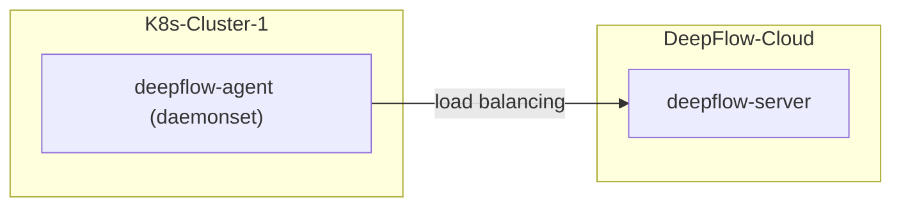

# 简介

假如你要使用 DeepFlow 监控一个新的 K8s 集群。
DeepFlow 能够零侵扰采集所有 Pod 的观测信号（AutoMetrics、AutoTracing、AutoProfiling），
并基于调用 apiserver 获取的信息自动为所有观测数据注入`K8s 资源`和`K8s 自定义 Label`标签（AutoTagging）。

- **部署拓扑**



# 部署

## 获取部署 DeepFlow Agent 必需的信息

部署 DeepFlow Agent 前需在 DeepFlow Web 页面中获取两个 ID，并配置到 DeepFlow Agent 的配置文件中：

- **获取 `团队 ID / teamId`**
  
  `teamId`即`团队 ID`，用于识别 DeepFlow Agent 所属的组织，操作步骤参考下图：

   

- **新建采集器组并获取 `agentGroupID`**

   `agentGroupId`即采集器组 ID，用于识别 DeepFlow Agent 所属的采集器组，操作步骤参考下图：

   

> 注：创建采集器组的目的是为了配置不同的运行策略，以便于对 DeepFlow Agent 进行运行策略的分组管理。当 DeepFlow Agent 配置的`agent-group-id`在平台中无法找到时，平台会下发 default 组的运行策略。

- **获取 `deepflowK8sClusterID`**

 `deepflowK8sClusterID`即 K8s 集群 ID，用于识别 DeepFlow Agent 所属的 K8s 集群，该 ID 的产生有三种方式：
  1. 独立 K8s 集群
  2. 公有云 K8s 集群
  3. 公有云租户自建 K8s 集群

   操作步骤参考下图：

   

> 注：创建采集器组的目的是为了配置不同的运行策略，以便于对 DeepFlow Agent 进行运行策略的分组管理。当 DeepFlow Agent 配置的`agent-group-id`在平台中无法找到时，平台会下发 default 组的运行策略。


## 初始化 Helm 仓库并新建 DeepFlow Agent 的 yaml 文件

初始化 Helm Repo，并新建 `values-custom.yaml` 文件并配置 DeepFlow Agent 部署所需的关键字段信息，其中关键字段的取值说明如下：
- `deepflowServerNodeIPS`，即 DeepFlow Agent 所要连接的 DeepFlow Server 地址，须使用样例中的地址；当此处配置的地址错误时，DeepFlow Agent 将无法注册；
- `agentGroupID`，即采集器组ID/`agent-group-id`，填写上边步骤（2）中获取的 ID 值；当此处配置的 ID 值无效时，DeepFlow Server 会向 DeepFlow Agent 下发 default 组的运行策略；
- `teamId`，即`团队 ID`/`team-id`，填写上边步骤（1）中获取的 ID 值，用于 DeepFlow Server 识别区分不同组织的 DeepFlow Agent；当此处配置的 ID 值错误时，DeepFlow Agent 将无法注册；
- `clusterNAME`，即方便运维人员识别的 K8s 集群命名， DeepFlow Server 根据该字段自动生成 K8s 云平台的名字；不同的 K8s 集群需使用不同的名字，当多个 K8s 集群的 DeepFlow Agent使用相同的名字时，会导致 DeepFlow Agent 注册异常。


::: code-tabs#shell

@tab Use DockerHub

```bash
helm repo add deepflow https://deepflowio.github.io/deepflow
helm repo update deepflow # use `helm repo update` when helm < 3.7.0
cat << EOF > values-custom.yaml
deepflowServerNodeIPS:
- agent.cloud.deepflow.yunshan.net
agentGroupID: "g-xxxxxxxxxx"  # FIXME: agentGroupID
teamId: "t-xxxxxxxxxx"  # FIXME: teamId
clusterNAME: "k8s-cluster-1" # FIXME: cluster name in the DeepFlow Cloud
image:
  repository: deepflowee/deepflow-agent
  pullPolicy: Always
  tag: v6.5
EOF
```

@tab Use Aliyun

```bash
helm repo add deepflow https://deepflow-ce.oss-cn-beijing.aliyuncs.com/chart/stable
helm repo update deepflow # use `helm repo update` when helm < 3.7.0
cat << EOF > values-custom.yaml
deepflowServerNodeIPS:
- agent.cloud.deepflow.yunshan.net
agentGroupID: "g-xxxxxxxxxx"  # FIXME: agentGroupID
teamId: "t-xxxxxxxxxx"  # FIXME: teamId
clusterNAME: "k8s-cluster-1" # FIXME: cluster name in the DeepFlow Cloud
image:
  repository: hub.deepflow.yunshan.net/public/deepflow-agent
  pullPolicy: Always
  tag: v6.5
EOF
```

:::

## 部署 deepflow-agent

使用 Helm 安装 deepflow-agent：

```bash
helm install deepflow-agent -n deepflow deepflow/deepflow-agent --create-namespace \
    -f values-custom.yaml
```

# 检查


## 注意

若您已经在 DeepFlow Cloud 中对接了公有云平台，需要接入公有云上的 K8s 集群时，您需要在 `values-custom.yaml` 文件中指定
`deepflowK8sClusterID`，并无需指定 `clusterNAME`，该 ID 为公有云平台上的集群 ID，也可通过 `资源`-`资源池`-`云平台`-`录入附属容器集群` 获取集群 ID。
