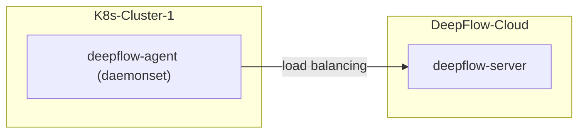

# 简介

在 K8s 集群中部署 DeepFlow Agent 后，将自动零侵扰采集 K8s 集群中 Pod 的观测数据（AutoMetrics、AutoTracing、AutoProfiling），
并自动为所有观测数据注入`K8s 资源`和`K8s 自定义 Label`标签（AutoTagging）。

本章节将详细介绍如何在您的 K8s 集群中部署 DeepFlow Agent。

- **部署拓扑**



# 部署

## 获取部署 DeepFlow Agent 必需的信息

部署 DeepFlow Agent 前需在 DeepFlow Web 页面中获取 3 个 ID 值（独立容器集群仅需 2 个），并配置到 DeepFlow Agent 的 yaml 文件中：

- **获取 `teamId`**
  
  `teamId`即`团队 ID`，用于识别 DeepFlow Agent 所属的组织，操作步骤参考下图：

   

- **新建采集器组并获取 `agentGroupID`**

   `agentGroupId`即采集器组 ID，用于识别 DeepFlow Agent 所属的采集器组，操作步骤参考下图：

   

   > 注：创建采集器组的目的是为了配置不同的运行策略，以便于对 DeepFlow Agent 进行运行策略的分组管理。

- **获取`deepflowK8sClusterID`**

   `deepflowK8sClusterID`即容器集群 ID，用于识别 DeepFlow Agent 所属的容器集群，操作步骤参考下图：

   > 注：独立容器集群的 DeepFlow Agent 无需配置该 ID；
   > 附属容器集群的 DeepFlow Agent 必须配置该 ID；
   > “独立容器集群”、“附属容器集群”的说明详见**对接公有云 API**。


## 初始化 Helm 仓库，并新建 DeepFlow Agent 的 yaml 文件

初始化 Helm Repo，新建 `values-custom.yaml` 文件，并在文件中写入 DeepFlow Agent 部署所需的关键字段信息：

::: code-tabs#shell

@tab Use DockerHub

```bash
helm repo add deepflow https://deepflowio.github.io/deepflow
helm repo update deepflow # use `helm repo update` when helm < 3.7.0
cat << EOF > values-custom.yaml
deepflowServerNodeIPS:
- agent.cloud.deepflow.yunshan.net
agentGroupID: "g-xxxxxxxxxx"  # FIXME: agentGroupID
teamId: "t-xxxxxxxxxx"  # FIXME: teamId
clusterNAME: "k8s-cluster-1" # FIXME: cluster name in the DeepFlow Cloud
image:
  repository: deepflowee/deepflow-agent
  pullPolicy: Always
  tag: v6.5
EOF
```

@tab Use Aliyun

```bash
helm repo add deepflow https://deepflow-ce.oss-cn-beijing.aliyuncs.com/chart/stable
helm repo update deepflow # use `helm repo update` when helm < 3.7.0
cat << EOF > values-custom.yaml
deepflowServerNodeIPS:
- agent.cloud.deepflow.yunshan.net
agentGroupID: "g-xxxxxxxxxx"  # FIXME: agentGroupID
teamId: "t-xxxxxxxxxx"  # FIXME: teamId
clusterNAME: "k8s-cluster-1" # FIXME: cluster name in the DeepFlow Cloud
image:
  repository: hub.deepflow.yunshan.net/public/deepflow-agent
  pullPolicy: Always
  tag: v6.5
EOF
```

:::

关键字段的取值说明如下：
| 字段 | 字段说明 | 取值 | 异常说明 |
|-------|-----|--------|--------|
| `deepflowServerNodeIPS` |  DeepFlow Agent 所要连接的 DeepFlow Server 地址 |  `agent.cloud.deepflow.yunshan.net` |  该地址错误时，DeepFlow Agent 将**无法注册** |
| `teamId` |  即`团队 ID` ， DeepFlow Server 根据该字段确定 DeepFlow Agent 所属的组织 | 填写本节第 1 步获取的 ID 值 | 该 ID 值错误时，DeepFlow Agent 将**无法注册** |
| `agentGroupID` |  即采集器组 ID，DeepFlow Server 根据该字段下发运行策略 | 填写本节第 2 步获取的 ID 值 |  该 ID 值无效时，DeepFlow Server 会向 DeepFlow Agent **下发 default 组的运行策略** |
| `deepflowK8sClusterID` | **附属容器集群场景下使用**，即容器集群 ID，DeepFlow Server 根据该字段确定 DeepFlow Agent 所属的容器集群 | 填写本节第 3 步获取的 ID 值 | 该 ID 错误时，DeepFlow Agent 将**无法注册**|
| `clusterNAME` |  **独立容器集群场景下使用**，即方便运维人员识别的容器集群名称，DeepFlow Server 根据该字段自动新建容器集群和 ID |  灵活按需命名 |  如果不同 K8s 集群的 DeepFlow Agent 配置相同的`clusterNAME`，会导致 DeepFlow Agent **注册异常** |

## 部署 deepflow-agent

使用 Helm 安装 deepflow-agent：

```bash
helm install deepflow-agent -n deepflow deepflow/deepflow-agent --create-namespace \
    -f values-custom.yaml
```

# 检查


## 注意

若您已经在 DeepFlow Cloud 中对接了公有云平台，需要接入公有云上的 K8s 集群时，您需要在 `values-custom.yaml` 文件中指定
`deepflowK8sClusterID`，并无需指定 `clusterNAME`，该 ID 为公有云平台上的集群 ID，也可通过 `资源`-`资源池`-`云平台`-`录入附属容器集群` 获取集群 ID。
