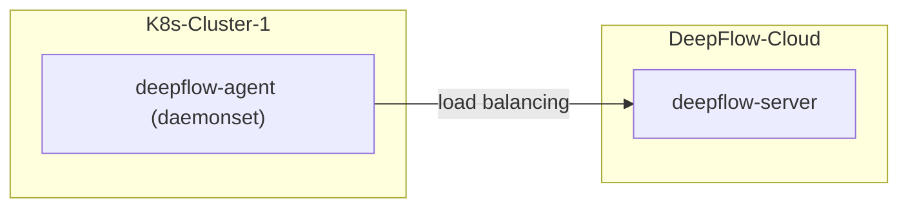

# 简介

假如你要使用 DeepFlow 监控一个新的 K8s 集群。
DeepFlow 能够零侵扰采集所有 Pod 的观测信号（AutoMetrics、AutoTracing、AutoProfiling），
并基于调用 apiserver 获取的信息自动为所有观测数据注入`K8s 资源`和`K8s 自定义 Label`标签（AutoTagging）。

# 准备工作

## 部署拓扑



## 获取部署 DeepFlow Agent 所需的关键信息

新集群 Agent 接入 DeepFlow Cloud 所需的关键信息：

1. 新建采集器组并获取 agentGroupID，参考下图获取

   

2. 获取 teamId，参考下图获取

   

初始化 Helm Repo 和 `values-custom.yaml` 文件，此文件保存部署 DeepFlow Agent 所需的关键信息，其中 `clusterNAME` 填写为方便你识别的名称即可。

::: code-tabs#shell

@tab Use DockerHub

```bash
helm repo add deepflow https://deepflowio.github.io/deepflow
helm repo update deepflow # use `helm repo update` when helm < 3.7.0
cat << EOF > values-custom.yaml
deepflowServerNodeIPS:
- agent.cloud.deepflow.yunshan.net
agentGroupID: "g-xxxxxxxxxx"  # FIXME: agentGroupID
teamId: "t-xxxxxxxxxx"  # FIXME: teamId
clusterNAME: "k8s-cluster-1" # FIXME: cluster name in the DeepFlow Cloud
image:
  repository: deepflowee/deepflow-agent
  pullPolicy: Always
  tag: v6.5
EOF
```

@tab Use Aliyun

```bash
helm repo add deepflow https://deepflow-ce.oss-cn-beijing.aliyuncs.com/chart/stable
helm repo update deepflow # use `helm repo update` when helm < 3.7.0
cat << EOF > values-custom.yaml
deepflowServerNodeIPS:
- agent.cloud.deepflow.yunshan.net
agentGroupID: "g-xxxxxxxxxx"  # FIXME: agentGroupID
teamId: "t-xxxxxxxxxx"  # FIXME: teamId
clusterNAME: "k8s-cluster-1" # FIXME: cluster name in the DeepFlow Cloud
image:
  repository: hub.deepflow.yunshan.net/public/deepflow-agent
  pullPolicy: Always
  tag: v6.5
EOF
```

:::

依次修改 `values-custom.yaml` 文件中的 `agentGroupID`、`teamId`、`clusterNAME` 字段的值。

## 部署 deepflow-agent

使用 Helm 安装 deepflow-agent：

```bash
helm install deepflow-agent -n deepflow deepflow/deepflow-agent --create-namespace \
    -f values-custom.yaml
```

## 注意

若您已经在 DeepFlow Cloud 中对接了公有云平台，需要接入公有云上的 K8s 集群时，您需要在 `values-custom.yaml` 文件中指定
`deepflowK8sClusterID`，并无需指定 `clusterNAME`，该 ID 为公有云平台上的集群 ID，也可通过 `资源`-`资源池`-`云平台`-`录入附属容器集群` 获取集群 ID。
