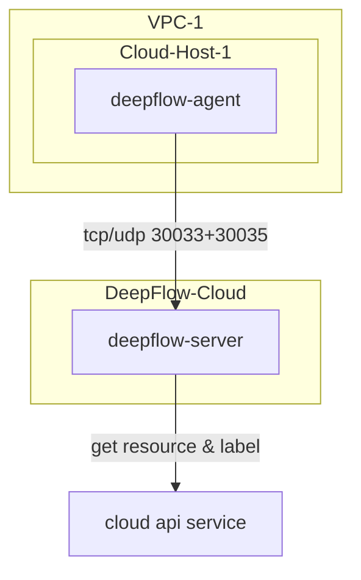

# 简介

DeepFlow 支持监控云服务器，并通过调用云厂商 API 获取云资源信息，自动注入到所有观测数据中（AutoTagging）。

# 部署拓扑



# 创建公有云 Domain

DeepFlow 目前支持如下公有云的资源信息同步（标记为 `TBD` 的正在整理代码中）：
| 云服务商（英文） | 云服务商（中文） | DeepFlow 中使用的类型标识 |
| ---------------- | ---------------- | ------------------------ |
| AWS | AWS | aws |
| Aliyun | 阿里云 | aliyun |
| Baidu Cloud | 百度云 | baidu_bce |
| Huawei Cloud | 华为云 | huawei |
| Microsoft Azure | 微软云 | `TBD` |
| QingCloud | 青云 | qingcloud |
| Tencent Cloud | 腾讯云 | tencent |

## 获取采集器安装包和采集器组的 Agent Group ID

公有云服务器部署 DeepFlow Agent 时需要向云杉网络的同学获取传统服务器的安装包和 Agent Group ID

# 部署 DeepFlow Agent

::: code-tabs#shell

@tab rpm

```bash
unzip deepflow-agent-rpm.zip
yum -y localinstall x86_64/deepflow-agent-1.0*.rpm
```

@tab deb

```bash
unzip deepflow-agent-deb.zip
dpkg -i x86_64/deepflow-agent-1.0*.systemd.deb
```

@tab docker compose

```bash
touch /etc/deepflow-agent.yaml

cat << EOF > deepflow-agent-docker-compose.yaml
version: '3.2'
services:
  deepflow-agent:
    image: hub.deepflow.yunshan.net/public/deepflow-agent:v6.5
    container_name: deepflow-agent
    restart: always
    #privileged: true  ## Docker version below 20.10.10 requires the opening of the privileged mode, See https://github.com/moby/moby/pull/42836
    cap_add:
      - SYS_ADMIN
      - SYS_RESOURCE
      - SYS_PTRACE
      - NET_ADMIN
      - NET_RAW
      - IPC_LOCK
      - SYSLOG
    volumes:
      - /etc/deepflow-agent.yaml:/etc/deepflow-agent/deepflow-agent.yaml:ro
      - /sys/kernel/debug:/sys/kernel/debug:ro
      - /var/run/docker.sock:/var/run/docker.sock
    network_mode: "host"
    pid: "host"
EOF

docker compose -f deepflow-agent-docker-compose.yaml up -d
```

:::

修改 deepflow-agent 的配置文件 `/etc/deepflow-agent.yaml` ：

```yaml
controller-ips:
  - agent.cloud.deepflow.yunshan.net
vtap-group-id-request: 'g-xxxxxxxxxx' # FIXME: agent-group ID
team-id: 't-xxxxxxxxxx' # FIXME: Team ID
```

启动 deepflow-agent ：

```bash
systemctl enable deepflow-agent
systemctl restart deepflow-agent
```
