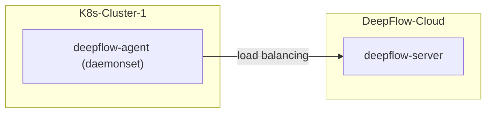

# 简介

本章节将详细介绍如何在您的 K8s 集群中部署 DeepFlow Agent。

在 K8s 集群中部署 DeepFlow Agent 后，将自动零侵扰采集 K8s 集群中 Pod 的观测数据（AutoMetrics、AutoTracing、AutoProfiling），
并自动为所有观测数据注入`K8s 资源`和`K8s 自定义 Label`标签（AutoTagging）。

- **部署拓扑**



# 录入附属容器集群

<a id="独立/附属容器集群"></a>
DeepFlow 观测覆盖的 K8s 集群分类两类：（1）附属容器集群——指容器集群的 Node 使用的是 DeepFlow 在某个云平台中学习到的云服务器；（2）独立容器集群——指容器集群的 Node 与 DeepFlow 从云平台中学习到的云服务器没有关联。

对于附属容器集群，需要在 DeepFlow 的云平台配置中自动或手动录入容器集群信息，容器集群中的 DeepFlow Agent 方可被 DeepFlow Server 端正确接纳。

对于独立容器集群，可以由 DeepFlow Server 在收到该集群的首个 DeepFlow Agent 注册信息后自动创建，无需运维人员操作，您可直接进入[部署](#部署)章节。

> 注意：如果部署 K8s 集群的云服务器已经通过云平台对接自动学习并记录到某个云平台，那么该 K8s 集群必须要对接或录入为该云平台的附属容器集群，否则将导致 DeepFlow 的可观测性数据打标时无法确定数据所属的云平台，从而产生数据标签的紊乱。

## 自动录入附属容器集群

对部分公有云 K8s 产品，DeepFlow 能够通过公有云 API 自动学习并录入 K8s 集群信息，无需运维人员操作。自动学习并录入的附属容器集群列表可以在 DeepFlow Web 页面的`资源`-`资源池`-`云平台`-`附属容器集群`中查看。

已支持自动录入附属容器集群的公有云包括：
- 阿里公有云
- 百度公有云
- AWS
- 青云公有云

## 手动录入附属容器集群

对于公有云租户自建 K8s 集群，或通过公有云 API 无法自动学习的 K8s 集群，需要运维人员手动在 DeepFlow 的`资源`-`资源池`-`云平台`-`附属容器集群`中手动录入附属容器集群。


<a id="部署"></a>
# 部署

## 获取部署 DeepFlow Agent 必需的信息

部署 DeepFlow Agent 前需在 DeepFlow Web 页面中获取 3 个 ID 值（独立容器集群仅需 2 个），并配置到 DeepFlow Agent 的 yaml 文件中：

<a id="获取团队ID"></a>
- **获取 `teamId`**
 
`teamId`即`团队 ID`，用于识别 DeepFlow Agent 所属的组织，操作步骤参考下图：
  


<a id="获取采集器组ID"></a>
- **新建采集器组并获取 `agentGroupID`**

`agentGroupId`即采集器组 ID，用于识别 DeepFlow Agent 所属的采集器组，操作步骤参考下图：


> 注：创建采集器组的目的是为了配置不同的运行策略，以便于对 DeepFlow Agent 进行运行策略的分组管理。

<a id="获取容器集群ID"></a>
- **获取`deepflowK8sClusterID`**

`deepflowK8sClusterID`即容器集群 ID，用于识别 DeepFlow Agent 所属的[附属容器集群](#独立/附属容器集群)，操作步骤参考下图：


## 初始化 Helm 仓库，并新建 DeepFlow Agent 的 yaml 文件

初始化 Helm Repo，新建 `values-custom.yaml` 文件，并在文件中写入 DeepFlow Agent 部署所需的关键字段信息：

::: code-tabs#shell

@tab 独立容器集群，使用 DockerHub

```bash
helm repo add deepflow https://deepflowio.github.io/deepflow
helm repo update deepflow # use `helm repo update` when helm < 3.7.0
cat << EOF > values-custom.yaml
deepflowServerNodeIPS:
- agent.cloud.deepflow.yunshan.net
teamId: "t-xxxxxxxxxx"  # Mandatory. Filling with the 'teamId' which could be found in DeepFlow Cloud.
agentGroupID: "g-xxxxxxxxxx"  # Optional. Filling with the 'agentGroupID' which could be found in DeepFlow Cloud.
clusterNAME: "k8s-cluster-1" # Optional. Filling with a Kubernetes cluster name which you want.
image:
  repository: deepflowee/deepflow-agent
  pullPolicy: Always
  tag: v6.5
EOF
```

@tab 独立容器集群，使用 Aliyun 仓库

```bash
helm repo add deepflow https://deepflow-ce.oss-cn-beijing.aliyuncs.com/chart/stable
helm repo update deepflow # use `helm repo update` when helm < 3.7.0
cat << EOF > values-custom.yaml
deepflowServerNodeIPS:
- agent.cloud.deepflow.yunshan.net
teamId: "t-xxxxxxxxxx"  # Mandatory. Filling with the 'teamId' which could be found in DeepFlow Cloud.
agentGroupID: "g-xxxxxxxxxx"  # Optional. Filling with the 'agentGroupID' which could be found in DeepFlow Cloud.
clusterNAME: "k8s-cluster-1" # Optional. Filling with a Kubernetes cluster name which you want.
image:
  repository: hub.deepflow.yunshan.net/public/deepflow-agent
  pullPolicy: Always
  tag: v6.5
EOF
```

@tab 附属容器集群，使用 DockerHub

```bash
helm repo add deepflow https://deepflowio.github.io/deepflow
helm repo update deepflow # use `helm repo update` when helm < 3.7.0
cat << EOF > values-custom.yaml
deepflowServerNodeIPS:
- agent.cloud.deepflow.yunshan.net
teamId: "t-xxxxxxxxxx"  # Mandatory. Filling with the 'teamId' which could be found in DeepFlow Cloud.
agentGroupID: "g-xxxxxxxxxx"  # Optional. Filling with the 'agentGroupID' which could be found in DeepFlow Cloud.
deepflowK8sClusterID: "d-xxxxxxxxxx"  # Mandatory to standalone Kubernetes cluster. Filling with the Kubernetes ClusterID which could be found in DeepFlow Cloud.
image:
  repository: deepflowee/deepflow-agent
  pullPolicy: Always
  tag: v6.5
EOF
```

@tab 附属容器集群，使用 Aliyun 仓库

```bash
helm repo add deepflow https://deepflow-ce.oss-cn-beijing.aliyuncs.com/chart/stable
helm repo update deepflow # use `helm repo update` when helm < 3.7.0
cat << EOF > values-custom.yaml
deepflowServerNodeIPS:
- agent.cloud.deepflow.yunshan.net
teamId: "t-xxxxxxxxxx"  # Mandatory. Filling with the 'teamId' which could be found in DeepFlow Cloud.
agentGroupID: "g-xxxxxxxxxx"  # Optional. Filling with the 'agentGroupID' which could be found in DeepFlow Cloud.
deepflowK8sClusterID: "d-xxxxxxxxxx"  # Mandatory to standalone Kubernetes cluster. Filling with the Kubernetes ClusterID which could be found in DeepFlow Cloud.
image:
  repository: hub.deepflow.yunshan.net/public/deepflow-agent
  pullPolicy: Always
  tag: v6.5
EOF
```

:::

关键字段的取值说明如下：

| 字段 | 字段用途 | 取值 | 例外说明 |
|-------|-----|--------|--------|
| `deepflowServerNodeIPS` |  DeepFlow Agent 所要连接的 DeepFlow Server 地址 |  `agent.cloud.deepflow.yunshan.net` |  该地址错误时，DeepFlow Agent 将**无法注册** |
| `teamId` |  即`团队 ID` ， DeepFlow Server 根据该字段确定 DeepFlow Agent 所属的组织 | [获取方式](#获取团队ID) | 该 ID 值错误时，DeepFlow Agent 将**无法注册** |
| `agentGroupID` |  即采集器组 ID，DeepFlow Server 根据该字段下发运行策略 | [获取方式](#获取采集器组ID) |  该 ID 值无效时，DeepFlow Server 会向 DeepFlow Agent **下发 default 组的运行策略** |
| `deepflowK8sClusterID` | **附属容器集群场景下使用**，即容器集群 ID，DeepFlow Server 根据该字段确定 DeepFlow Agent 所属的容器集群 | [获取方式](#获取容器集群ID) | 该 ID 错误时，DeepFlow Agent 将**无法注册**|
| `clusterNAME` |  **独立容器集群场景下使用**，即方便运维人员识别的容器集群名称，DeepFlow Server 根据该字段自动新建容器集群和 ID |  灵活按需命名 |  如果不同 K8s 集群的 DeepFlow Agent 配置相同的`clusterNAME`，会导致 DeepFlow Agent **注册异常** |

> 注意！！！`deepflowK8sClusterID`与`clusterNAME`互斥，两个参数不能同时配置。独立容器集群的 DeepFlow Agent 使用`clusterNAME`。附属容器集群的 DeepFlow Agent 使用`deepflowK8sClusterID`。

## 部署 deepflow-agent

使用 Helm 安装 deepflow-agent：

```bash
helm install deepflow-agent -n deepflow deepflow/deepflow-agent --create-namespace \
    -f values-custom.yaml
```
