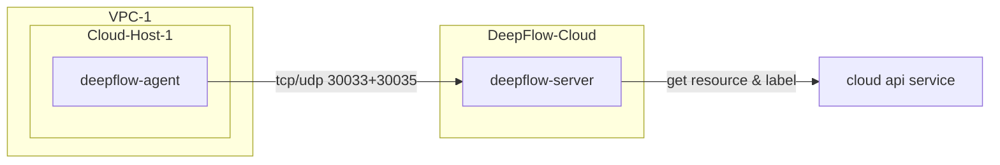

# 简介

本章节将详细介绍如何在您的云服务器中部署 DeepFlow Agent。

DeepFlow Agent 在云服务器中开始运行后，将自动零侵扰采集云服务器中应用的观测数据（AutoMetrics、AutoTracing、AutoProfiling）， 并自动为所有观测数据注入`云资源`标签（AutoTagging）。

- 部署拓扑


# 部署

## 部署前的工作

- **检查云服务器资源**

云服务器资源已成功被 DeepFlow 通过云平台 API 接口学习，是 DeepFlow Agent 在云服务器部署中的前提。
- 如果未录入云平台，请首先录入云平台并配置正确的云平台 API 对接信息，参考[录入云平台](./cloud/)章节说明。
- 如果已录入云平台，请在 DeepFlow 的 Web 页面中检查`资源`-`计算资源`-`云服务器`中通过 IP 搜索，确认云服务器是否已成功学习，操作步骤参考下图：


  

- **获取 `teamId`**
  
`teamId`即`团队 ID`，用于识别 DeepFlow Agent 所属的组织，操作步骤参考下图：


- **新建采集器组并获取 `agentGroupID`**

`agentGroupId`即采集器组 ID，用于识别 DeepFlow Agent 所属的采集器组，操作步骤参考下图：


> 注：创建采集器组的目的是为了配置不同的运行策略，以便于对 DeepFlow Agent 进行运行策略的分组管理。

- **获取安装包**

Docker 环境推荐使用 Docker Compose 模式部署，无需手动获取安装包。

非 Docker 环境，请联系云杉技术支持人员获取安装包。

## 安装 DeepFlow Agent 软件包

::: code-tabs#shell

@tab rpm

```bash
unzip deepflow-agent-rpm.zip
yum -y localinstall x86_64/deepflow-agent-1.0*.rpm
```

@tab deb

```bash
unzip deepflow-agent-deb.zip
dpkg -i x86_64/deepflow-agent-1.0*.systemd.deb
```

@tab docker compose

```bash
touch /etc/deepflow-agent.yaml

cat << EOF > deepflow-agent-docker-compose.yaml
version: '3.2'
services:
  deepflow-agent:
    image: hub.deepflow.yunshan.net/public/deepflow-agent:v6.5
    container_name: deepflow-agent
    restart: always
    #privileged: true  ## Docker version below 20.10.10 requires the opening of the privileged mode, See https://github.com/moby/moby/pull/42836
    cap_add:
      - SYS_ADMIN
      - SYS_RESOURCE
      - SYS_PTRACE
      - NET_ADMIN
      - NET_RAW
      - IPC_LOCK
      - SYSLOG
    volumes:
      - /etc/deepflow-agent.yaml:/etc/deepflow-agent/deepflow-agent.yaml:ro
      - /sys/kernel/debug:/sys/kernel/debug:ro
      - /var/run/docker.sock:/var/run/docker.sock
    network_mode: "host"
    pid: "host"
EOF

docker compose -f deepflow-agent-docker-compose.yaml up -d
```

:::

## 修改 DeepFlow Agent 配置文件

修改 DeepFlow Agent 的配置文件（默认存放位置：`/etc/deepflow-agent.yaml` ）

```yaml
controller-ips:
  - agent.cloud.deepflow.yunshan.net
vtap-group-id-request: 'g-xxxxxxxxxx' # FIXME: agent-group ID
team-id: 't-xxxxxxxxxx' # FIXME: Team ID
```

## 启动 DeepFlow Agent 服务

```bash
systemctl enable deepflow-agent
systemctl restart deepflow-agent
```
