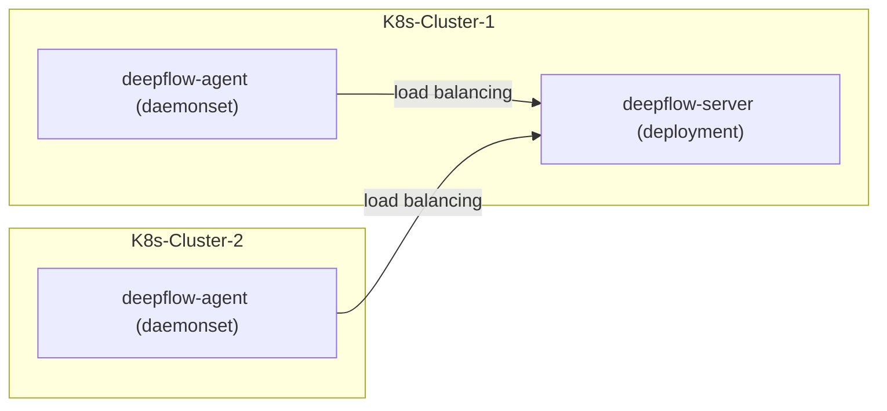

# 简介

假如你要使用 DeepFlow 监控一个新的 K8s 集群。
DeepFlow 能够零侵扰采集所有 Pod 的观测信号（AutoMetrics、AutoTracing、AutoProfiling），
并基于调用 apiserver 获取的信息自动为所有观测数据注入`K8s 资源`和`K8s 自定义 Label`标签（AutoTagging）。

# 准备工作

## 部署拓扑



## 获取 DeepFlow 平台中的 K8s ClusterID

DeepFlow 平台使用公有云的集群 ID 或者随机为每个集群生成一个唯一 ID，从“资源-资源池-云平台”中查看需要部署的集群 ID，形如"g-3aebEkS108"。

## 获取 DeepFlow Agent 镜像

向云杉网络的同学获取 DeepFlow Agent 镜像地址和镜像 tag。

V6.4 版本最新镜像为 `hub.deepflow.yunshan.net/public/deepflow-agent:v6.4`，注意此仓库位于阿里云北京 Region。

# 部署 deepflow-agent

使用 Helm 安装 deepflow-agent：

```bash
cat << EOF > values-custom.yaml
deepflowServerNodeIPS:
- 10.1.2.3  # FIXME: DeepFlow Server Node IPs
- 10.4.5.6  # FIXME: DeepFlow Server Node IPs
deepflowK8sClusterID: "fffffff"  # FIXME: K8s ClusterID
image:
  repository: hub.deepflow.yunshan.net/public/deepflow-agent
  pullPolicy: Always
  # Overrides the image tag whose default is the chart appVersion.
  tag: v6.4
EOF

helm repo add deepflow https://deepflowio.github.io/deepflow
helm repo update deepflow # use `helm repo update` when helm < 3.7.0
helm install deepflow-agent -n deepflow deepflow/deepflow-agent --create-namespace \
    -f values-custom.yaml
```

# 注意

在同一个 K8s 集群中，建议将采集器部署在同一采集器组内。如果出于特定需求必须将它们分散到不同的采集器组，请务必确保所有相关采集器组的 cpu、memory 限制保持一致。此外，请注意远程操作可能带来的影响，例如，通过执行 `kubectl edit` 命令修改某个agent 的 cpu、memory 限制，可能会导致同个采集器组的 agent 进入连续重启的状态。