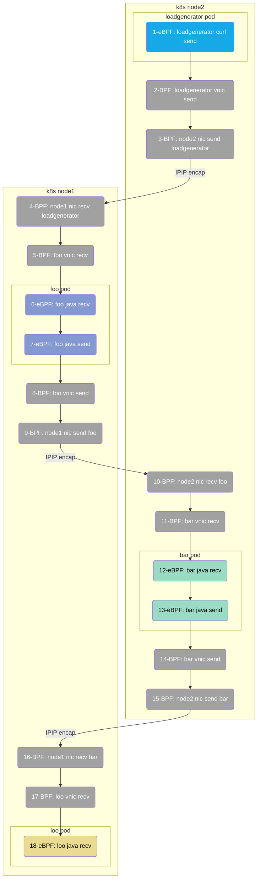

# 简介

本章以一个使用 Spring Boot 开发的微服务应用为例，展示 DeepFlow 的 AutoTracing 能力。

# 部署 Spring Boot Demo

我们使用的 Demo 源自[这个 GitHub 仓库](https://github.com/chanjarster/spring-boot-istio-jaeger-demo)，
它的调用链比较简单：`foo_svc -> bar_svc -> loo_svc`。

使用如下命令可在 K8s 中快速部署 Demo：

```bash
kubectl apply -f https://raw.githubusercontent.com/deepflowio/deepflow-demo/main/DeepFlow-EBPF-Sping-Demo/deepflow-ebpf-spring-demo.yaml
```

这个 Demo 原始的 GitHub 代码仓库中使用 Jaeger 进行了主动追踪，为了演示 AutoTracing 能力我们特意在上述部署脚本中去掉了 Jaeger。

# 查看分布式追踪

前往 Grafana，打开 `Distributed Tracing` Dashboard，选择 `namespace = deepflow-ebpf-spring-demo` 后，可选择一个调用进行追踪，效果如下图：


DeepFlow 的追踪数据中含有三种 Span，跟踪一次请求的整个轨迹：

- N：通过 BPF 从网络流量中提取的 Span
- S：通过 eBPF 从系统或应用函数调用中提取的 Span
- A：通过 OTel 从应用内部采集的 Span

上图中展示了前两种，第三种在[集成 OpenTelemetry](../../integration/input/tracing/opentelemetry/) 可以展示出来。

[访问 DeepFlow Online Demo](https://ce-demo.deepflow.yunshan.net/d/Distributed_Tracing/distributed-tracing?var-namespace=deepflow-ebpf-spring-demo&from=deepflow-doc) 也可查看追踪效果。
上图中的调用链火焰图对应的拓扑图如下。



对这个追踪 Demo 我们总结一下：

- 零插码：整个追踪过程不需要手动插入任何追踪代码，不需要向 HTTP Header 中注入任何 TraceID/SpanID
- 多语言：支持对 Java 语言应用及 C（curl）语言基础服务的追踪
- 全链路：利用 eBPF 和 BPF，自动追踪到了这个 Trace 的 18 个 Span，含 6 个 eBPF Span、12 个 BPF Span
- 全栈：支持追踪跨 K8s Node 上两个 Pod 之间的网络路径，即使中间经过了隧道封装，例如 Span 2-5 等（IPIP 隧道封装）
