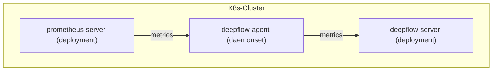

# 数据流



# 配置 Prometheus

## 安装 Prometheus

在 [Prometheus 文档](https://prometheus.io/docs/introduction/overview/)中可了解相关背景知识。
如果你的集群中没有 Prometheus，可用如下步骤在 `deepflow-prometheus-demo` 命名空间中快速部署一个 Prometheus：
```bash
# add helm chart
helm repo add prometheus-community https://prometheus-community.github.io/helm-charts
helm repo update

# install prometheus
helm install prometheus prometheus-community/prometheus -n deepflow-prometheus-demo --create-namespace
```

## 配置 remote_write

我们需要配置 Prometheus `remote_write`，将数据发送给 DeepFlow Agent。

首先确定 DeepFlow Agent 启动的数据监听服务的地址。在[安装 DeepFlow Agent](../../../install/single-k8s/) 后，会显示 DeepFlow Agent Service 地址，它的默认值是 `deepflow-agent.default`，请根据实际的服务名称与命名空间填写到配置中。

执行以下命令可修改 Prometheus 的默认配置（假设它在 `deepflow-prometheus-demo` 中）：
```bash
kubectl edit cm -n deepflow-prometheus-demo prometheus-server
```

配置 `remote_write` 地址（请修改 `DEEPFLOW_AGENT_SVC` 为 deepflow-agent 的服务名）：
```yaml
remote_write:
  - url: http://${DEEPFLOW_AGENT_SVC}/api/v1/prometheus
```

## 配置 remote_read

如果希望 Prometheus 从 DeepFlow 查询数据，需要配置 Prometheus 的 `remote_read`（请修改 `DEEPFLOW_SERVER_SVC` 为 deepflow-server 的服务名）：
```yaml
remote_read:
  - url: http://${DEEPFLOW_SERVER_SVC}/api/v1/prom/read
    read_recent: true
```

# 配置 DeepFlow

请参考[配置 DeepFlow](../tracing/opentelemetry/#配置-deepflow) 一节内容，并添加配置 `prometheus targets api` 地址（v6.2 及以前版本不需要配置），完成 DeepFlow Agent 配置。目的是将 prometheus activeTargets.labels 和 config 同步到 deepflow-server 中，以提升存储和查询性能。

为 Agent 所在的 Group 添加以下配置（请修改 `PROMETHEUS_HTTP_API_ADDRESSES`）:
```yaml
prometheus_http_api_addresses: # 集成 Prometheus 指标时需填写此项
- {PROMETHEUS_HTTP_API_ADDRESSES}
```

# 查看 Prometheus 数据

Prometheus 中的指标将会存储在 DeepFlow 的 `prometheus` database 中。
Prometheus 原有的标签可通过 tag.XXX 引用，指标值通过 value 引用。
同时 DeepFlow 也会自动注入大量的 Meta Tag 和 Custom Tag，使得 Prometheus 采集的数据可以与其他数据源无缝关联。

使用 Grafana，选择 `DeepFlow` 数据源进行搜索时的展现图下图：


