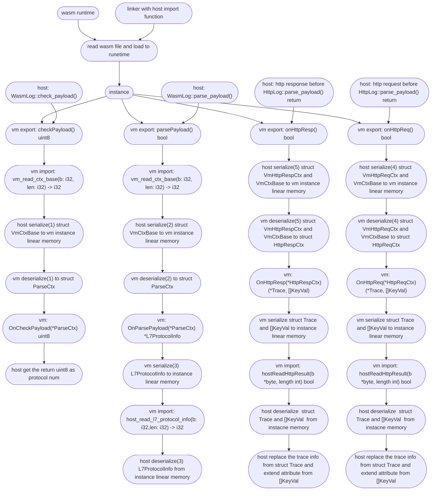

# Wasm plugin 执行流程

在了解 Wasm plugin 的执行流程之前，需要先对 deepflow 的协议解析有一个大概的认识，可以参考 [DeepFlow 协议开发文档](https://github.com/deepflowio/deepflow/blob/main/docs/HOW_TO_SUPPORT_YOUR_PROTOCOL_CN.MD). 

Wasm plugin 的执行流程如下

其中 序列化/反序列化的结构有6个：

- VmCtxBase 
  - 在目前所有的 Export 函数调用的时候， host 会将 VmCtxBase 序列化到线性内存，序列化的格式参考[这里](https://github.com/deepflowio/deepflow/blob/0da738106f710cad9bbce6632384105b1b868e59/agent/src/plugin/wasm/vm.rs#L199)，同样地，instance 也会反序列化，具体代码可以参考[这里](https://github.com/deepflowio/deepflow-wasm-go-sdk/blob/5393818adf94f2f9b296de82e20f614ba3b2336a/sdk/serde.go#L73)。
  
- L7ProtocolInfo
  - 在 Export 函数 parse_payload 最后，instance 会序列化 L7ProtocolInfo 到线性内存，序列化的格式和代码可以参考[这里](https://github.com/deepflowio/deepflow-wasm-go-sdk/blob/5393818adf94f2f9b296de82e20f614ba3b2336a/sdk/serde.go#L335)，host 也会反序列化，代码可以参考[这里](https://github.com/deepflowio/deepflow/blob/0da738106f710cad9bbce6632384105b1b868e59/agent/src/plugin/mod.rs#L152)。
  
- VmHttpReqCtx
  - 在 http 请求解析完成返回之前，会调用 Export 函数 on_http_req，host 会序列化 VmCtxBase 和 VmHttpReqCtx 到 instance 的线性内存，VmHttpReqCtx 的序列化的代码和格式可以参考[这里](https://github.com/deepflowio/deepflow/blob/0da738106f710cad9bbce6632384105b1b868e59/agent/src/plugin/wasm/vm.rs#L328)，instance 反序列化的代码参考[这里](https://github.com/deepflowio/deepflow-wasm-go-sdk/blob/5393818adf94f2f9b296de82e20f614ba3b2336a/sdk/serde.go#L173)。
  
- VmHttpRespCtx
  - 在 http 响应解析完成返回之前，会调用 Export 函数 on_http_resp，host 会序列化 VmCtxBase 和 VmHttpRespCtx 到 instance 的线性内存，VmHttpRespCtx 的序列化的格式参考[这里](https://github.com/deepflowio/deepflow/blob/0da738106f710cad9bbce6632384105b1b868e59/agent/src/plugin/wasm/vm.rs#L395)，instance 反序列化的代码参考[这里](https://github.com/deepflowio/deepflow-wasm-go-sdk/blob/5393818adf94f2f9b296de82e20f614ba3b2336a/sdk/serde.go#L232)。

- Trace，[]KeyVal
  - 在 Export 函数 on_http_req/on_http_resp 返回之前，instance 会将 Trace 和 []KeyVal 序列化到线性内存，序列化的代码和可以参考[这里](https://github.com/deepflowio/deepflow-wasm-go-sdk/blob/5393818adf94f2f9b296de82e20f614ba3b2336a/sdk/serde.go#L515)，反序列化的代码和格式可以参考[这里](https://github.com/deepflowio/deepflow/blob/0da738106f710cad9bbce6632384105b1b868e59/agent/src/plugin/wasm/abi_import.rs#L376)。

