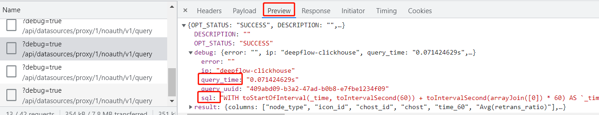

# 慢查询

## 开启 debug 模式

grafana url 中增加 `debug=true` search 参数，例如：

```url
http://your.grafana?debug=true
http://your.grafana?xx=xx&debug=true
```

## 查看 querier 耗时

按 F12 键唤出调试页面，下图以Chrome为例说明排查方法：


- 点击 Network 标签，可以查看API耗时的详细情况
  - 观察 Time 列，可以查看到API的整体耗时
  - 观察 Waterfall，可以直观的看到耗时久的API，水平绿柱（或蓝柱）越长则耗时越久
  - 鼠标悬停瀑布图的某个水平柱上，可显示详情，一般关注 Wating 和 Content Download 两项
    - 前者一般可表示服务端API耗时
    - 后者表示从API首个回复包到最后一个包的时间，通常可结合表格中的`Size`列，内容越大传输越耗时

注意：要先打开F12调试框，再刷新页面才能查看到API调用信息。一般可以在打开F12后切换一下菜单，然后点击上图中左上角第二行、第二列的清除图标，然后再切回需要排查问题的菜单来查看。

## 查看 ClickHouse 耗时

在 Network 标签页中，点击具体的API，可以在 Preview 标签中看到 ClickHouse 中 SQL 语句的执行时间



- 查看 debug 字段，可以看到以下内容：
  - sql 表示在 ClickHouse 中执行的具体 SQL 语句
  - query_time 表示 SQL 语句本身的执行时间
