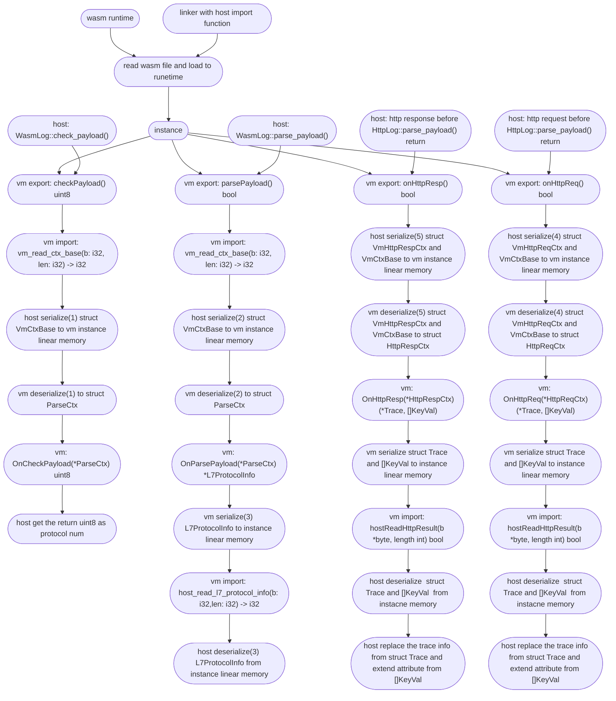

# 关于 Wasm 插件系统

Wasm 插件系统通过在固定的地方调用 Wasi Export Function 实现一些用户自定义的功能，目前已经实现的功能有：
- 自定义协议的解析，例子可以参考[这里](https://github.com/deepflowio/deepflow-wasm-go-sdk/blob/5393818adf94f2f9b296de82e20f614ba3b2336a/example/dns/dns.go)
- HTTPv1 协议增强，例子可以参考[这里](https://github.com/deepflowio/deepflow-wasm-go-sdk/blob/5393818adf94f2f9b296de82e20f614ba3b2336a/example/http/http.go)

关于 Wasm Plugin 的开发你也可以参考这篇博客文章：[使用 DeepFlow Wasm 插件实现业务可观测性](https://deepflow.io/blog/035-deepflow-enabling-zero-code-observability-for-applications-by-webAssembly/)。

# Golang SDK 说明

目前仅提供 Golang 的 SDK，后续会支持更多语言。Golang SDK 编译需要用到 tinygo。下面简单说明一下如何使用 Golang 快速开发插件。

```go
package main

import (
	"github.com/deepflowio/deepflow-wasm-go-sdk/sdk"
	_ "github.com/wasilibs/nottinygc" // 将 nottinygc 作为 TinyGo 编译 WASI 的一个替代内存分配器，默认的内存分配器在数据量大的场景会有性能问题
)

// 定义结构，需要实现 sdk.Parser 接口
type plugin struct {
}

/*
    这里返回数组表示 agent 需要在哪些地方掉起插件对应的 Export 函数，目前有下面3个 hook 点：
        HOOK_POINT_HTTP_REQ       表示 http 请求解析完成返回之前
        HOOK_POINT_HTTP_RESP      表示 http 响应解析完成返回之前
        HOOK_POINT_PAYLOAD_PARSE  表示协议的判断和解析
*/
func (p plugin) HookIn() []sdk.HookBitmap {
	return []sdk.HookBitmap{
		sdk.HOOK_POINT_HTTP_REQ,
		sdk.HOOK_POINT_HTTP_RESP,
        sdk.HOOK_POINT_PAYLOAD_PARSE,
	}
}

// HookIn() 包含 HOOK_POINT_HTTP_REQ 时，http 请求解析完成返回之前会调用。
// HttpReqCtx 包含了 BaseCtx 和已经解析出来的一些 http 头部
func (p plugin) OnHttpReq(ctx *sdk.HttpReqCtx) sdk.Action {
    // baseCtx 包括一些 ip，port，4层协议，包方向等信息
    baseCtx := &ctx.BaseCtx

    // 可选过滤端口和路径
	if baseCtx.DstPort != 8080 || !strings.HasPrefix(ctx.Path, "/user_info?") {
		return sdk.ActionNext()
	}

    // payload 就是应用层数据，可能会被截断
	payload, err := baseCtx.GetPayload()
    if err != nil {
		return sdk.ActionAbortWithErr(err)
	}

    var(
        trace = &sdk.Trace{}
        attr = []sdk.KeyVal{}
    )

    // some logic here
    //...

    // 返回结果
    return sdk.HttpReqActionAbortWithResult(nil, trace, attr)
}


/*
    HookIn() 包含 HOOK_POINT_HTTP_RESP 时，http 响应解析完成返回之前会调用。
    HttpRespCtx 包含了 BaseCtx 和响应码
    其余处理基本和 OnHttpReq 一致
*/
func (p plugin) OnHttpResp(ctx *sdk.HttpRespCtx) sdk.Action {
    return sdk.ActionNext()
}

/*
    HookIn() 包含 HOOK_POINT_PAYLOAD_PARSE 时，在协议判断时会调用
    需要返回一个唯一协议号和协议名称，协议号返回 0 表示失败
*/
func (p plugin) OnCheckPayload(baseCtx *sdk.ParseCtx) (uint8, string) {
	return 0, ""
}

func (p plugin) OnParsePayload(baseCtx *sdk.ParseCtx) sdk.ParseAction {
    // ctx.L7 就是 OnCheckPayload 返回的协议号，可以先根据4层协议或协议号过滤。
    if ctx.L4 != sdk.TCP || ctx.L7 != 1 {
		return sdk.ActionNext()
	}

	payload, err := ctx.GetPayload()
	if err != nil {
		return sdk.ActionAbortWithErr(err)
	}
    // the parse logic here
    // ...

    /*
        关于 L7ProtocolInfo 结构：
            type L7ProtocolInfo struct {
                ReqLen    *int       // 请求长度 例如 http 的 content-length
                RespLen   *int       // 响应长度 例如 http 的 content-length
                RequestID *uint32    // 子流的id标识，例如 http2 的 stream id，dns 的 transaction id
                Req       *Request
                Resp      *Response
                Trace     *Trace     // 跟踪信息
                Kv        []KeyVal   // 对应 attribute
            }

            type Request struct {
                ReqType  string  // 对应请求类型
                Domain   string  // 对应请求域名
                Resource string  // 对应请求资源
                Endpoint string  // 对应 endpoint
            }

            type Response struct {
                Status    RespStatus // 对应响应状态
                Code      *int32     // 对应响应码
                Result    string     // 对应响应结果
                Exception string     // 对应响应异常
            }
    */
    return sdk.ParseActionAbortWithL7Info([]*sdk.L7ProtocolInfo{})
}


// main 需要注册解析器
func main() {
    sdk.SetParser(plugin{})
	sdk.Warn("xxx wasm plugin registered")
}
// 关于返回值
/*
    agent 可以加载多个 wasm 插件，agent 会遍历所有插件调用对应的 Export 函数，但是遍历的行为可以通过返回值控制

    返回值有以下几种：
        sdk.ActionNext()                 停止当前插件，直接执行下一个插件
        sdk.ActionAbort()                停止当前插件并且停止遍历
        sdk.ActionAbortWithErr(err)      停止当前插件，打印错误日志并且停止遍历

        sdk.HttpActionAbortWithResult()
        sdk.ParseActionAbortWithL7Info()  agent 停止遍历并且提取相应返回结果
*/
```

# 编译与加载插件

## 编译插件

使用下面的命令编译得到 Wasm 程序

```sh
# 使用 nottinygc 替换 TinyGo 原来的内存分配器需要增加编译参数：-gc=custom 和 -tags=custommalloc
tinygo build -o wasm.wasm -gc=custom -tags=custommalloc -target=wasi -panic=trap -scheduler=none -no-debug ./main.go
```

## 上传插件

将 wasm 文件上传到对应的节点上，执行
```sh
deepflow-ctl plugin create  --type wasm --image wasm.wasm --name wasm
```

## 加载插件

在配置中添加
```
wasm-plugins:
  - wasm // 对应 deepflow-ctl 上传插件的名称
```

# 相关问题和限制

- 不能使用 go func()， 可以去掉 -scheduler=none 参数让编译通过但是并不会得到理想的效果
- 不能使用 time.Sleep() ，这回导致 Wasm 插件不能加载
- 如果插件执行时间太长，将会长时间阻塞agent的执行，如果执行死循环，那么 agent 会一直阻塞
- tinygo 对于 go 的标准库和第三方库有一定的限制，并非任意 go 代码或库都可以使用，对于标准库，tinygo 支持的情况可以参考[tinygo package supported](https://tinygo.org/docs/reference/lang-support/stdlib/)。需要提醒的是，这里的列表仅供参考，Passes tests 显示 no 并非完全不能使用，例如 fmt.Sprintf() 可以使用但 fmt.Println() 就不能使用。
- 由于 go 1.21 版本开始支持 wasi，如果需要使用 builtin 的序列化相关的库（json，yaml，xml 等等） 需要使用 go 版本不低于 1.21 并且 tinygo 版本需要不低于 0.29。
- 从 Parser 返回的结构(L7ProtocolInfo, Trace, []KeyVal)会序列化到线性内存，目前对于每个结构的序列化申请的内存固定为 1 page (65536 bytes)，如果返回的结构太大会导致序列化失败。
- agent 通过遍历所有支持的协议来判断一个流的应用层协议，目前的顺序是 HTTP -> Wasm Hook -> DNS -> ... ，Wasm 的优先级仅次于 HTTP，所以用户定义的协议判断和解析可以重写 agent 已有的协议判断和解析(HTTP/HTTP2 除外)，例如[这个例子](https://github.com/deepflowio/deepflow-wasm-go-sdk/blob/5393818adf94f2f9b296de82e20f614ba3b2336a/example/dns/dns.go)中，可以重写 DNS 解析，Agent 将不会执行默认的 DNS 解析逻辑。
- 由于网络环境和协议的复杂性，有可能会接收到不完整的应用层数据帧，例如 MTU 限制导致 IP 分片，TCP 对端接收窗口或者流控拥堵窗口收缩，MSS 过小等原因导致获取不到完整的应用层数据帧，目前尚未实现传输层连接跟踪。另外应用层数据太长也会被截断。

# Wasm plugin 执行流程

在了解 Wasm plugin 的执行流程之前，需要先对 deepflow 的协议解析有一个大概的认识，可以参考 [DeepFlow 协议开发文档](https://github.com/deepflowio/deepflow/blob/main/docs/HOW_TO_SUPPORT_YOUR_PROTOCOL_CN.MD).

Wasm plugin 的执行流程如下



其中 序列化/反序列化的结构有6个：
- VmCtxBase
  - 在目前所有的 Export 函数调用的时候，host 会将 VmCtxBase 序列化到线性内存，序列化的格式参考[这里](https://github.com/deepflowio/deepflow/blob/0da738106f710cad9bbce6632384105b1b868e59/agent/src/plugin/wasm/vm.rs#L199)
  - 同样地，instance 也会反序列化，具体代码可以参考[这里](https://github.com/deepflowio/deepflow-wasm-go-sdk/blob/5393818adf94f2f9b296de82e20f614ba3b2336a/sdk/serde.go#L73)。
- L7ProtocolInfo
  - 在 Export 函数 parse_payload 最后，instance 会序列化 L7ProtocolInfo 到线性内存，序列化的格式和代码可以参考[这里](https://github.com/deepflowio/deepflow-wasm-go-sdk/blob/5393818adf94f2f9b296de82e20f614ba3b2336a/sdk/serde.go#L335)
  - host 也会反序列化，代码可以参考[这里](https://github.com/deepflowio/deepflow/blob/0da738106f710cad9bbce6632384105b1b868e59/agent/src/plugin/mod.rs#L152)。
- VmHttpReqCtx
  - 在 http 请求解析完成返回之前，会调用 Export 函数 on_http_req，host 会序列化 VmCtxBase 和 VmHttpReqCtx 到 instance 的线性内存
  - VmHttpReqCtx 的序列化的代码和格式可以参考[这里](https://github.com/deepflowio/deepflow/blob/0da738106f710cad9bbce6632384105b1b868e59/agent/src/plugin/wasm/vm.rs#L328)
  - instance 反序列化的代码参考[这里](https://github.com/deepflowio/deepflow-wasm-go-sdk/blob/5393818adf94f2f9b296de82e20f614ba3b2336a/sdk/serde.go#L173)。
- VmHttpRespCtx
  - 在 http 响应解析完成返回之前，会调用 Export 函数 on_http_resp，host 会序列化 VmCtxBase 和 VmHttpRespCtx 到 instance 的线性内存
  - VmHttpRespCtx 的序列化的格式参考[这里](https://github.com/deepflowio/deepflow/blob/0da738106f710cad9bbce6632384105b1b868e59/agent/src/plugin/wasm/vm.rs#L395)
  - instance 反序列化的代码参考[这里](https://github.com/deepflowio/deepflow-wasm-go-sdk/blob/5393818adf94f2f9b296de82e20f614ba3b2336a/sdk/serde.go#L232)。
- Trace，[]KeyVal
  - 在 Export 函数 on_http_req/on_http_resp 返回之前，instance 会将 Trace 和 []KeyVal 序列化到线性内存
  - 序列化的代码和可以参考[这里](https://github.com/deepflowio/deepflow-wasm-go-sdk/blob/5393818adf94f2f9b296de82e20f614ba3b2336a/sdk/serde.go#L515)
  - 反序列化的代码和格式可以参考[这里](https://github.com/deepflowio/deepflow/blob/0da738106f710cad9bbce6632384105b1b868e59/agent/src/plugin/wasm/abi_import.rs#L376)。
