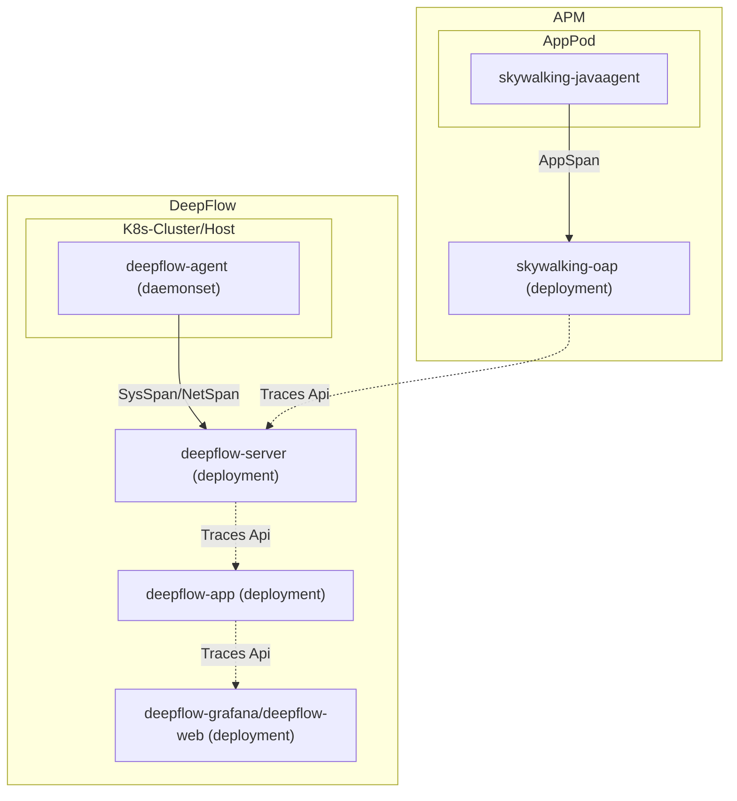

# 简介

DeepFlow 实现了获取外部 APM 的 APP Span 的能力，并将 APP Span 与 DeepFlow 采集到的追踪数据进行关联，目前仅支持了 SkyWalking 作为外部 APM 存储。应用无需做任何修改，只需要修改 DeepFlow 配置即可得到 DeepFlow 的全链路、零插桩追踪能力。

# 数据流



# 配置

修改 DeepFlow Server 的[配置](https://github.com/deepflowio/deepflow/blob/main/server/server.yaml)，添加如下内容：

```yaml
querier:
  external-apm:
  - name: skywalking
    addr: 127.0.0.1:12800 # FIXME: 这里填写为 SkyWalking OAP Server 的地址，12800 端口为 HTTP 服务默认端口
```

同时，需要修改 DeepFlow App 的[配置](https://github.com/deepflowio/deepflow-app/blob/main/app/app.yaml)，将以下值修改为 `true` 即可：

```yaml
app:
  spec:
    call_apm_api_to_supplement_trace: true
```
