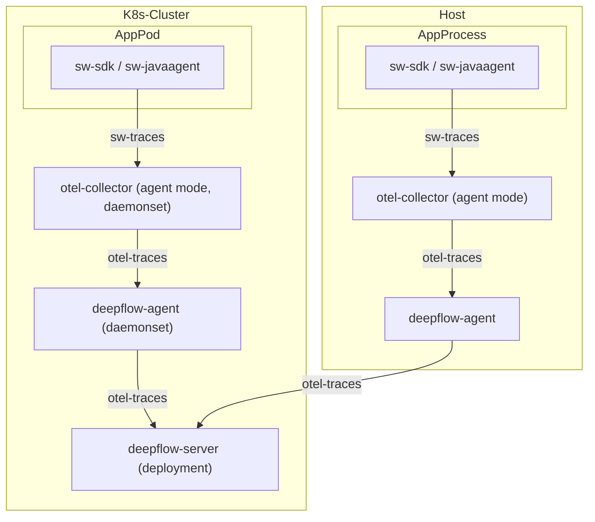

# 数据流



# 通过 DeepFlow Agent 发送

DeepFlow v6.6 及之后的企业版版本，支持直接通过 DeepFlow Agent 直接接收并发送 SkyWalking 数据，无需额外配置。

# 通过 OpenTelemtry Collector Receiver 发送

## 背景知识

你可以查看 [OpenTelemetry 文档](https://opentelemetry.io/docs/) 了解 OpenTelemetry 背景知识，并参考前序章节中的 [OpenTelemetry 安装](../tracing/opentelemetry/#配置-opentelemetry) 快速安装 OpenTelemetry。

你可以查看 [SkyWalking 文档](https://skywalking.apache.org/docs/) 了解 SkyWalking 背景知识，这个 Demo 不需要安装完整的 SkyWalking ，我们将使用 OpenTelemetry 来集成 SkyWalking 的 Trace 数据。

## 确认 OpenTelemetry 版本

首先，你需要开启 OpenTelemetry 的 SkyWalking 数据接收能力，将数据经过 OpenTelemetry 标准协议处理之后，发送到 DeepFlow Agent。

OpenTelemetry 接收 SkyWalking 数据存在 Bug，最近我们在 [#11562](https://github.com/open-telemetry/opentelemetry-collector-contrib/pull/11562) 与 [#12651](https://github.com/open-telemetry/opentelemetry-collector-contrib/pull/12651) 这两个 PR 中进行了修复，接下来的 Demo 我们需要 OpenTelemetry 的 [Collector 镜像](https://hub.docker.com/r/otel/opentelemetry-collector-contrib) 版本 `>= 0.57.0`。请检查你的环境中 otel-agent 的镜像版本，并确保它符合要求。可参考前序章节中的 [OpenTelemetry 安装](../tracing/opentelemetry/#配置-otel-agent)，更新你的环境中的 otel-agent 版本。

## 配置 OpenTelemetry 接收 SkyWalking 数据

在[背景知识](#背景知识)一节中，安装好 OpenTelemetry 之后，我们可以使用如下步骤配置 OpenTelemetry 接收 SkyWalking 数据:

假设 OpenTelemetry 所在的命名空间为 `open-telemetry`，假设 otel-agent 使用的 ConfigMap 名为 `otel-agent-conf`，使用如下命令修改 otel-agent 配置：

```bash
kubectl -n open-telemetry edit cm otel-agent-conf
```

在 `receivers` 一节中，增加如下内容：

```yaml
receivers:
  # add the following config
  skywalking:
    protocols:
      grpc:
        endpoint: 0.0.0.0:11800
      http:
        endpoint: 0.0.0.0:12800
```

在 ``service.pipelines.traces` 一节中，增加如下内容：

```yaml
service:
  pipelines:
    traces:
      # add receiver `skywalking`
      receivers: [skywalking]
```

同时，确认 `otel-agent-conf` 中参照[配置 otel-agent](../tracing/opentelemetry/#配置-otel-agent) 一节的内容完成了对应的配置。

接着，使用如下命令修改 otel-agent Service，开放对应端口：

```bash
kubectl -n open-telemetry patch service otel-agent -p '{"spec":{"ports":[{"name":"sw-http","port":12800,"protocol":"TCP","targetPort":12800},{"name":"sw-grpc","port":11800,"protocol":"TCP","targetPort":11800}]}}'
```

最后，重启 otel-agent 完成 otel-agent 更新：

```bash
kubectl rollout restart -n open-telemetry daemonset/otel-agent
```

# 修改 SkyWalking 发送配置

最后，检查应用中配置的 [SkyWalking OAP Server](https://skywalking.apache.org/docs/main/next/en/setup/backend/backend-setup/#requirements-and-default-settings) 的对接地址，并修改为 Otel Agent 的 Service 地址：`otel-agent.open-telemetry`，比如将环境变量 `SW_AGENT_COLLECTOR_BACKEND_SERVICES=oap-server:11800` 修改为 `SW_AGENT_COLLECTOR_BACKEND_SERVICES=otel-agent.open-telemetry:11800`；如果是使用 DeepFlow Agent 直接接收，修改为 `deepflow-agent.deepflow` 即可。

当然，应用配置的上报地址可能有各种形式，请根据应用实际启动命令修改，对于 `Java` 应用而言，只需要确保能修改启动命令中注入的地址即可，如：`-Dskywalking.collector.backend_service=otel-agent.open-telemetry:11800`。

# 配置 DeepFlow

请参考 [配置 DeepFlow](../tracing/opentelemetry/#配置-deepflow) 一节内容，完成 DeepFlow Agent 的配置。

# 基于 WebShop Demo 体验

## 部署 Demo

此 Demo 来源于 [这个 GitHub 仓库](https://github.com/liuzhibin-cn/my-demo)，这是一个基于 Spring Boot 编写的由五个微服务组成的 WebShop 应用，其架构如下：


使用如下命令可以一键部署这个 Demo，这个 Demo 已经完成了上报地址的配置，不需要再对它做额外修改。

```bash
kubectl apply -f https://raw.githubusercontent.com/deepflowio/deepflow-demo/main/DeepFlow-Otel-SkyWalking-Demo/deepflow-otel-skywalking-demo.yaml
```

## 查看追踪数据

前往 Grafana，打开 `Distributed Tracing` Dashboard，选择 `namespace = deepflow-otel-skywalking-demo` 后，可选择一个调用进行追踪。
DeepFlow 能够将 SkyWalking、eBPF、BPF 获取到的追踪数据关联展示在一个 Trace 火焰图中，
覆盖一个 Spring Boot 应用从业务代码、系统函数、网络接口的全栈调用路径，实现真正的全链路分布式追踪，效果如下：


你也可以访问 [DeepFlow Online Demo](https://ce-demo.deepflow.yunshan.net/d/Distributed_Tracing/distributed-tracing?var-namespace=deepflow-otel-skywalking-demo&from=deepflow-doc) 查看效果。
