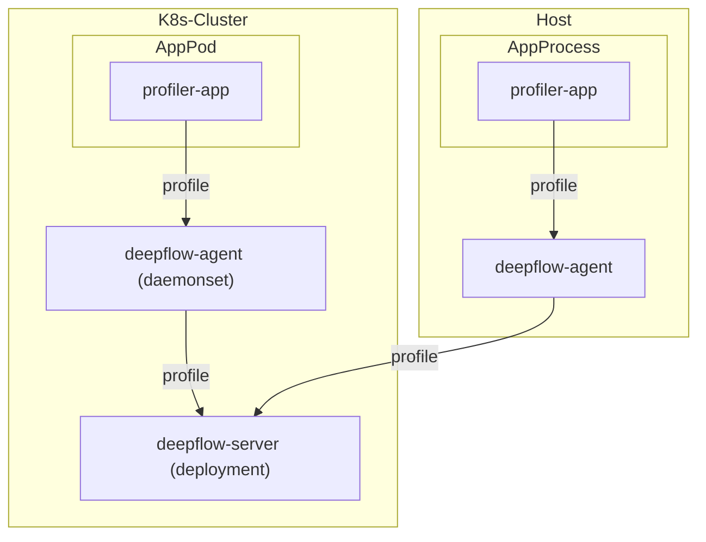

# 数据流



# 配置应用

目前 DeepFlow 支持基于 [Pyroscope](https://github.com/grafana/pyroscope) 以及 Golang pprof、Java Jfr 的 Profile 数据（持续性能剖析数据）集成。

## 基于 Pyroscope SDK

DeepFlow 目前支持以 Pyroscope SDK 为基础发送的 Profile 数据接入，可以在 [Pyroscope SDKs](https://grafana.com/docs/pyroscope/latest/configure-client/#pyroscope-sdks-sdk-instrumentation) 文档中找到受支持的语言的 SDK，并在代码中完成插桩。

在代码修改之后，在应用的运行环境中通过环境变量的方式将目标发送地址修改为 DeepFlow Agent 即可，以 K8S 部署为例，在部署文件中加入如下环境变量：

```yaml
env:
- name: PYROSCOPE_SERVER_ADDRESS
  value: http://deepflow-agent.deepflow/api/v1/profile
```

此外，为了在 DeepFlow 中标识不同的数据来源，需要显式标注应用名称，增加如下环境变量：

```yaml
env:
- name: PYROSCOPE_APPLICATION_NAME
  value: application-demo # FIXME: 你的应用名称
```

## 基于 Golang pprof

基于 Golang pprof 采集到的 Profile 数据，同样可以发送到 DeepFlow，但需要手动增加主动上报的代码逻辑。你可以通过 ["net/http/pprof"](https://pkg.go.dev/net/http/pprof) 采集 Profile 数据，并公开数据下载服务，客户端请求 `/debug/pprof/profile` 接口获取到目标 pprof 数据之后发送到 DeepFlow 即可。

以下是一段构建上报逻辑的参考代码：

```go
func main() {
  // 注意，这里实际用的 URL 为 `/api/v1/profile/ingest`
  deepflowAgentAddress = "http://deepflow-agent.deepflow/api/v1/profile/ingest"
  var pprof io.Reader // FIXME: 此为示例，请先从 `/debug/pprof/profile` 获取到 pprof 数据
	err = sendProfileData(pprof, deepflowAgentAddress)
	if err != nil {
		fmt.Println(err)
	}
}

// 构建发送请求
func sendProfileData(pprof io.Reader, remoteURL string) error {
	bodyBuf := &bytes.Buffer{}
	bodyWriter := multipart.NewWriter(bodyBuf)
	pprofWriter, err := bodyWriter.CreateFormFile("profile", "profile.pprof")
	if err != nil {
		return err
	}

	_, err = io.Copy(pprofWriter, pprof)
	if err != nil {
		return err
	}

	err = bodyWriter.Close()
	if err != nil {
		return err
	}

	u, err := url.Parse(remoteURL)
	if err != nil {
		return err
	}

	q := u.Query()
	q.Set("spyName", "gospy")                            // hardcode，无需修改
	q.Set("name", "application-demo")                    // FIXME: 你的应用名称
	q.Set("unit", "samples");                            // FIXME: 取值单位，见下方说明
	q.Set("from", strconv.Itoa(int(time.Now().Unix())))  // FIXME: profile 开始时间
	q.Set("until", strconv.Itoa(int(time.Now().Unix()))) // FIXME: profile 结束时间
	q.Set("sampleRate", "100")                           // FIXME: profile 的真实采样率，采样率100=1s/10ms，也即 10ms 采样一次
	u.RawQuery = q.Encode()

	req, err := http.NewRequest(http.MethodPost, u.String(), bodyBuf)
	if err != nil {
		return err
	}
	req.Header.Set("Content-Type", bodyWriter.FormDataContentType())

	// 发送请求
	client := http.Client{}
	resp, err := client.Do(req)
	if err != nil {
		return err
	}
	defer resp.Body.Close()

	if resp.StatusCode != http.StatusOK {
		return fmt.Errorf("server returned non-OK status: %s", resp.Status)
	}

	return nil
}
```

## 基于 Java Async Profiler

对于 Java 应用，我们支持接收 [JFR](https://docs.oracle.com/javacomponents/jmc-5-4/jfr-runtime-guide/about.htm) 格式的 Profile 数据，用 Java 自带的 [jcmd](https://docs.oracle.com/javase/8/docs/technotes/guides/troubleshoot/tooldescr006.html) 或 [async-profiler](https://github.com/async-profiler/async-profiler) 采集 Profile 数据并生成 Jfr 格式发送到 DeepFlow 即可。

以下是一段构建上报逻辑的参考代码：

```java
import okhttp3.*;
import okio.BufferedSink;
import okio.GzipSink;
import okio.Okio;

import java.io.IOException;

public class Sender {
	// 注意，这里实际用的 URL 为 `/api/v1/profile/ingest`
    private static final String DEEPFLOW_AGENT_ADDRESS = "http://deepflow-agent.deepflow/api/v1/profile/ingest";

    public static void main(String[] args) throws IOException {
        sendProfileData(DEEPFLOW_AGENT_ADDRESS);
    }

    private static void sendProfileData(String remoteURL) throws IOException {
        OkHttpClient client = new OkHttpClient();

        byte[] data = new byte[] {}; // FIXME: 此为示例，请使用 profile 工具获取 Jfr 内容后上报
        MediaType mediaType = MediaType.parse("application/octet-stream");

        RequestBody requestBody = new RequestBody() {
            @Override
            public MediaType contentType() {
                return mediaType;
            }

			// 使用 Gzip 进行压缩后传输
            @Override
            public void writeTo(BufferedSink sink) throws IOException {
                BufferedSink gzipSink = Okio.buffer(new GzipSink(sink));
                gzipSink.write(data);
                gzipSink.close();
            }
        };

        HttpUrl.Builder urlBuilder = HttpUrl.parse(remoteURL).newBuilder();
        urlBuilder.addQueryParameter("name", "application-demo"); // FIXME: 你的应用名称
        urlBuilder.addQueryParameter("spyName", "javaspy"); // hardcode，无需修改
        urlBuilder.addQueryParameter("format", "jfr"); // hardcode，无需修改
        urlBuilder.addQueryParameter("unit", "samples"); // FIXME: 取值单位，见下方说明
        urlBuilder.addQueryParameter("from", String.valueOf(System.currentTimeMillis() / 1000)); // FIXME: profile 开始时间
        urlBuilder.addQueryParameter("until", String.valueOf(System.currentTimeMillis() / 1000));// FIXME: profile 结束时间
        urlBuilder.addQueryParameter("sampleRate", "100"); // FIXME: profile 的真实采样率，采样率100=1s/10ms，也即 10ms 采样一次
        String urlWithQueryParams = urlBuilder.build().toString();

        Request request = new Request.Builder()
                .url(urlWithQueryParams)
                .post(requestBody)
                .build();

        try (Response response = client.newCall(request).execute()) {
            if (response.isSuccessful()) {
                System.out.println("Profile data sent successfully.");
            } else {
                System.err.println("server returned non-OK status: " + response.code());
            }
        }
    }
}
```

## 上报参数说明

| 名称 | 类型 | 描述 |
| --- | --- | --- |
| name | string | 应用名称，用于标识上报数据，可额外带上自定义标签标记同一个应用的不同部署规格，如：`application-demo{region="cn",deploy="prod"}` |
| spyName | string | 用于标记上报数据类型，Golang 应用固定为 `gospy`，Java 应用固定为 `javaspy` |
| format | string | profile 数据格式，Golang 采集 pprof 格式为 `pprof` (缺省)，Java 采集 jfr 格式为 `jfr` |
| unit | string | 取值单位，对于不同的采样类型，有不同的单位，可参考[此处](https://github.com/deepflowio/deepflow/blob/v6.4.9/server/ingester/profile/dbwriter/profile.go#L99)，具体含义为：`cpu` 用 `samples` (样本数) 作为单位，`memory` 用 `bytes`（字节数）作为单位，其他类同 |
| from | int | profile 开始时间，Unix 时间戳（秒）|
| until | int | profile 结束时间，Unix 时间戳（秒）|
| sampleRate | int | profile 的真实采样率 |

# 配置 DeepFlow

请参考 [配置 DeepFlow](../tracing/opentelemetry/#配置-deepflow) 一节内容，完成 DeepFlow Agent 的配置，打开数据集成端口。

# 基于 Demo 体验

通过如下命令，快速部署 Demo 在 DeepFlow 中体验持续剖析能力：

::: code-tabs#shell

@tab Golang

```bash
kubectl apply -f https://raw.githubusercontent.com/deepflowio/deepflow-demo/main/DeepFlow-CP-Demo/deepflow-cp-golang-demo.yaml
```

@tab Java

```bash
kubectl apply -f https://raw.githubusercontent.com/deepflowio/deepflow-demo/main/DeepFlow-CP-Demo/deepflow-cp-java-demo.yaml
```

:::

然后，社区版可参考 [Auto Profiling](../../../features/continuous-profiling/auto-profiling/#结果查看) 一节内容获取到持续剖析产生的数据。
