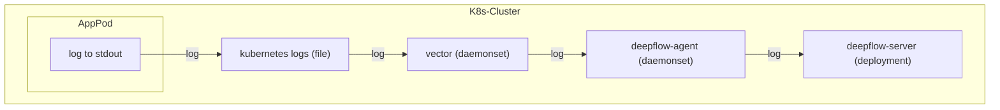

# 数据流



# 配置 Vector

## 采集日志

安装了 Vector 之后，我们可以通过 [Kubernetes_Log](https://vector.dev/docs/reference/configuration/sources/kubernetes_logs/) 模块获取部署在 Kubernetes 中的 Pod 日志，由于 DeepFlow 已经通过 AutoTagging 机制主动学习了 Kubernetes 中 Pod 相关的 Label 和 Annotations，所以发送日志流可以去掉这部分内容以减少传输量，示例配置如下：
```yaml
sources:
  kubernetes_logs:
    type: kubernetes_logs
    namespace_annotation_fields:
      namespace_labels: ""
    node_annotation_fields:
      node_labels: ""
    pod_annotation_fields:
      pod_annotations: ""
      pod_labels: ""
```

## 注入标签

然后，我们可以通过 Transforms 中的 [Remap](https://vector.dev/docs/reference/configuration/transforms/remap/) 模块，对发送的日志打上必要的标签。目前，我们要求打上这两个标签：`_df_log_type` 与 `level`。下面是一份示例配置：
```yaml
transforms:
  remap_kubernetes_logs:
    type: remap
    inputs:
    - kubernetes_logs
    source: |-
        # try to parse json
        if is_string(.message) && is_json(string!(.message)) {
            tags = parse_json(.message) ?? {}
            .message = tags.message # FIXME: the log content key inside json
            del(tags.message)
            .json = tags
        }

        if !exists(.level) {
           if exists(.json) {
              .level = .json.level
              del(.json.level)
           } else {
             level_tags = parse_regex(.message, r'[\s\[](?<level>INFO|WARN|WARNING|DEBUG|ERROR|TRACE|FATAL)[\s\]]') ?? {}
                .level = level_tags.level
             }
           }
        }

        if !exists(._df_log_type) {
            # default log type
            ._df_log_type = "user"
        }

        if !exists(.app_serivce) {
            .app_serivce = .kubernetes.container_name
        }
```

这段代码片段里，我们假定可能获取到 json 格式的日志内容及非 json 格式的这两类日志内容。对于这两类日志，我们都尝试提取它的日志等级 `level`。对 json 格式的日志，我们把它的内容提取到外层的 `message` 字段，并将剩余的所有 json key 放入名为 `json` 的字段中。在这段代码的最后，我们为这两类日志打上 `_df_log_type=user` 及 `app_service=kubernetes.container_name` 两个标签。

如果实际使用中，有更丰富的日志格式需要匹配，可参考 [Vrl](https://vector.dev/docs/reference/vrl/) 语法规则，自定义你的日志提取规则。

## 发送

最后，我们通过 [HTTP](https://vector.dev/docs/reference/configuration/sinks/http/) 模块，将日志发送到 DeepFlow Agent 中。
```yaml
sinks:
  http:
    encoding:
      codec: json
    inputs:
    - remap_kubernetes_logs # NOTE: 注意这里数据源是 transform 模块的 key
    type: http
    uri: http://deepflow-agent.deepflow/api/v1/log
```

将这三个模块组合到一起，即可实现采集日志、注入标签并最终发送到 DeepFlow。

# 配置 DeepFlow

为了让 DeepFlow Agent 可以接收这部分数据，请参考 [配置 DeepFlow](../tracing/opentelemetry/#配置-deepflow) 一节内容，完成 DeepFlow Agent 的配置。
