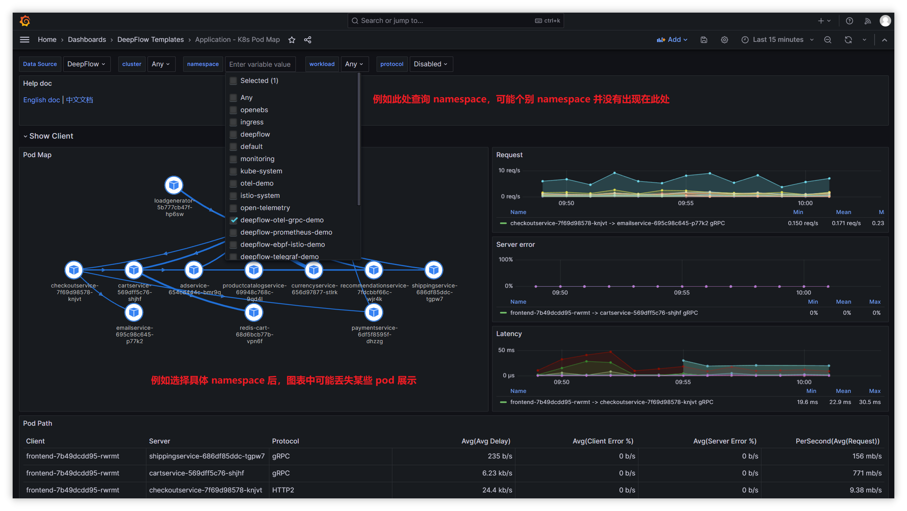
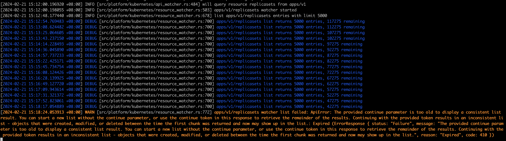
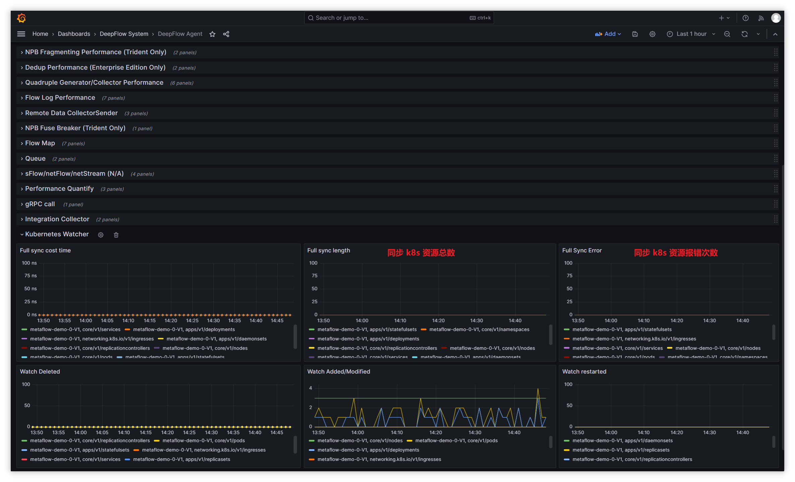

# Dashboard 面板找不到 kubernetes 资源
> 具体表现如下图所示: 在与 Pod 相关的面板中，缺少或丢失某些 Pod 或 namespace （可能丢了一两个，也有可能丢了很多）



**Step 1. 检查集群内 deepflow-agent 状态**
```
  ## deepflow server 端查看 agent 运行状态，NORMAL 为正常
  deepflow-ctl agent list
```

**Step 2. 通过添加变量，输出 agent debug 日志**


```
  ## agent pod 添加环境变量:
  ## 运行后日志中 grep replicasets，查看日志信息为 DEBUG 中，展示的每查询一页 (kubernetes-api-list-limit) 所需时间总和是否 > 5min
      - name: RUST_LOG
        value=info,deepflow_agent::platform::kubernetes::resource_watcher=debug
```

如果日志输出过多，不便查看时，可直接通过 DeepFlow System - DeepFlow Agent 面板查看同步数据


**Step 3. 同步资源过多解决方案**
> 如 Step 2 所述，deepflow-agent 默认每次同步 1000 条 k8s 资源信息，而 k8s 默认 continue 令牌过期时间为 5min，超出此时间会导致同步中断
> continue 令牌作用:
> - https://kubernetes.io/zh-cn/docs/reference/kubernetes-api/common-parameters/common-parameters/#continue
> - https://kubernetes.io/zh-cn/docs/reference/using-api/api-concepts/#retrieving-large-results-sets-in-chunks

解决方案:
  - 方案一：调大单页查询量（kubernetes-api-list-limit）
  https://github.com/deepflowio/deepflow/blob/main/server/agent_config/example.yaml#L468
  - 方案二：调大 continue 令牌过期时间（--etcd-compaction-interval）
  https://stackoverflow.com/questions/63664353/how-to-modify-default-expired-time-of-continue-token-in-kubernetes
