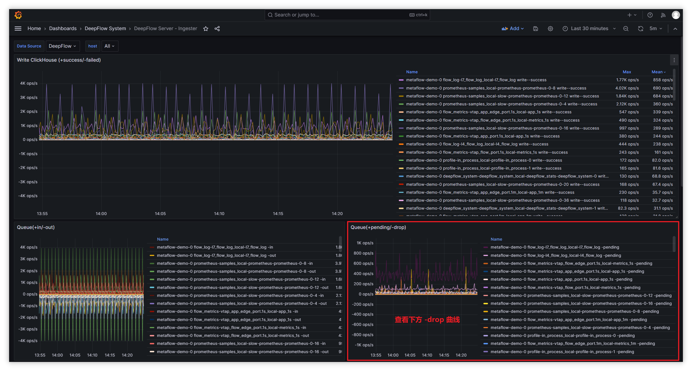

# deepflow-server 丢包原因排查
- 影响因素:
  - server 性能瓶颈
    - 通过 DeepFlow Server Dashboard 查看 CPU、内存 瓶颈，如果为跑满，则说明非 server 瓶颈
  - clickhouse 性能瓶颈
    - 通过如下查询语句，判断 clickhouse 写入性能
      ```SQL
      -- 单个 clickhouse 的接收性能：
      -- written_rows / (qurey_duration_ms/1000）* server 写⼊线程数(ingester.flow-ck-writer.queue_count)

      SELECT event_time,query_duration_ms,written_rows,written_bytes,query
      FROM system.query_log
      WHERE event_time>now()-1000 AND query LIKE '%INSERT INTO%'
      ORDER BY query_duration_ms
      DESC limit 10 
      ```
      ```SQL
      -- server 每秒平均写入 clickhouse 数据

      SELECT tag_values[1] AS host, AVG(metrics_float_values[4])/10 AS written_per_s, AVG(metrics_float_values[3])/10 AS drop_per_s
      FROM deepflow_system.deepflow_system 
      WHERE virtual_table_name='deepflow_server_ingester_ckwriter'
      GROUP BY host
      ORDER BY written_per_s
      DESC limit 30;
      ```
      ```SQL
      -- server 丢包队列查看方式

      SELECT tag_values[1] AS host, tag_values[3] AS queue, AVG(metrics_float_values[1])/10 AS avg_total_per_s, AVG(metrics_float_values[2])/10 AS avg_handled_per_s, AVG(metrics_float_values[3])/10 AS avg_drop_per_s
      FROM deepflow_system.deepflow_system
      WHERE virtual_table_name='deepflow_server_ingester_queue' AND time > now()-900
      GROUP BY host,queue
      ORDER BY avg_drop_per_s,avg_total_per_s
      DESC limit 30;
      ```
- 查看 server 向 clickhouse 写入时丢包量:


    |   队列名                                                  |   队列数量配置                        |   队列长度配置                              |   队列说明                |
    |   ---                                                    |   ----                                |          ---                               |    ----                  |
    |   1-recv-unmarshall                                      |   unmarshall-queue-count              |          unmarshall-queue-size             |    指标数据处理队列       |
    |   1-receive-to-decode-l4/l7                              |   flow-log-decoder-queue-count        |          flow-log-decoder-queue-size       |    流日志处理队列         |
    |   1-receive-to-decode-telegraf/prometheus/deepflow_stats |   ext-metrics-decoder-queue-count     |          ext-metrics-decoder-queue-size    |    其他数据处理队列       |
    |   1-receive-to-decode-profile                            |   profile-decoder-queue-count         |          profile-decoder-queue-size        |    性能分析数据处理队列    |
    |   1-receive-to-decode-proc_event                         |   perf-event-decoder-queue-count      |          perf-event-decoder-queue-size     |    IO等事件的处理队列      |
    |   1-receive-to-decode-raw_pcap                           |   pcap-queue-count                    |          pcap-queue-size                   |    pcap包处理队列         |
    |   flow_metrics- 前缀                                     |   metrics-ck-writer->queue-count      |          metrics-ck-writer->queue-size      |    指标数据写入队列       |
    |   flow_log-l7_packet 前缀                                |   pcap-ck-writer->queue-count         |          pcap-ck-writer->queue-size         |    pcap数据写入队列       |
    |   flow_log- 前缀除flow_log-l7_packet                     |   flowlog-ck-writer->queue-count      |          flowlog-ck-writer->queue-size      |    流日志数据写入队列      |
    |   ext_metrics- 前缀                                      |   ext_metrics-ck-writer->queue-count  |          ext_metrics-ck-writer->queue-size  |    其他数据写入队列        |
    |   profile- 前缀                                          |   profile-ck-writer->queue-count      |          profile-ck-writer->queue-size      |    性能分析数据写入队列    |

- 其余类型丢包处理方式:
  

    |   类型             |   指标集              |   指标                           |
    |   ---             |   ----                |   ---                            |
    |   队列丢包         |   ingester.queue      |   metrics.overwritten            |
    |   流⽇志采样丢包    |   ingester.decoder    |   metrics.drop_count            |
    |   数据写⼊丢包      |   ingester.ckwriter   |   metrics.write_failed_count    |
    |   收到⽆效数据丢包  |   ingester.recviver   |   metrics.invalid               |
  - 流⽇志采样丢包处理:
    - 通过 Dashboard: DeepFlow Server - Ingester 中 flow log(throttle-drop) 面板查看相应队列丢包量
    - 默认 l4/l7 流日志处理为 5w/s，若 cpu、内存、磁盘充足，可调大 throttle 增加处理能力
    - 通过调整数据节点 [Ingester](https://github.com/deepflowio/deepflow/blob/main/server/server.yaml#L347) 模块配置参数，增大处理能力避免丢包
  - 数据写入丢包处理:
    - 过滤 server 日志 `write block failed` 可查看写入失败原因
    - 如使用 pv，则查看后端存储是否还有可用空间
    - 如使用 hostPath，则查看本地磁盘是否还有可用空间
  - 收到⽆效数据丢包:
    - 过滤 server 日志 ` TCP client` 可以获取⽆效数据发送者的 IP 地址
      - 若是 DeepFlow-Agent 发送，则确认 DeepFlow-Agent 和 DeepFlow-Server 版本是否一致
      - 若⾮ DeepFlow-Agent 发送，则禁⽌该 IP 发送数据到数据节点的监听端⼝ (默认: 30033)，也可提⾼该告警阈值，屏蔽此类 IP 发送数据产⽣的告警


# 简介

通过 [Golang Profile](https://go.dev/blog/pprof)，我们可以捕获 DeepFlow Server 的数据写入性能进行分析并优化。

# 步骤

1. 安装 [deepflow-ctl](../ce-install/upgrade/#%E5%8D%87%E7%BA%A7-deepflow-cli) 工具。
2. 找到需要 Profile 分析的 DeepFlow Server Pod IP，如果 DeepFlow Server 的副本数大于1，从中挑任意一个即可：
```bash
deepflow_server_pod_ip=$(kubectl -n deepflow get pods -o wide | grep deepflow-server | awk '{print $6}')
```
3. 开启 Profile 功能：
```bash
deepflow-ctl -i $deepflow_server_pod_ip ingester profiler on
```

# 获取 CPU Profile

```bash
go tool pprof http://$deepflow_server_pod_ip:9526/debug/pprof/profile
```
执行命令后，默认采样时间为 30s，可通过 `http://$deepflow_server_pod_ip:9526/debug/pprof/profile?seconds=60` 即带上 `seconds=x` 参数修改 Profile 时长，Profile 结束后，可输入 `svg` 命令生成矢量图格式的 Profile 结果图，并复制到本地通过浏览器查看。

# 获取 Memory Profile
```bash
go tool pprof http://$deepflow_server_pod_ip:9526/debug/pprof/heap
```
执行命令后，会进行实时采样，获取当前的内存快照，然后同样可输入 `svg` 命令生成矢量图格式的 Profile 结果图，并复制到本地通过浏览器查看。

# 其他 Profile 信息

如果还想获取其他 Profile 信息，可在 [Golang SourceCode](https://github.com/golang/go/blob/master/src/net/http/pprof/pprof.go#L350) 找到所有可供分析的类型。
