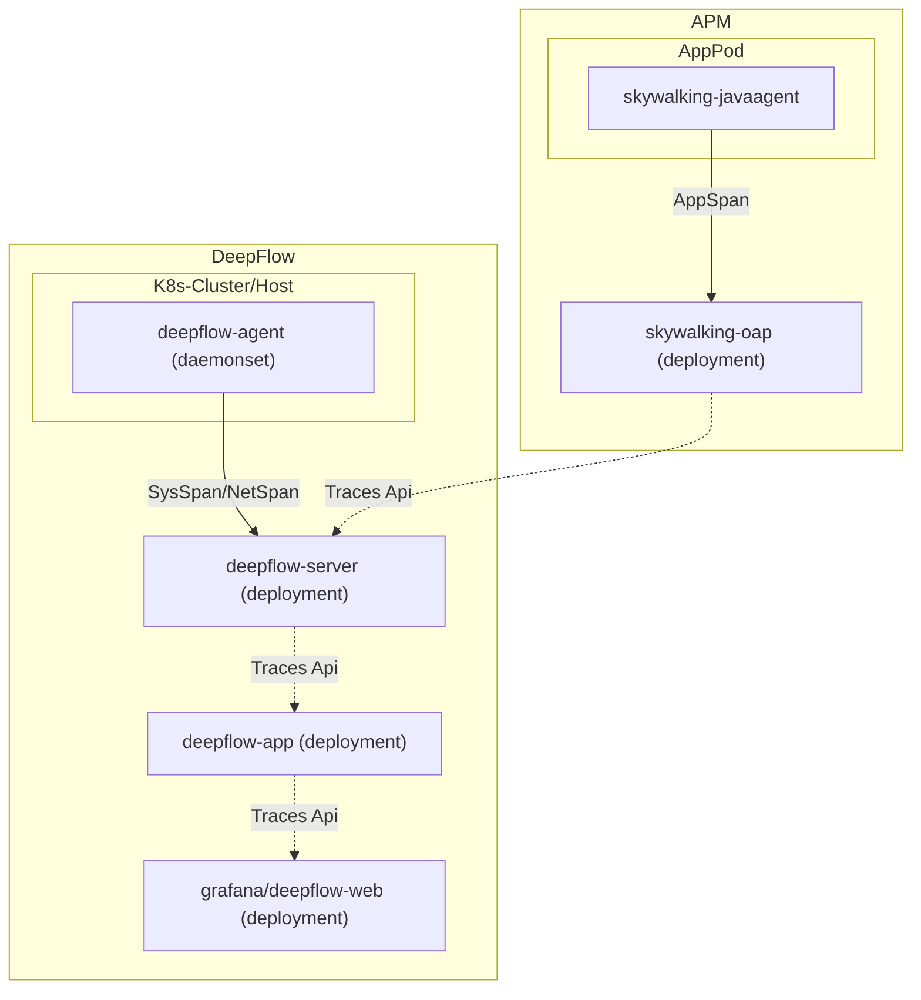

# 简介

DeepFlow 实现了获取外部 APM 的 APP Span 的能力，并将 APP Span 与 DeepFlow 采集到的追踪数据进行关联，目前仅支持了 SkyWalking 作为外部 APM 存储。应用无需做任何修改，只需要修改 DeepFlow 配置即可得到 DeepFlow 的全链路、零插桩追踪能力。

# 数据流



# 配置

修改 DeepFlow Server 的[配置](https://github.com/deepflowio/deepflow/blob/main/server/server.yaml)，添加如下内容：

```yaml
querier:
  external-apm:
    - name: skywalking
      addr: 127.0.0.1:12800 # FIXME: 这里填写为 SkyWalking OAP Server 的地址，12800 端口为 HTTP 服务默认端口
```

同时，需要修改 DeepFlow App 的[配置](https://github.com/deepflowio/deepflow-app/blob/main/app/app.yaml)，将以下值修改为 `true` 即可：

```yaml
app:
  spec:
    call_apm_api_to_supplement_trace: true
```

其中，从 SkyWalking APM 的 [skywalking-query-protocol](https://github.com/apache/skywalking-query-protocol/blob/master/trace.graphqls)转换为 DeepFlow 火焰图的映射关系如下表：

| 名称              | 中文           | SkyWalking 数据结构                                                                                                 | 描述                                                                                       |
|-----------------|--------------|-----------------------------------------------------------------------------------------------------------------|------------------------------------------------------------------------------------------|
| startTimeUs     | 开始时间         | span.startTime                                                                                                  | --                                                                                       |
| endTimeUs       | 结束时间         | span.endTime                                                                                                    | --                                                                                       |
| tapSide         | 观测点          | span.spanType.Exit: 客户端应用(C-APP), span.spanType.Entry: 服务端应用(S-APP), span.spanType.Local: 应用(APP)               | 观测点，即 observation_point，转换为对应的枚举值                                                        |
| traceID         | TraceID      | span.traceID                                                                                                    | --                                                                                       |
| spanID          | SpanID       | span.segmentID-span.spanID                                                                                      | --                                                                                       |
| parentSpanID    | ParentSpanID | span.segmentID-span.parentSpanID/span.ref.parentSegmentID/span.ref.parentSpanID                                 | 当 span.parentSpanID=-1时，尝试获取 span.ref 作为 parentSpan                                      |
| spanKind        | span 类型      | span.type=Exit: SPAN_KIND_CLIENT, span.type=Entry: SPAN_KIND_SERVER, span.type=Local: SPAN_KIND_INTERNAL        | 转换为对应的枚举值                                                                                |
| endpoint        | 请求端点         | span.endpointName                                                                                               | 请求的具体资源，在 HTTP 协议中一般是请求路由                                                                |
| appService      | 应用服务         | span.serviceCode                                                                                                | --                                                                                       |
| appInstance     | 应用服务实例       | span.serviceInstance                                                                                            | --                                                                                       |
| serviceUname    | 服务名称         | span.serviceCode                                                                                                | --                                                                                       |
| requestType     | 请求类型         | span.tags.[http.method/cache.cmd/db.operation/rpc.method]                                                       | 根据协议获取 tag 中的 value                                                                      |
| requestResource | 请求资源         | span.endpointName/span.tags.[db.statement/cache.key/url/http.url]                                               | 当 span.endpointName 不存在时，尝试从 http.url 中截取，仅提取域名之后的请求信息                                   |
| responseCode    | 响应码          | span.tags.[http.status.code/http.status_code/http.status]                                                       | --                                                                                       |
| reponseStatus   | 响应状态         | --                                                                                                              | 从 responseCode 转换，2xx~3xx: STATUS_OK, 4xx: STATUS_CLIENT_ERROR, 5xx: STATUS_SERVER_ERROR |
| signalSource    | 信号源          | OTEL(4)                                                                                                         | 固定枚举值                                                                                    |
| l7Protocol      | 应用协议         | span.layer=Http: HTTP, span.tags.[db.type/db.system/http.scheme/rpc.system/messaging.system/messaging.protocol] | 若 span.layer 不等于 Http，则尝试从 span.tags 中获取，如果有任意 `http.` 开头的 tag，均视为 HTTP 协议               |
| l7ProtocolStr   | 应用协议（名称）     | --                                                                                                              | 根据 l7Protocol 的枚举值获取具体名称                                                                 |
| attribute       | 标签           | span.tags                                                                                                       | --                                                                                       |
