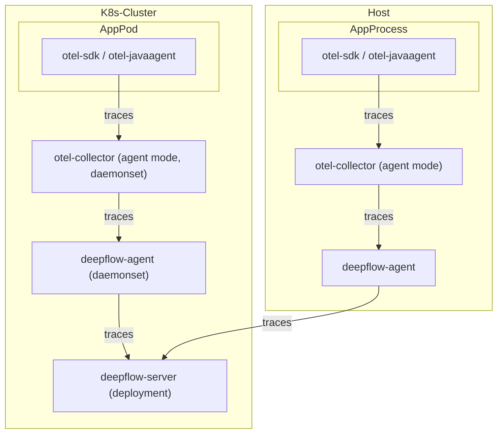
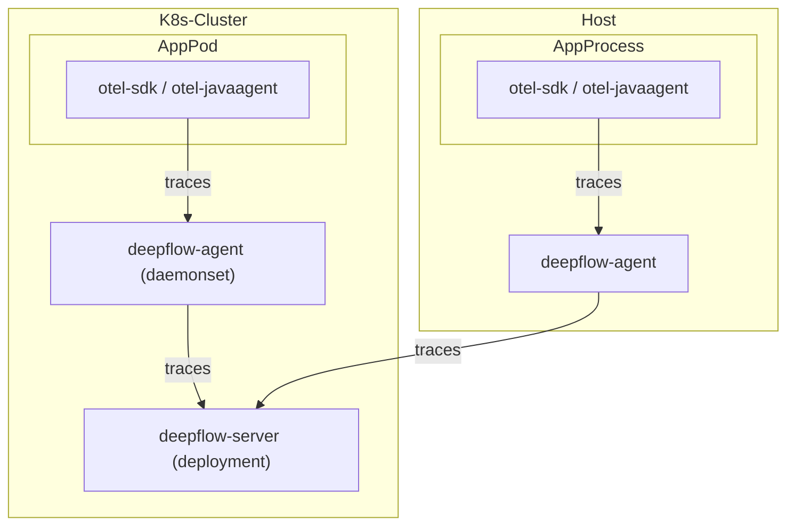
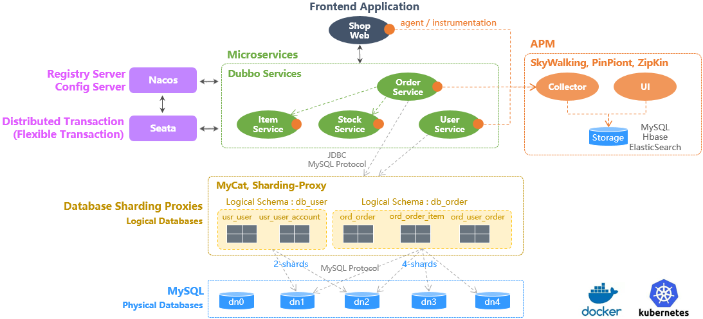
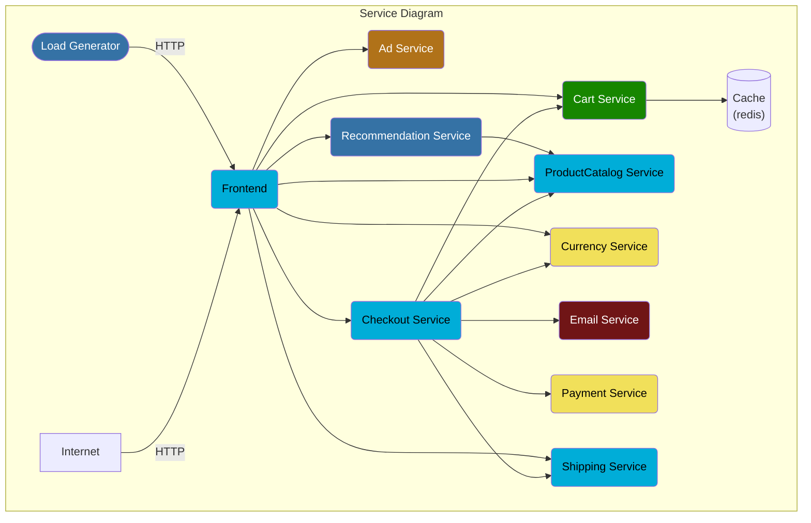

# 数据流

通过 otel-collector 发送至 deepflow-agent：



直接发送至 deepflow-agent：



# 配置 OpenTelemetry

我们推荐使用 agent 模式的 otel-collector 向 deepflow-agent 发送 trace 数据，以避免数据跨 K8s 节点传输。
当然使用 gateway 模式的 otel-collector 也是完全可行的。以下的文档中以 otel-agent 为例介绍部署和配置方法。

## 安装 otel-agent

查看 [OpenTelemetry 文档](https://opentelemetry.io/docs/) 可了解相关背景知识。
如果你的环境中还没有 OpenTelemetry，可以使用如下命令在 `open-telemetry` 命名空间中快速部署一个 otel-agent DaesmonSet：

```bash
kubectl apply -n open-telemetry -f https://raw.githubusercontent.com/deepflowio/deepflow-demo/main/open-telemetry/open-telemetry.yaml
```

> 注：若使用自有环境的 OpenTelemetry，建议将对应 Kubernetes Service 的 `Service.spec.internalTrafficPolicy` 参数配置为 `Local`，这样可使业务数据直接发送至本机 Otel，避免源地址转换导致 DeepFlow 数据关联异常。
>

安装完毕之后，可以在环境里看到这样一个组件清单：

```bash
kubectl get all -n open-telemetry
```

| Type      | Component  |
| --------- | ---------- |
| Daemonset | otel-agent |
| Service   | otel-agent |
| ConfigMap | otel-agent |

如果使用其他版本 opentelemetry，可以在 [otel-docker](https://hub.docker.com/r/otel/opentelemetry-collector-contrib/tags) 官方仓库中拉取并更新镜像：

> 注：自 0.80.0 版本起，OpenTelemetry 修改了 SkyWalking Receiver 的 Parent Span ID，[此改动](https://github.com/open-telemetry/opentelemetry-collector-contrib/pull/21799)会影响 DeepFlow 的关联逻辑。如你使用了 SkyWalking Receiver，请务必使用 0.79.0 或更早的版本；如未使用，则任意版本均可。

```bash
LATEST_TAG="xxx"  # FIXME

kubectl set image -n open-telemetry daemonset/otel-agent otel-agent=otel/opentelemetry-collector-contrib:${LATEST_TAG}
```

## 配置 otel-agent

我们需要配置 otel-agent ConfigMap 中的 `otel-agent-config.exporters.otlphttp`，将 trace 发送至 DeepFlow。首先查询当前配置：

```bash
kubectl get cm -n open-telemetry otel-agent-conf -o custom-columns=DATA:.data | \
    grep -A 5 otlphttp:
```

deepflow-agent 使用 ClusterIP Service 接收 trace，将 otel-agent 的配置进行修改：

```yaml
otlphttp:
  traces_endpoint: 'http://deepflow-agent.deepflow/api/v1/otel/trace'
  tls:
    insecure: true
  retry_on_failure:
    enabled: true
```

同时，为了确保 Span 发送侧的 IP 传递到 DeepFlow 中，需要增加如下配置：

```yaml
processors:
  k8sattributes:
  resource:
    attributes:
      - key: app.host.ip
        from_attribute: k8s.pod.ip
        action: insert
```

最后，在 service.pipeline 中，对 `traces` 一节增加：

```yaml
service:
  pipelines:
    traces:
      ## 确保 k8sattributes processor 先被处理
      processors: [k8sattributes, resource]
      exporters: [otlphttp]
```

# 配置 DeepFlow

接下来通过 [deepflow-ctl](../best-practice/agent-advanced-config) 添加或更新 [agent-group-config](../configuration/agent/) 后使 agent 接收 otel 数据：

```bash
inputs:
  integration:
    enabled: true
    listen_port: 38086
```

# 基于 Spring Boot Demo 体验

## 部署 Demo

此 Demo 来源于 [这个 GitHub 仓库](https://github.com/liuzhibin-cn/my-demo)，这是一个基于 Spring Boot 编写的由五个微服务组成的 WebShop 应用，其架构如下：



使用如下命令可以一键部署这个 Demo：

```bash
kubectl apply -n deepflow-otel-spring-demo -f https://raw.githubusercontent.com/deepflowio/deepflow-demo/main/DeepFlow-Otel-Spring-Demo/deepflow-otel-spring-demo.yaml
```

## 查看追踪数据

在 Grafana 中查看 `DeepFlow Templates` 目录下 `Distributed Tracing` 面板，通过图中上方变量变量过滤后查看追踪效果。
DeepFlow 能够将 OpenTelemetry、eBPF、BPF 获取到的追踪数据关联展示在一个 Trace 火焰图中，
覆盖一个 Spring Boot 应用从业务代码、系统函数、网络接口的全栈调用路径，实现真正的全链路分布式追踪，效果如下：


你也可以访问 [DeepFlow Online Demo](https://ce-demo.deepflow.yunshan.net/d/Distributed_Tracing/distributed-tracing?var-namespace=deepflow-otel-spring-demo&from=deepflow-doc) 查看效果。

对这个追踪 Demo 我们总结一下：

- 全链路：集成 OTel、eBPF 和 BPF，自动追踪到了这个 Trace 的 100 个 Span，含 20 个 eBPF Span、34 个 BPF Span
- 全链路：对 OTel 无插码的服务，支持通过 eBPF 自动追踪补齐，例如 Span 1-6（loadgenerator）等
- 全链路：对 OTel 无法插码的服务，支持通过 eBPF 自动追踪补齐，例如 Span 67、100 的 eBPF Span 描绘出了 MySQL Transaction 的开始和结束（SET autocommit、commit）
- 全栈：支持追踪同 K8s Node 上两个 Pod 之间的网络路径，例如 Span 91-92 等
- 全栈：支持追踪跨 K8s Node 上两个 Pod 之间的网络路径，即使中间经过了隧道封装，例如 Span 2-5 等（IPIP 隧道封装）
- 全栈：eBPF 和 BPF Span 穿插在 OTel Span 之间，打通应用、系统和网络，例如 eBPF Span 12、27、41、53 与它们的父 Span（OTel）的显著时差可用于确定真实的性能瓶颈，避免上下游应用开发团队的迷惑

# 基于 OpenTelemetry WebStore Demo 体验

## 部署 Demo

此 Demo 来源于 [opentelemetry-webstore-demo](https://github.com/open-telemetry/opentelemetry-demo-webstore)，
这个 Demo 由 Go、C#、Node.js、Python、Java 等语言实现的十多个微服务组成，它的应用架构如下：



使用如下命令可以一键部署这个 Demo：

```bash
kubectl apply -n deepflow-otel-grpc-demo -f https://raw.githubusercontent.com/deepflowio/deepflow-demo/main/DeepFlow-Otel-Grpc-Demo/deepflow-otel-grpc-demo.yaml
```

## 查看追踪数据

前往 Grafana，打开 `Distributed Tracing` Dashboard，选择 `namespace = deepflow-otel-grpc-demo` 后，可选择一个调用进行追踪。
DeepFlow 能够将 OpenTelemetry、eBPF、BPF 获取到的追踪数据关联展示在一个 Trace 火焰图中，
覆盖一个多语言应用从业务代码、系统函数、网络接口的全栈调用路径，实现真正的全链路分布式追踪，效果如下：


你也可以访问 [DeepFlow Online Demo](https://ce-demo.deepflow.yunshan.net/d/Distributed_Tracing/distributed-tracing?var-namespace=deepflow-otel-grpc-demo&var-request_resource=*Order*&from=deepflow-doc) 查看效果。
