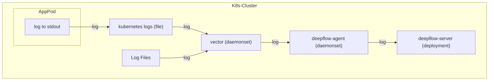
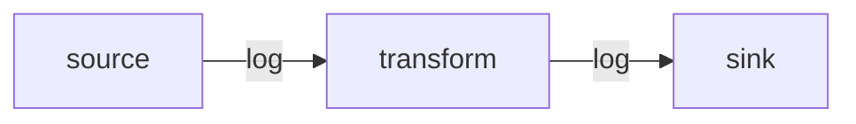
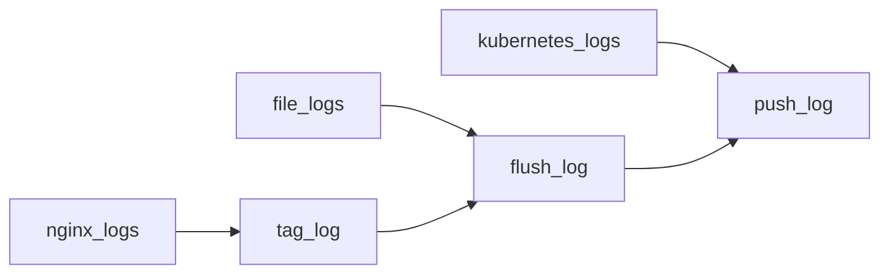

# 数据流



# 配置 Vector

## 安装 Vector

可以在 [Vector 文档](https://vector.dev/docs/)中可了解相关背景知识。
如果你的集群中没有 Vector，可用如下步骤部署 Vector：

::: code-tabs#shell

@tab APT 部署

```bash
## Add Vector repo
bash -c "$(curl -L https://setup.vector.dev)"
apt-get install vector -y
vector --version
### config file /etc/vector/vector.yaml
systemctl start vector
systemctl enable vector
```

@tab YUM 部署

```bash
## Add Vector repo
bash -c "$(curl -L https://setup.vector.dev)"
yum install vector -y
vector --version

### config file /etc/vector/vector.yaml
systemctl start vector
systemctl enable vector
```

@tab K8s 集群部署

```bash
helm repo add vector https://helm.vector.dev
helm repo update

cat << EOF > vector-values-custom.yaml
role: Agent
# FIXME: add nodeSelector here for deepflow
#nodeSelector:
#  allow/vector: "false"

# resources -- Set Vector resource requests and limits.
resources:
  requests:
    cpu: 200m
    memory: 256Mi
  limits:
    cpu: 200m
    memory: 256Mi
image:
  repository: timberio/vector
  tag: 0.37.1-distroless-libc
podLabels:
  vector.dev/exclude: "true"
  app: deepflow
# extraVolumes -- Additional Volumes to use with Vector Pods.
  # extraVolumes:
  # - name: opt-log
  #   hostPath:
  #     path: "/opt/log/"
# extraVolumeMounts -- Additional Volume to mount into Vector Containers.
  # extraVolumeMounts:
  # - name: opt-log
  #   mountPath: "/opt/log/"
  #   readOnly: true
customConfig:
  ## The configuration comes from https://vector.dev/docs/reference/configuration/global-options/#data_dir
  data_dir: /vector-data-dir
  api:
    enabled: true
    address: 127.0.0.1:8686
    playground: false
  sources:
    kubernetes_logs:
      type: kubernetes_logs
      namespace_annotation_fields:
        namespace_labels: ""
      node_annotation_fields:
        node_labels: ""
      pod_annotation_fields:
        pod_annotations: ""
        pod_labels: ""

  transforms:
    remap_kubernetes_logs:
      type: remap
      inputs:
      - kubernetes_logs
      source: |-
        # try to parse json
        if is_string(.message) && is_json(string!(.message)) {
            tags = parse_json(.message) ?? {}
            .message = tags.message # FIXME: the log content key inside json
            del(tags.message)
            .json = tags
        }

        if !exists(.level) {
           if exists(.json) {
            .level = to_string!(.json.level)
            del(.json.level)
           } else {
            # match log levels surround by ``[]`` or ``<>`` with ignore case
            level_tags = parse_regex(.message, r'[\[\\\<](?<level>(?i)INFOR?(MATION)?|WARN(ING)?|DEBUG?|ERROR?|TRACE|FATAL|CRIT(ICAL)?)[\]\\\>]') ?? {}
            if !exists(level_tags.level) {
              # match log levels surround by whitespace, required uppercase strictly in case mismatching
              level_tags = parse_regex(.message, r'[\s](?<level>INFOR?(MATION)?|WARN(ING)?|DEBUG?|ERROR?|TRACE|FATAL|CRIT(ICAL)?)[\s]') ?? {}
            }
            if exists(level_tags.level) {
              level_tags.level = upcase(string!(level_tags.level))
              .level = level_tags.level
            }
          }
        }

        if !exists(._df_log_type) {
            # default log type
            ._df_log_type = "user"
        }

        if !exists(.app_service) {
            .app_service = .kubernetes.container_name
        }
  sinks:
    http:
      encoding:
        codec: json
      inputs:
      - remap_kubernetes_logs
      type: http
      uri: http://deepflow-agent.deepflow/api/v1/log
EOF
helm install vector vector/vector \
  --namespace vector \
  --create-namespace \
  -f vector-values-custom.yaml
```

:::

在配置之前，可以先了解下 [Vector 的工作流](https://vector.dev/docs/about/under-the-hood/architecture/pipeline-model/)，数据按如下模块顺序流转，从采集源发往目的端：



一般而言，一个 Vector 配置至少包含 sources 模块、sinks 模块，需要对数据额外处理则必须添加 transforms 模块，并将数据清洗为最终需要的内容，一个典型的 Vector 配置如：

```yaml
# 数据来源
sources:
  nginx_logs:
    # ...
  file_logs:
    # ...
  kubernetes_logs:
    # ...

# 数据处理
transforms:
  tag_log:
    # inputs 指的是数据来源，这里可配置 sources 中的 Key，也可以配置 transforms 中的其他 Key
    inputs:
      - nginx_logs
    # ...
  flush_log:
    # tag_log 来源于上一个 transforms 模块，这样一份数据就按顺序被两个 transforms 模块处理
    inputs:
      - tag_log
      - file_logs
    # ...

# 数据输出
sinks:
  push_log:
    # 同样，这里的 inputs 可以同时来自 sources 模块或 transforms 模块
    inputs:
      - flush_log
      - kubernetes_logs
    # ...
```

在上面的示例里，通过不同的配置，分别实现了三种不同的数据流：



下面我们可以具体看下每个模块的具体配置内容。

## 采集日志

安装了 Vector 之后，我们可以通过 [Kubernetes_Log](https://vector.dev/docs/reference/configuration/sources/kubernetes_logs/) 模块获取部署在 Kubernetes 中的 Pod 日志，由于 DeepFlow 已经通过 AutoTagging 机制主动学习了 Kubernetes 中 Pod 相关的 Label 和 Annotations，所以发送日志流可以去掉这部分内容以减少传输量，示例配置如下：

```yaml
sources:
  kubernetes_logs:
    type: kubernetes_logs
    namespace_annotation_fields:
      namespace_labels: ''
    node_annotation_fields:
      node_labels: ''
    pod_annotation_fields:
      pod_annotations: ''
      pod_labels: ''
```

如果你将 Vector 以进程形式部署在云服务器中，则可以用 [File](https://vector.dev/docs/reference/configuration/sources/file) 模块获取指定路径的日志，我们以 `/var/log/` 路径为例，示例配置如下：

```yaml
sources:
  files_logs:
    type: file
    include:
      - /var/log/*.log
      - /var/log/**/*.log
    exclude:
      # FIXME: 如果同时配置了 kubernetes_logs 模块和 file 模块，为了避免监测日志内容重复，需要去除 k8s 的日志文件夹
      - /var/log/pods/**
      - /var/log/containers/**
    fingerprint:
      strategy: 'device_and_inode'
```

## 注入标签

然后，我们可以通过 Transforms 中的 [Remap](https://vector.dev/docs/reference/configuration/transforms/remap/) 模块，对发送的日志打上必要的标签。目前，我们要求打上这两个标签：`_df_log_type` 与 `level`。下面是一份示例配置：

```yaml
transforms:
  remap_kubernetes_logs:
    type: remap
    inputs:
      - kubernetes_logs
      - files_logs
    source: |-
      # try to parse json
      if is_string(.message) && is_json(string!(.message)) {
          tags = parse_json(.message) ?? {}
          .message = tags.message # FIXME: the log content key inside json
          del(tags.message)
          .json = tags
      }

      if !exists(.level) {
         if exists(.json) {
          .level = to_string!(.json.level)
          del(.json.level)
         } else {
          # match log levels surround by `[]` or `<>` with ignore case
          level_tags = parse_regex(.message, r'[\[\\<](?<level>(?i)INFOR?(MATION)?|WARN(ING)?|DEBUG?|ERROR?|TRACE|FATAL|CRIT(ICAL)?)[\]\\>]') ?? {}
          if !exists(level_tags.level) {
            # match log levels surround by whitespace, required uppercase strictly in case mismatching
            level_tags = parse_regex(.message, r'[\s](?<level>INFOR?(MATION)?|WARN(ING)?|DEBUG?|ERROR?|TRACE|FATAL|CRIT(ICAL)?)[\s]') ?? {}
          }
          if exists(level_tags.level) {
            level_tags.level = upcase(string!(level_tags.level))
            .level = level_tags.level
          }
        }
      }

      if !exists(._df_log_type) {
          # default log type
          ._df_log_type = "user"
      }

      if !exists(.app_service) {
          # FIXME: files 模块没有此字段，请通过日志内容注入应用名称
          .app_service = .kubernetes.container_name
      }
```

这段代码片段里，我们假定可能获取到 json 格式的日志内容及非 json 格式的这两类日志内容。对于这两类日志，我们都尝试提取它的日志等级 `level`。对 json 格式的日志，我们把它的内容提取到外层的 `message` 字段，并将剩余的所有 json key 放入名为 `json` 的字段中。在这段代码的最后，我们为这两类日志打上 `_df_log_type=user` 及 `app_service=kubernetes.container_name` 两个标签。

如果实际使用中，有更丰富的日志格式需要匹配，可参考 [Vrl](https://vector.dev/docs/reference/vrl/) 语法规则，自定义你的日志提取规则。

## 常见配置

除了以上的配置外，Transforms 模块还可以实现很多 Feature，帮助我们从日志中获取更精确的信息，这里提供一些常见的配置：

### 合并多行日志

使用建议：使用正则匹配日志的“开始模式”，在遇到下一个“开始模式”之前，所有日志聚合为一个日志消息并保留换行符。为了减少误匹配，这里使用形如 `yyyy-MM-dd HH:mm:ss` 的日期时间格式匹配一行日志的开头。

```yaml
transforms:
  multiline_kubernetes_logs:
    type: reduce
    inputs:
      - kubernetes_logs
    group_by:
      - file
      - stream
    merge_strategies:
      message: concat_newline
    starts_when: match(string!(.message), r'^(\[|\[?\u001B\[[0-9;]*m|\{\".+\"|(::ffff:)?([0-9]{1,3}.){3}[0-9]{1,3}[\s\-]+(\[)?)?\d{4}[-\/\.]?\d{2}[-\/\.]?\d{2}[T\s]?\d{2}:\d{2}:\d{2}')
    expire_after_ms: 2000 # unit: ms, aggregate logs max waiting timeout
    flush_period_ms: 500 # unit: ms, flush expire events
```

### 过滤颜色控制符

使用建议：使用正则过滤日志中的颜色控制符，增加日志可读性。

```yaml
transforms:
  flush_kubernetes_logs:
    type: remap
    inputs:
      - multiline_kubernetes_logs
    source: |-
      .message = replace(string!(.message), r'\u001B\[([0-9]{1,3}(;[0-9]{1,3})*)?m', "")
```

### 提取日志等级

使用建议：使用正则尝试匹配日志中出现的日志等级。为了减少误匹配，在日志等级外可以加上形如`[]`的符号。

```yaml
transforms:
  remap_kubernetes_logs:
    type: remap
    inputs:
      - flush_kubernetes_logs
    source: |-
      # match log levels surround by `[]` or `<>` with ignore case
      level_tags = parse_regex(.message, r'[\[\\<](?<level>(?i)INFOR?(MATION)?|WARN(ING)?|DEBUG?|ERROR?|TRACE|FATAL|CRIT(ICAL)?)[\]\\>]') ?? {}
      if !exists(level_tags.level) {
        # match log levels surround by whitespace, required uppercase strictly in case mismatching
        level_tags = parse_regex(.message, r'[\s](?<level>INFOR?(MATION)?|WARN(ING)?|DEBUG?|ERROR?|TRACE|FATAL|CRIT(ICAL)?)[\s]') ?? {}
      }
      if exists(level_tags.level) {
        level_tags.level = upcase(string!(level_tags.level))
        .level = level_tags.level
      }
```

### 提取自定义标签

如果应用里需要注入一些自定义的标签，用于过滤日志，同样地，也可以使用 Transforms 的 Remap 模块，写一段注入标签的代码，其中，我们要求自定义标签必须写入 `.json` 结构体内，才能被存储、查询，示例如下：

```yaml
transforms:
  inject_json_tags:
    type: remap
    inputs:
      - remap_kubernetes_logs
    source: |-
      .json = {
        "cluster": "Production",
        "extra_user_tag": "xxxxx" # FIXME: 可自定义添加需要的标签
      }
```

然后，在使用 [SQL API](../../output/query/sql) 查询时，我们可以使用如下语句过滤注入的标签：

```bash
curl -XPOST "http://${deepflow_server_node_ip}:${port}/v1/query/" \
    --data-urlencode "db=application_log" \
    --data-urlencode "sql=select attribute.cluster, body from log where attribute.cluster='Production'"
```

### 基于日志构建指标序列

如果应用里带了一些运行时指标信息，比如 `nginx` 记录了请求时延，同样地，也可以使用 Transforms 的 Remap 模块，写一段注入指标的代码，其中，我们要求自定义标签必须写入 `.metrics` 结构体内，才能被存储、查询，示例如下：

```yaml
transforms:
  inject_json_tags:
    type: remap
    inputs:
      - remap_kubernetes_logs
    source: |-
      .metrics = {
        "response_duration": xxx, # FIXME: 把从日志中提取到的指定数据添加到此处
      }
```

然后，在使用 [SQL API](../../output/query/sql) 查询时，我们可以使用如下语句搜索指定的指标，同样，指标也支持此文档中的 [聚合算子](../../../features/universal-map/metrics-and-operators)：

```bash
curl -XPOST "http://${deepflow_server_node_ip}:${port}/v1/query/" \
    --data-urlencode "db=application_log" \
    --data-urlencode "sql=select metrics.response_duration from log"
```

### 提取分布式追踪 ID

如果应用具有分布式追踪能力，无论是做了 [OTel](https://opentelemetry.io/docs/concepts/instrumentation/) 插桩或者应用中天然存在具有唯一性的全局流水号，且输出到日志中，同样可以上报到后端，把分布式追踪请求链路与日志关联起来。例如：将日志中的 `TID:xxx` 提取为 trace_id 的示例如下：

```yaml
transforms:
  inject_trace_id_in_logs:
    type: remap
    inputs:
      - remap_kubernetes_logs
    source: |-
      trace = parse_regex(.message, r'\[TID:(?<trace_id>[0-9a-zA-Z\.\-]+)\]') ?? {}
      if exists(trace.trace_id) {
         .trace_id = trace.trace_id
         .span_id = "" # 如果能获取到 span_id，可以通过此 tag 注入标签
      }
```

## 发送

最后，我们通过 [HTTP](https://vector.dev/docs/reference/configuration/sinks/http/) 模块，将日志发送到 DeepFlow Agent 中。

```yaml
sinks:
  http:
    encoding:
      codec: json
    inputs:
      - remap_kubernetes_logs # NOTE: 注意这里数据源是 transform 模块的 key
    type: http
    uri: http://deepflow-agent.deepflow/api/v1/log
```

将这三个模块组合到一起，即可实现采集日志、注入标签并最终发送到 DeepFlow。

## 完整示例

基于上述的说明，我们给出一个完整的示例，假设采集对象是 **部署在云服务器上的 nginx 应用**， 可以通过如下配置来采集它的日志，并发送到 DeepFlow :

```yaml
sources:
  nginx_logs:
    type: file
    include:
      - /var/log/nginx/*.log
    fingerprint:
      strategy: 'device_and_inode'
transforms:
  tag_nginx_log:
    type: remap
    inputs:
      - nginx_logs
    source: |-
      source = parse_regex(.file, r'\/var\/log\/(?<file_source>.+)\.log') ?? {}
      source.file_source = replace!(source.file_source, "/", "-")
      hostname, _ = get_hostname()
      .app_service = hostname + "-" + source.file_source
      .json = {
        "cluster": "Production",
        "module": "nginx"
      }
      .metrics = {
        "ready_status": 1,
      }
sinks:
  http:
    encoding:
      codec: json
    inputs:
      - tag_nginx_log
    uri: http://${deepflow-agent-host}:${port}/api/v1/log # FIXME: 这里填写可接收数据的目标 DeepFlow Agent 地址
    type: http
```

# 配置 DeepFlow

为了让 DeepFlow Agent 可以接收这部分数据，请参考 [配置 DeepFlow](../tracing/opentelemetry/#配置-deepflow) 一节内容，完成 DeepFlow Agent 的配置。
