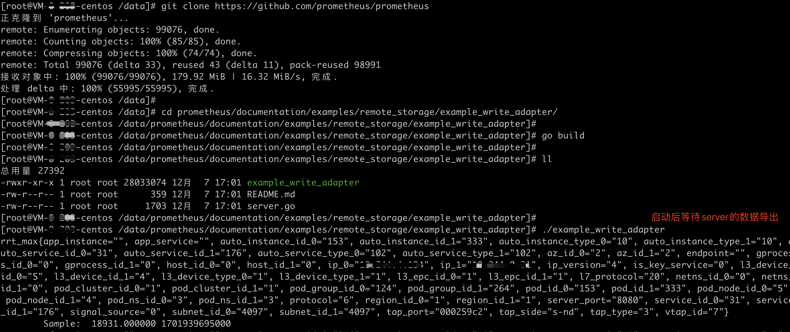

# 功能

通过 Prometheus Remote Write 的方式，可以将 DeepFlow 的生成的指标导出到外部的平台。结合 Prometheus 的生态继续使用，比如可以通过 Prometheus 查看指标，配置告警等能力

# Metrics 简介

在 DeepFlow 内，关于 Metric 可以分为两种

- 应用性能指标：[具体可参考](../../../features/universal-map/application-metrics/)
  - 对应到 clickhouse 里是 `flow_metrics.application*` 表数据
- 网络性能指标：[具体可参考](../../../features/universal-map/network-metrics/)
  - 对应到 clickhouse 里是 `flow_metrics.network*` 表数据

# Prometheus Remote Write

协议格式可参考 Prometheus 的 pb 文件定义：https://github.com/prometheus/prometheus/blob/main/prompb/remote.proto

# DeepFlow Server 配置指引

在 Server 的配置下，增加如下配置，即可开启指标导出

```yaml
ingester:
  exporters:
    - protocol: prometheus
      enabled: true
      endpoints: [http://127.0.0.1:9091/receive, http://1.1.1.1:9091/receive]
      data-sources:
        - flow_metrics.application_map.1s
      # - flow_metrics.application_map.1m
      # - flow_metrics.application.1s
      # - flow_metrics.application.1m
      # - flow_metrics.network_map.1s
      # - flow_metrics.network_map.1m
      # - flow_metrics.network.1s
      # - flow_metrics.network.1m
      queue-count: 4
      queue-size: 100000
      batch-size: 1024
      flush-timeout: 10
      tag-filters:
      export-fields:
        - $tag
        - $metrics
      extra-headers:
        key1: value1
        key2: value2
      export-empty-tag: false
      export-empty-metrics-disabled: false
      enum-translate-to-name-disabled: false
      universal-tag-translate-to-name-disabled: false
```

# 详细参数说明

| 字段          | 类型    | 必选 | 描述                                                                    |
| ------------- | ------- | ---- | ----------------------------------------------------------------------- |
| protocol      | strings | 是   | 固定值 `prometheus`                                                     |
| data-sources  | strings | 是   | 取值 `flow_metrics.*` 数据, 不支持 `flow_log.*` 等数据                  |
| endpoints     | strings | 是   | 远端接收地址，remote write 接收地址, 随机选择一个能发送成功的           |
| batch-size    | int     | 否   | 批次大小，当达到这个数值，成批的发送。默认值： 1024                     |
| extra-headers | map     | 否   | 远端 HTTP 请求的头部字段，比如有效验需求的，可以在这里补充 token 等信息 |
| export-fields | strings | 是   | 当前不支持 `$k8s.label`, 建议配置: [$tag, $metrics]                     |

[详细配置参考](./exporter-config/)

# 快速实践 demo

- 搭建一个 RemoteWrite 接收端，可参考 Prometheus 的这个 [demo](https://github.com/prometheus/prometheus/tree/main/documentation/examples/remote_storage/example_write_adapter)

- 添加配置

```yaml
exporters:
  - protocol: prometheus
    data-sources:
      - flow_metrics.application_map.1s
    endpoints: [http://localhost:1234/receive]
    export-fields:
      - $tag
      - $metrics
```

- 重启 DeepFlow Server，稍等片刻后，即可在 RemoteWrite 接收端，看到如图输出结果


