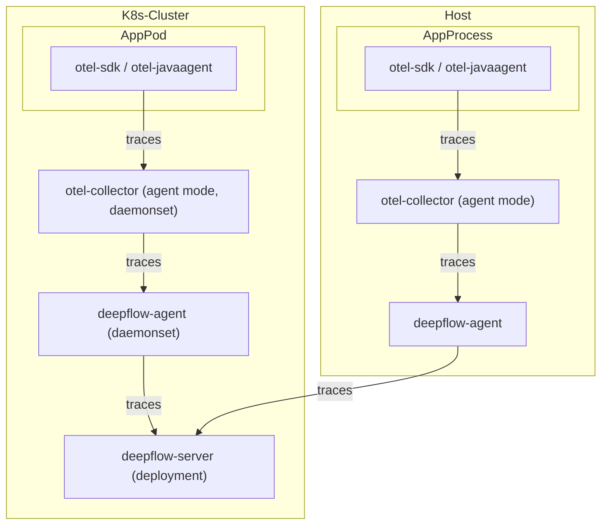
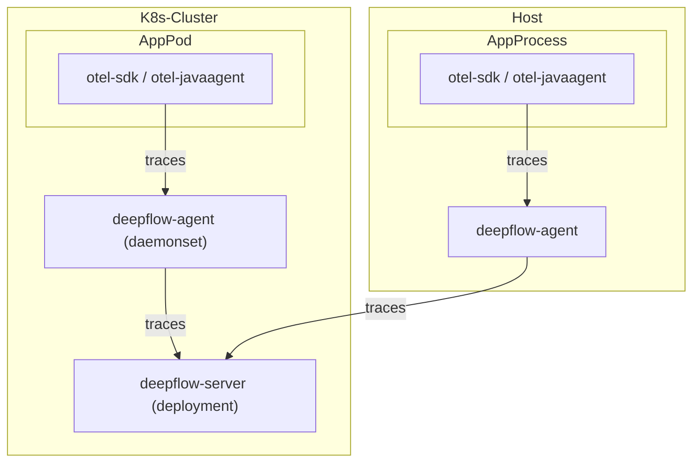

> This document was translated by GPT-4

# Data Flow

Send to deepflow-agent via otel-collector:



Directly send to deepflow-agent:



# Configuring OpenTelemetry

We recommend sending trace data to deepflow-agent using otel-collector in agent mode to avoid data transmission across K8s nodes.
However, using otel-collector in gateway mode is also perfectly viable. The following document describes deployment and configuration methods using otel-agent as an example.

## Installing otel-agent

Check [OpenTelemetry Documents](https://opentelemetry.io/docs/) for background information.
If OpenTelemetry is not already setup in your environment, you can quickly deploy an otel-agent DaesmonSet in the `open-telemetry` namespace using the following command:

```bash
kubectl apply -n open-telemetry -f https://raw.githubusercontent.com/deepflowio/deepflow-demo/main/open-telemetry/open-telemetry.yaml
```

Once installed, you can view a list of components within your environment:

```bash
kubectl get all -n open-telemetry
```

| Type      | Component  |
| --------- | ---------- |
| Daemonset | otel-agent |
| Service   | otel-agent |
| ConfigMap | otel-agent |

If you need to use other versions or updated opentelemetry-collector-contrib,
please find the image version you want in the [otel-docker](https://hub.docker.com/r/otel/opentelemetry-collector-contrib/tags) repository,
then update the image using the following command:

```bash
LATEST_TAG="xxx"  # FIXME

kubectl set image -n open-telemetry daemonset/otel-agent otel-agent=otel/opentelemetry-collector-contrib:${LATEST_TAG}
```

## Configuring otel-agent

We need to configure `otel-agent-config.exporters.otlphttp` in otel-agent ConfigMap to send traces to DeepFlow. First, query the current configuration:

```bash
kubectl get cm -n open-telemetry otel-agent-conf -o custom-columns=DATA:.data | \
    grep -A 5 otlphttp:
```

The deepflow-agent uses ClusterIP Service to receive traces, modify the otel-agent configuration as follows:

```yaml
otlphttp:
  traces_endpoint: 'http://deepflow-agent.deepflow/api/v1/otel/trace'
  tls:
    insecure: true
  retry_on_failure:
    enabled: true
```

In addition, to ensure the IP of the Span sender is passed on to DeepFlow, we need to add the following configuration:

```yaml
processors:
  k8sattributes:
  resource:
    attributes:
      - key: app.host.ip
        from_attribute: k8s.pod.ip
        action: insert
```

Finally, in the service.pipeline, add the following to the `traces` section:

```yaml
service:
  pipelines:
    traces:
      processors: [k8sattributes, resource] # Ensure the k8sattributes processor is processed first
      exporters: [otlphttp]
```