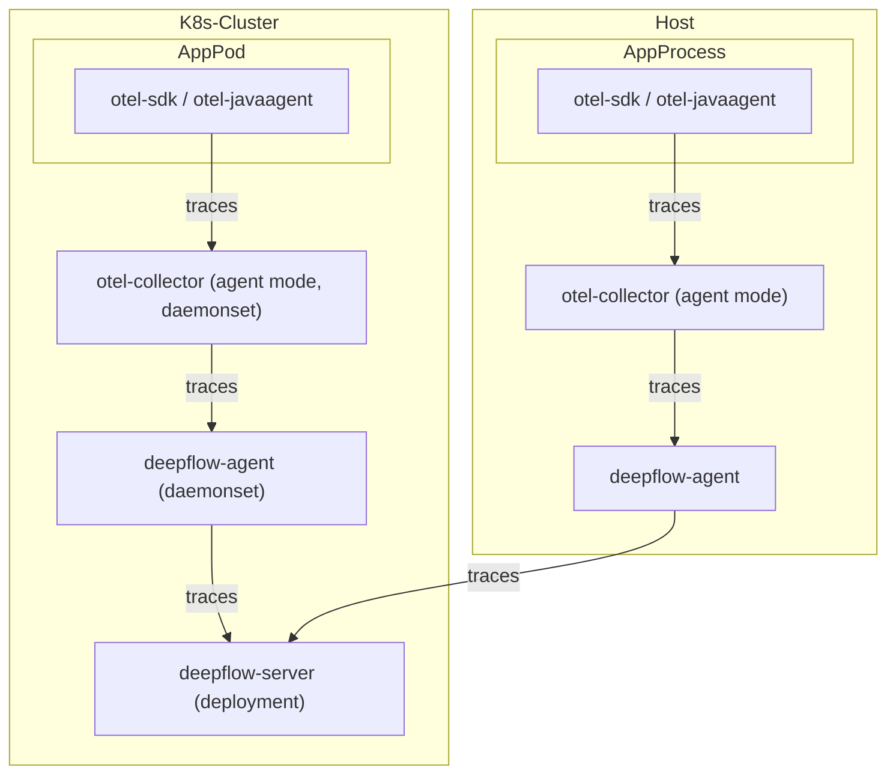
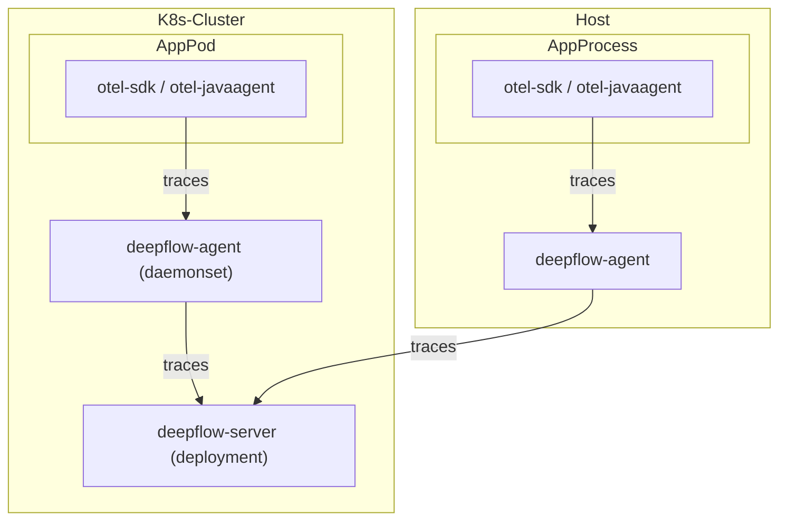

# 数据流

通过 otel-collector 发送至 deepflow-agent：



直接发送至 deepflow-agent：



# 配置 OpenTelemetry

我们推荐使用 agent 模式的 otel-collector 向 deepflow-agent 发送 trace 数据，以避免数据跨 K8s 节点传输。
当然使用 gateway 模式的 otel-collector 也是完全可行的。以下的文档中以 otel-agent 为例介绍部署和配置方法。

## 安装 otel-agent

查看 [OpenTelemetry 文档](https://opentelemetry.io/docs/) 可了解相关背景知识。
如果你的环境中还没有 OpenTelemetry，可以使用如下命令在 `open-telemetry` 命名空间中快速部署一个 otel-agent DaesmonSet：

```bash
kubectl apply -n open-telemetry -f https://raw.githubusercontent.com/deepflowio/deepflow-demo/main/open-telemetry/open-telemetry.yaml
```

安装完毕之后，可以在环境里看到这样一个组件清单：

```bash
kubectl get all -n open-telemetry
```

| Type      | Component  |
| --------- | ---------- |
| Daemonset | otel-agent |
| Service   | otel-agent |
| ConfigMap | otel-agent |

如果你需要使用其他版本或更新的 opentelemetry-collector-contrib，
请在 [otel-docker](https://hub.docker.com/r/otel/opentelemetry-collector-contrib/tags) 仓库中，
找到你想要的镜像版本，然后使用如下命令更新镜像：

```bash
LATEST_TAG="xxx"  # FIXME

kubectl set image -n open-telemetry daemonset/otel-agent otel-agent=otel/opentelemetry-collector-contrib:${LATEST_TAG}
```

## 配置 otel-agent

我们需要配置 otel-agent ConfigMap 中的 `otel-agent-config.exporters.otlphttp`，将 trace 发送至 DeepFlow。首先查询当前配置：

```bash
kubectl get cm -n open-telemetry otel-agent-conf -o custom-columns=DATA:.data | \
    grep -A 5 otlphttp:
```

deepflow-agent 使用 ClusterIP Service 接收 trace，将 otel-agent 的配置进行修改：

```yaml
otlphttp:
  traces_endpoint: 'http://deepflow-agent.deepflow/api/v1/otel/trace'
  tls:
    insecure: true
  retry_on_failure:
    enabled: true
```

同时，为了确保 Span 发送侧的 IP 传递到 DeepFlow 中，需要增加如下配置：

```yaml
processors:
  k8sattributes:
  resource:
    attributes:
      - key: app.host.ip
        from_attribute: k8s.pod.ip
        action: insert
```

最后，在 service.pipeline 中，对 `traces` 一节增加：

```yaml
service:
  pipelines:
    traces:
      processors: [k8sattributes, resource] # 确保 k8sattributes processor 先被处理
      exporters: [otlphttp]
```
