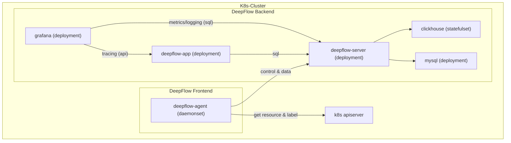

> This document was translated by ChatGPT

# Introduction

If you have deployed applications in a K8s cluster, this chapter explains how to use DeepFlow for monitoring. DeepFlow can collect observability signals (AutoMetrics, AutoTracing, AutoProfiling) from all Pods without interference and automatically injects `K8s resources` and `K8s custom labels` tags (AutoTagging) into all observability data based on information obtained from the apiserver.

# Preparation

## Deployment Topology



## Storage Class

We recommend using Persistent Volumes to store data for MySQL and ClickHouse to avoid unnecessary maintenance costs. You can provide a default Storage Class or add the parameter `--set global.storageClass=<your storageClass>` to select a Storage Class for creating PVC.

You may choose [OpenEBS](https://openebs.io/) for creating PVC:

```bash
kubectl apply -f https://openebs.github.io/charts/openebs-operator.yaml
## config default storage class
kubectl patch storageclass openebs-hostpath  -p '{"metadata": {"annotations":{"storageclass.kubernetes.io/is-default-class":"true"}}}'
```

# Deploy DeepFlow

Install DeepFlow using Helm:

::: code-tabs#shell

@tab Use Github and DockerHub

```bash
helm repo add deepflow https://deepflowio.github.io/deepflow
helm repo update deepflow # use `helm repo update` when helm < 3.7.0
helm install deepflow -n deepflow deepflow/deepflow --version 6.6.018 --create-namespace
```

@tab Use Aliyun

```bash
helm repo add deepflow https://deepflow-ce.oss-cn-beijing.aliyuncs.com/chart/stable
helm repo update deepflow # use `helm repo update` when helm < 3.7.0
cat << EOF > values-custom.yaml
global:
  image:
      repository: registry.cn-beijing.aliyuncs.com/deepflow-ce
EOF
helm install deepflow -n deepflow deepflow/deepflow --version 6.6.018 --create-namespace -f values-custom.yaml
```

:::

Note:

- Use helm --set global.storageClass to specify the storageClass
- Use helm --set global.replicas to specify the number of replicas for deepflow-server and clickhouse
- We recommend saving the contents of helm's `--set` parameters in a separate yaml file, refer to the [Advanced Configuration](../best-practice/server-advanced-config/) section.

# Download deepflow-ctl

deepflow-ctl is a command-line tool for managing DeepFlow. It is recommended to download it to the K8s Node where deepflow-server is located for subsequent use:

```bash
# Set temporary variable
Version=v6.6

# Download using the variable
curl -o /usr/bin/deepflow-ctl \
  "https://deepflow-ce.oss-cn-beijing.aliyuncs.com/bin/ctl/$Version/linux/$(arch | sed 's|x86_64|amd64|' | sed 's|aarch64|arm64|')/deepflow-ctl"

# Add execute permission
chmod a+x /usr/bin/deepflow-ctl
```

# Access the Grafana Page

The output from executing helm to deploy DeepFlow provides commands to obtain the URL and password for accessing Grafana. Example output:

```bash
NODE_PORT=$(kubectl get --namespace deepflow -o jsonpath="{.spec.ports[0].nodePort}" services deepflow-grafana)
NODE_IP=$(kubectl get nodes -o jsonpath="{.items[0].status.addresses[0].address}")
echo -e "Grafana URL: http://$NODE_IP:$NODE_PORT  \nGrafana auth: admin:deepflow"
```

Example output after executing the above command:

```text
Grafana URL: http://10.1.2.3:31999
Grafana auth: admin:deepflow
```

# Next Steps

- [Universal Service Map - Experience DeepFlow's AutoMetrics Capability](../features/universal-map/auto-metrics/)
- [Distributed Tracing - Experience DeepFlow's AutoTracing Capability](../features/distributed-tracing/auto-tracing/)
- [Eliminate Data Silos - Learn About DeepFlow's AutoTagging and SmartEncoding Capabilities](../features/auto-tagging/eliminate-data-silos/)
- [Say Goodbye to High Base Troubles - Integrate Metrics Data like Prometheus](../integration/input/metrics/metrics-auto-tagging/)
- [Full-Stack Distributed Tracing - Integrate Tracing Data like OpenTelemetry](../integration/input/tracing/full-stack-distributed-tracing/)