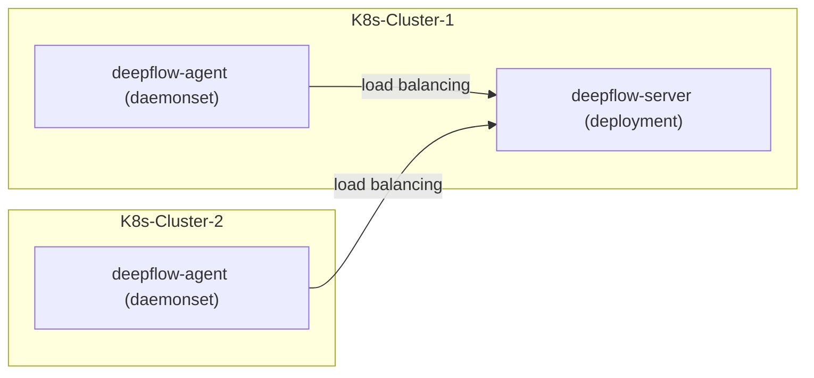

> This document was translated by GPT-4

# Introduction

DeepFlow Server can serve multiple DeepFlow Agents in various K8s clusters. Assuming that you have already deployed DeepFlow Server in a K8s cluster, this chapter introduces how to monitor other K8s clusters.

# Preparation

## Deployment Topology



## Ensure Different K8s Clusters Can Be Distinguished

DeepFlow uses the MD5 value of the K8s CA file to distinguish different clusters. Please check the `/run/secrets/kubernetes.io/serviceaccount/ca.crt` file in the Pods of different K8s clusters to ensure that the CA files of different clusters are unique.

If your different K8s clusters use the same CA file, before deploying deepflow-agent in multiple clusters, you need to obtain a `K8sClusterID` using `deepflow-ctl domain create`:

```bash
unset CLUSTER_NAME
CLUSTER_NAME="k8s-1"  # FIXME: K8s cluster name
cat << EOF | deepflow-ctl domain create -f -
name: $CLUSTER_NAME
type: kubernetes
EOF
deepflow-ctl domain list $CLUSTER_NAME  # Get K8sClusterID
```

# Deploy deepflow-agent

Use Helm to install deepflow-agent:

::: code-tabs#shell

@tab Use Github and DockerHub

```bash
cat << EOF > values-custom.yaml
deepflowServerNodeIPS:
- 10.1.2.3  # FIXME: K8s Node IPs
- 10.4.5.6  # FIXME: K8s Node IPs
clusterNAME: k8s-1  # FIXME: name of the cluster in deepflow
EOF

helm repo add deepflow https://deepflowio.github.io/deepflow
helm repo update deepflow # use `helm repo update` when helm < 3.7.0
helm install deepflow-agent -n deepflow deepflow/deepflow-agent --create-namespace \
    -f values-custom.yaml
```

@tab Use Aliyun

```bash
cat << EOF > values-custom.yaml
image:
  repository: registry.cn-beijing.aliyuncs.com/deepflow-ce/deepflow-agent
deepflowServerNodeIPS:
- 10.1.2.3  # FIXME: K8s Node IPs
- 10.4.5.6  # FIXME: K8s Node IPs
clusterNAME: k8s-1  # FIXME: name of the cluster in deepflow
EOF

helm repo add deepflow https://deepflow-ce.oss-cn-beijing.aliyuncs.com/chart/stable
helm repo update deepflow # use `helm repo update` when helm < 3.7.0
helm install deepflow-agent -n deepflow deepflow/deepflow-agent --create-namespace \
  -f values-custom.yaml
```

:::

We recommend configuring the `deepflowServerNodeIps` of deepflow-agent as one or more relatively fixed Node IPs in the K8s cluster during the deployment process above.

**Note**：

If the CA files of different K8s clusters are the same, you need to pass in the `kubernetesClusterId` obtained using `deepflow-ctl` during the deployment:

```bash
echo "deepflowK8sClusterID: "fffffff"  # FIXME: Generate by `deepflow-ctl  domain create`" >> values-custom.yaml
helm upgrade deepflow-agent -n deepflow deepflow/deepflow-agent  \
    -f values-custom.yaml
```

# Next Steps

- [Universal Service Map - Experience DeepFlow's AutoMetrics capabilities](../features/universal-map/auto-metrics/)
- [Distributed Tracing - Experience DeepFlow's AutoTracing ability](../features/distributed-tracing/auto-tracing/)
- [Eliminating Data Islands - Understanding DeepFlow's AutoTagging and SmartEncoding capabilities](../features/auto-tagging/eliminate-data-silos/)
- [Saying Goodbye to High-Base Troubles - Integrating Metrics data such as Promethes](../integration/input/metrics/metrics-auto-tagging/)
- [Full-Stack Distributed Tracing - Integration of tracing data such as OpenTelemetry](../integration/input/tracing/full-stack-distributed-tracing/)
