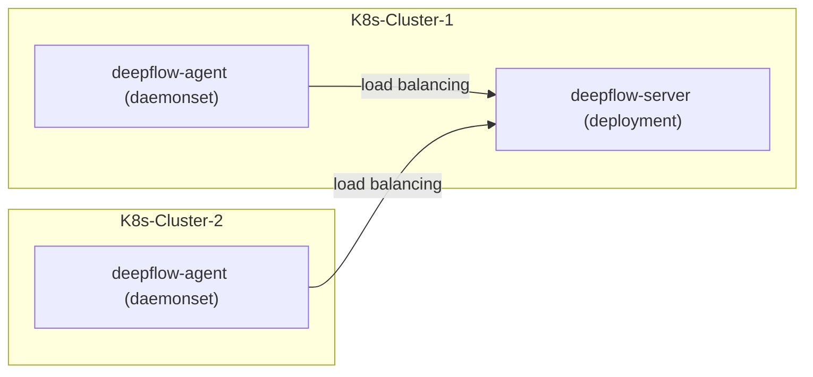

> This document was translated by ChatGPT

# Introduction

DeepFlow Server can serve DeepFlow Agents from multiple K8s clusters. Assuming you have already deployed DeepFlow Server in one K8s cluster, this chapter explains how to monitor other K8s clusters.

# Preparations

## Deployment Topology



## Ensure Different K8s Clusters Can Be Distinguished

DeepFlow uses the MD5 value of the K8s CA file to distinguish between different clusters. Please check the `/run/secrets/kubernetes.io/serviceaccount/ca.crt` file in the Pods of different K8s clusters to ensure that the CA files are different.

If your different K8s clusters use the same CA file, before deploying deepflow-agent in multiple clusters, you need to use `deepflow-ctl domain create` to create a `k8s domain` and obtain its `$CLUSTER_NAME` and `$CLUSTER_ID`:

Note: It is uncommon for multiple K8s clusters to have the same CA file. Nevertheless, we still recommend manually connecting the deepflow-agent of other K8s clusters to the deepflow-server cluster. The advantage of manual connection is that you can customize the K8s cluster name displayed in the Grafana Dashboard. You can create a custom K8s cluster domain via `deepflow-ctl domain create -f custom-domain.yaml`:

```bash
# Name (you can customize the cluster name, for example, beijing-prod-k8s)
name: $CLUSTER_NAME  # FIXME
# Type of cloud platform
type: kubernetes
config:
  ## Regional identifier (must use this default valued)
  #region_uuid: ffffffff-ffff-ffff-ffff-ffffffffffff
  ## Resource synchronization controller (it is recommended to use the default setting here)
  #controller_ip: 127.0.0.1
  ## Maximum mask for POD subnet IPv4 addresses
  #pod_net_ipv4_cidr_max_mask: 16
  ## Maximum mask for POD subnet IPv6 addresses
  #pod_net_ipv6_cidr_max_mask: 64
  ## Additional routing interface connection
  #node_port_name_regex: ^(cni|flannel|vxlan.calico|tunl|en[ospx])
  ## Synchronization interval, in seconds: minimum 1, maximum 86400, default 60
  #sync_timer: 60

## View the specific information of the domain created:
deepflow-ctl domain list $CLUSTER_NAME
```

# Deploy deepflow-agent

Use Helm to install deepflow-agent. If the service used by deepflow-server is the default NodePort type, fill in the deepflow-server Node IP directly under `deepflowServerNodeIPS`; if the [service used by deepflow-server is of LoadBalancer type](../best-practice/production-deployment/#优化-deepflow-agent-到-deepflow-server-的流量路径), then directly fill in the LoadBalancer VIP.

::: code-tabs#shell

@tab Use Github and DockerHub

```bash
cat << EOF > values-custom.yaml
deepflowServerNodeIPS:
- 10.1.2.3  # FIXME
- 10.4.5.6  # FIXME
clusterNAME: $CLUSTER_NAME  # FIXME: $CLUSTER_NAME
deepflowK8sClusterID:       # FIXME: $CLUSTER_NAME ID
EOF

helm repo add deepflow https://deepflowio.github.io/deepflow
helm repo update deepflow # use `helm repo update` when helm < 3.7.0
helm install deepflow-agent -n deepflow deepflow/deepflow-agent --version 6.6.018 --create-namespace -f values-custom.yaml
```

@tab Use Aliyun

```bash
cat << EOF > values-custom.yaml
image:
  repository: registry.cn-beijing.aliyuncs.com/deepflow-ce/deepflow-agent
deepflowServerNodeIPS:
- 10.1.2.3  # FIXME
- 10.4.5.6  # FIXME
clusterNAME: $CLUSTER_NAME  # FIXME: $CLUSTER_NAME
deepflowK8sClusterID:       # FIXME: $CLUSTER_NAME ID
EOF

helm repo add deepflow https://deepflow-ce.oss-cn-beijing.aliyuncs.com/chart/stable
helm repo update deepflow # use `helm repo update` when helm < 3.7.0
helm install deepflow-agent -n deepflow deepflow/deepflow-agent --version 6.6.018 --create-namespace -f values-custom.yaml
```

:::

We recommend configuring `deepflowServerNodeIPS` for deepflow-agent in the above deployment process to one or more relatively fixed Node IPs of the K8s cluster.

# Next Steps

- [Universal Service Map - Experience DeepFlow's AutoMetrics capability](../features/universal-map/auto-metrics/)
- [Distributed Tracing - Experience DeepFlow's AutoTracing capability](../features/distributed-tracing/auto-tracing/)
- [Eliminate Data Silos - Learn about DeepFlow's AutoTagging and SmartEncoding capabilities](../features/auto-tagging/eliminate-data-silos/)
- [Say Goodbye to High Cardinality Issues - Integrate Prometheus and other metrics data](../integration/input/metrics/metrics-auto-tagging/)
- [Full-Stack Distributed Tracing - Integrate OpenTelemetry and other tracing data](../integration/input/tracing/full-stack-distributed-tracing/)