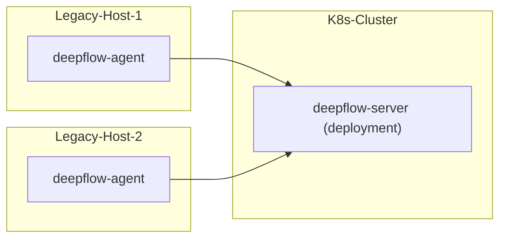

> This document was translated by GPT-4

# Introduction

DeepFlow supports monitoring of traditional servers. Please note that the DeepFlow Server must be run on K8s. If you do not have a K8s cluster, you can refer to the [All-in-One Quick Deployment](./all-in-one/) section to deploy DeepFlow Server first.

# Deployment Topology



# Configuring DeepFlow Server

## Update deepflow-server configuration

Check if all server sectors are in the following list of sectors

```yaml
local_ip_ranges:
  - 10.0.0.0/8
  - 172.16.0.0/12
  - 192.168.0.0/16
  - 169.254.0.0/15
  - 224.0.0.0-240.255.255.255
```

If not, you need to add the missing server sectors to the `local_ip_ranges` list in the custom configuration file below.

Modify the `values-custom.yaml` custom configuration file:

```yaml
# add
configmap:
  server.yaml:
    controller:
      genesis:
        local_ip_ranges:
          - 10.0.0.0/8
          - 172.16.0.0/12
          - 192.168.0.0/16
          - 169.254.0.0/15
          - 224.0.0.0-240.255.255.255
        # - 7.8.0.0/16  # FIXME: your host all network cidr
      trisolaris:
        trident-type-for-unkonw-vtap: 3 # required
```

Update deepflow

```bash
helm upgrade deepflow -n deepflow -f values-custom.yaml deepflow/deepflow
## Restart deepflow-server
kubectl delete pods -n deepflow -l app=deepflow -l component=deepflow-server
```

## Create Host Domain

```bash
unset DOMAIN_NAME
DOMAIN_NAME="legacy-host"  # FIXME: domain name

cat << EOF | deepflow-ctl domain create -f -
name: $DOMAIN_NAME
type: agent_sync
EOF
```

## Create Collector Group

Create a collector group:

```bash
unset AGENT_GROUP
AGENT_GROUP="legacy-host"  # FIXME: domain name

deepflow-ctl agent-group create $AGENT_GROUP
deepflow-ctl agent-group list $AGENT_GROUP # Get agent-group ID
```

Create collector group configuration file `agent-group-config.yaml`:

```yaml
vtap_group_id: g-ffffff # FIXME: agent-group ID
platform_enabled: 1
```

Create collector group configuration:

```bash
deepflow-ctl agent-group-config create -f agent-group-config.yaml
```

# Deploy DeepFlow Agent

Download deepflow-agent

::: code-tabs#shell

@tab rpm

```bash
curl -O https://deepflow-ce.oss-cn-beijing.aliyuncs.com/rpm/agent/stable/linux/$(arch | sed 's|x86_64|amd64|' | sed 's|aarch64|arm64|')/deepflow-agent-rpm.zip
unzip deepflow-agent-rpm.zip
yum -y localinstall x86_64/deepflow-agent-1.0*.rpm
```

@tab deb

```bash
curl -O https://deepflow-ce.oss-cn-beijing.aliyuncs.com/deb/agent/stable/linux/$(arch | sed 's|x86_64|amd64|' | sed 's|aarch64|arm64|')/deepflow-agent-deb.zip
unzip deepflow-agent-deb.zip
dpkg -i x86_64/deepflow-agent-1.0*.systemd.deb
```

@tab binary file

```bash
curl -O https://deepflow-ce.oss-cn-beijing.aliyuncs.com/bin/agent/stable/linux/$(arch | sed 's|x86_64|amd64|' | sed 's|aarch64|arm64|')/deepflow-agent.tar.gz
tar -zxvf deepflow-agent.tar.gz -C /usr/sbin/

cat << EOF > /etc/systemd/system/deepflow-agent.service
[Unit]
Description=deepflow-agent.service
After=syslog.target network-online.target

[Service]
Environment=GOTRACEBACK=single
LimitCORE=1G
ExecStart=/usr/sbin/deepflow-agent
Restart=always
RestartSec=10
LimitNOFILE=1024:4096

[Install]
WantedBy=multi-user.target
EOF

systemctl daemon-reload
```

:::

Modify the deepflow-agent's configuration file `/etc/deepflow-agent.yaml` :

```yaml
controller-ips:
  - 10.1.2.3 # FIXME: K8s Node IPs
vtap-group-id-request: 'g-fffffff' # FIXME: agent-group ID
```

Start deepflow-agent:

```bash
systemctl enable deepflow-agent
systemctl restart deepflow-agent
```

**Note**:

If deepflow-agent cannot start normally due to missing dependency libraries, you can download a statically linked compiled deepflow-agent. Please note that statically linked compiled deepflow-agent has serious performance problems in multi-threading:
::: code-tabs#shell

@tab rpm

```bash
curl -O https://deepflow-ce.oss-cn-beijing.aliyuncs.com/rpm/agent/stable/linux/static-link/$(arch | sed 's|x86_64|amd64|' | sed 's|aarch64|arm64|')/deepflow-agent-rpm.zip
unzip deepflow-agent-rpm.zip
yum -y localinstall x86_64/deepflow-agent-1.0*.rpm
```

@tab deb

```bash
curl -O https://deepflow-ce.oss-cn-beijing.aliyuncs.com/deb/agent/stable/linux/static-link/$(arch | sed 's|x86_64|amd64|' | sed 's|aarch64|arm64|')/deepflow-agent-deb.zip
unzip deepflow-agent-deb.zip
dpkg -i x86_64/deepflow-agent-1.0*.systemd.deb
```

@tab binary file

```bash
curl -O https://deepflow-ce.oss-cn-beijing.aliyuncs.com/bin/agent/stable/linux/static-link/$(arch | sed 's|x86_64|amd64|' | sed 's|aarch64|arm64|')/deepflow-agent.tar.gz
tar -zxvf deepflow-agent.tar.gz -C /usr/sbin/

cat << EOF > /etc/systemd/system/deepflow-agent.service
[Unit]
Description=deepflow-agent.service
After=syslog.target network-online.target

[Service]
Environment=GOTRACEBACK=single
LimitCORE=1G
ExecStart=/usr/sbin/deepflow-agent
Restart=always
RestartSec=10
LimitNOFILE=1024:4096

[Install]
WantedBy=multi-user.target
EOF

systemctl daemon-reload
```

:::

# Next Steps

- [Universal Service Map - Experience DeepFlow's AutoMetrics Capabilities](../features/universal-map/auto-metrics/)
- [Distributed Tracing - Experience DeepFlow's AutoTracing Capabilities](../features/distributed-tracing/auto-tracing/)
- [Eliminate Data Silos - Understand DeepFlow's AutoTagging and SmartEncoding Capabilities](../features/auto-tagging/eliminate-data-silos/)
- [Say Goodbye to High-Base Troubles - Integrate Metrics Data such as Promethes](../integration/input/metrics/metrics-auto-tagging/)
- [Full Stack Distributed Tracing - Integrate Tracing Data such as OpenTelemetry](../integration/input/tracing/full-stack-distributed-tracing/)
