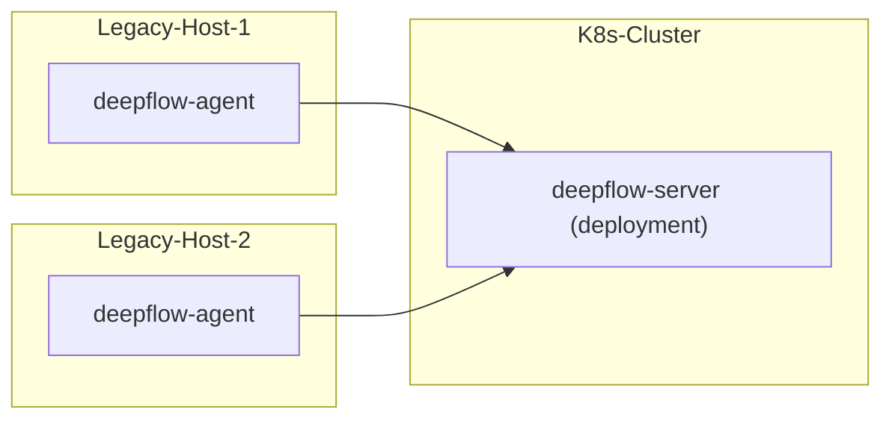

> This document was translated by ChatGPT

# Introduction

DeepFlow supports monitoring legacy servers. Note that the DeepFlow Server must run on top of K8s. If you do not have a K8s cluster, you can refer to the [All-in-One Quick Deployment](./all-in-one/) section to deploy the DeepFlow Server first.

# Deployment Topology



# Configure DeepFlow Server

## Update deepflow-server configuration

Check whether all network segments of the server are included in the following list:

```yaml
local_ip_ranges:
  - 10.0.0.0/8
  - 172.16.0.0/12
  - 192.168.0.0/16
  - 169.254.0.0/15
  - 224.0.0.0-240.255.255.255
```

If not, you need to add the missing server network segments to the `local_ip_ranges` list in the custom configuration file below.  
For example: if the host IP is 100.42.32.213, you need to add the corresponding 100.42.32.0/24 segment to the configuration.

Edit the `values-custom.yaml` custom configuration file:

```yaml
configmap:
  server.yaml:
    controller:
      genesis:
        local_ip_ranges:
          - 10.0.0.0/8
          - 172.16.0.0/12
          - 192.168.0.0/16
          - 169.254.0.0/15
          - 224.0.0.0-240.255.255.255
          - 100.42.32.0/24 # FIXME
      trisolaris:
        trident-type-for-unkonw-vtap: 3 # required
```

Update deepflow:

```bash
helm upgrade deepflow -n deepflow -f values-custom.yaml deepflow/deepflow
## Restart deepflow-server
kubectl delete pods -n deepflow -l app=deepflow -l component=deepflow-server
```

## Create Host Domain

Just like when monitoring multiple K8s clusters you need to create a K8s domain, here you also need to create a domain specifically for synchronizing servers.

```bash
unset DOMAIN_NAME
DOMAIN_NAME="legacy-host"  # FIXME: domain name

cat << EOF | deepflow-ctl domain create -f -
name: $DOMAIN_NAME
type: agent_sync
EOF
```

## Create Agent Group

Create an agent group:

```bash
unset AGENT_GROUP
AGENT_GROUP="legacy-host"  # FIXME: domain name

deepflow-ctl agent-group create $AGENT_GROUP
deepflow-ctl agent-group list $AGENT_GROUP # get agent-group-id
```

Use [deepflow-ctl](../best-practice/agent-advanced-config) to create an agent group configuration, so that deepflow-agent can send server network information to deepflow-server in self-synchronization mode.

```yaml
inputs:
  resources:
    workload_resource_sync_enabled: true
```

Create the agent group configuration:

```bash
deepflow-ctl agent-group-config create -f agent-group-config.yaml
```

# Deploy DeepFlow Agent

Note: The deepflow-agent version must be ≤ the deepflow-server version, otherwise registration and data reporting issues may occur.

::: code-tabs#shell

@tab rpm

```bash
AGENT_VERSION=v6.6 FIXME: Keep this in sync with the server version
curl -O https://deepflow-ce.oss-cn-beijing.aliyuncs.com/rpm/agent/$AGENT_VERSION/linux/$(arch | sed 's|x86_64|amd64|' | sed 's|aarch64|arm64|')/deepflow-agent-rpm.zip
unzip deepflow-agent-rpm.zip
yum -y localinstall x86_64/deepflow-agent-1.0*.rpm
```

@tab deb

```bash
AGENT_VERSION=v6.6 FIXME: Keep this in sync with the server version
curl -O https://deepflow-ce.oss-cn-beijing.aliyuncs.com/deb/agent/$AGENT_VERSION/linux/$(arch | sed 's|x86_64|amd64|' | sed 's|aarch64|arm64|')/deepflow-agent-deb.zip
unzip deepflow-agent-deb.zip
dpkg -i x86_64/deepflow-agent-1.0*.systemd.deb
```

@tab binary file

```bash
AGENT_VERSION=v6.6 FIXME: Keep this in sync with the server version
curl -O https://deepflow-ce.oss-cn-beijing.aliyuncs.com/bin/agent/$AGENT_VERSION/linux/$(arch | sed 's|x86_64|amd64|' | sed 's|aarch64|arm64|')/deepflow-agent.tar.gz
tar -zxvf deepflow-agent.tar.gz -C /usr/sbin/

cat << EOF > /etc/systemd/system/deepflow-agent.service
[Unit]
Description=deepflow-agent.service
After=syslog.target network-online.target

[Service]
Environment=GOTRACEBACK=single
LimitCORE=1G
ExecStart=/usr/sbin/deepflow-agent
Restart=always
RestartSec=10
LimitNOFILE=1024:4096

[Install]
WantedBy=multi-user.target
EOF

systemctl daemon-reload
```

@tab docker compose

```bash
touch /etc/deepflow-agent.yaml

cat << EOF > deepflow-agent-docker-compose.yaml
version: '3.2'
services:
  deepflow-agent:
    image: registry.cn-hongkong.aliyuncs.com/deepflow-ce/deepflow-agent:v6.5
    container_name: deepflow-agent
    restart: always
    #privileged: true  ## Docker version below 20.10.10 requires enabling privileged mode, See https://github.com/moby/moby/pull/42836
    cap_add:
      - SYS_ADMIN
      - SYS_RESOURCE
      - SYS_PTRACE
      - NET_ADMIN
      - NET_RAW
      - IPC_LOCK
      - SYSLOG
    volumes:
      - /etc/deepflow-agent.yaml:/etc/deepflow-agent/deepflow-agent.yaml:ro
      - /sys/kernel/debug:/sys/kernel/debug:ro
      - /var/run/docker.sock:/var/run/docker.sock
    network_mode: "host"
    pid: "host"
EOF

docker compose -f deepflow-agent-docker-compose.yaml up -d
```

:::

Edit the deepflow-agent configuration file `/etc/deepflow-agent.yaml`:

```yaml
controller-ips:
  - 10.1.2.3 # FIXME: K8s Node IPs
vtap-group-id-request: 'g-fffffff' # FIXME: <AGENT_GROUP_ID>
```

Start deepflow-agent:

```bash
systemctl enable deepflow-agent
systemctl restart deepflow-agent
```

**Note**:

If deepflow-agent fails to start due to missing dependency libraries, you can download the statically linked compiled deepflow-agent.  
Be aware that the statically linked compiled deepflow-agent has serious performance issues under multithreading:

::: code-tabs#shell

@tab rpm

```bash
AGENT_VERSION=v6.6 FIXME: Keep this in sync with the server version
curl -O https://deepflow-ce.oss-cn-beijing.aliyuncs.com/rpm/agent/$AGENT_VERSION/linux/static-link/$(arch | sed 's|x86_64|amd64|' | sed 's|aarch64|arm64|')/deepflow-agent-rpm.zip
unzip deepflow-agent-rpm.zip
yum -y localinstall x86_64/deepflow-agent-1.0*.rpm
```

@tab deb

```bash
AGENT_VERSION=v6.6 FIXME: Keep this in sync with the server version
curl -O https://deepflow-ce.oss-cn-beijing.aliyuncs.com/deb/agent/$AGENT_VERSION/linux/static-link/$(arch | sed 's|x86_64|amd64|' | sed 's|aarch64|arm64|')/deepflow-agent-deb.zip
unzip deepflow-agent-deb.zip
dpkg -i x86_64/deepflow-agent-1.0*.systemd.deb
```

@tab binary file

```bash
AGENT_VERSION=v6.6 FIXME: Keep this in sync with the server version
curl -O https://deepflow-ce.oss-cn-beijing.aliyuncs.com/bin/agent/$AGENT_VERSION/linux/static-link/$(arch | sed 's|x86_64|amd64|' | sed 's|aarch64|arm64|')/deepflow-agent.tar.gz
tar -zxvf deepflow-agent.tar.gz -C /usr/sbin/

cat << EOF > /etc/systemd/system/deepflow-agent.service
[Unit]
Description=deepflow-agent.service
After=syslog.target network-online.target

[Service]
Environment=GOTRACEBACK=single
LimitCORE=1G
ExecStart=/usr/sbin/deepflow-agent
Restart=always
RestartSec=10
LimitNOFILE=1024:4096

[Install]
WantedBy=multi-user.target
EOF

systemctl daemon-reload
```

:::

# Next Steps

- [Universal Service Map - Experience DeepFlow's AutoMetrics capability](../features/universal-map/auto-metrics/)
- [Distributed Tracing - Experience DeepFlow's AutoTracing capability](../features/distributed-tracing/auto-tracing/)
- [Eliminate Data Silos - Learn about DeepFlow's AutoTagging and SmartEncoding capabilities](../features/auto-tagging/eliminate-data-silos/)
- [Say Goodbye to High Cardinality Issues - Integrate Prometheus and other metrics data](../integration/input/metrics/metrics-auto-tagging/)
- [Full-Stack Distributed Tracing - Integrate OpenTelemetry and other tracing data](../integration/input/tracing/full-stack-distributed-tracing/)