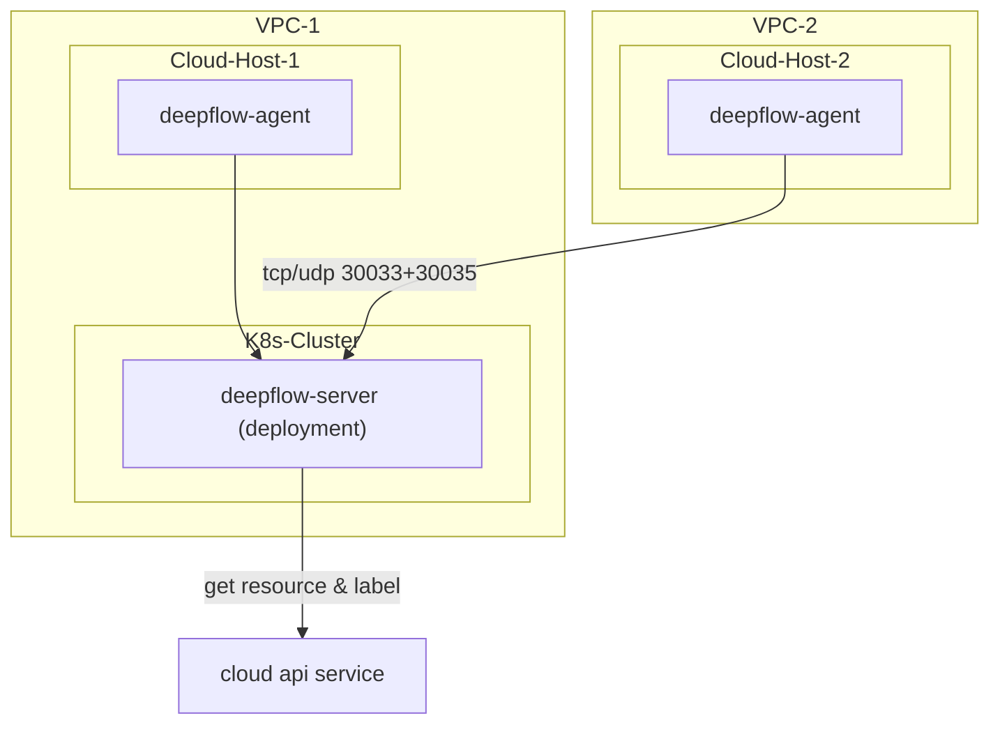

> This document was translated by ChatGPT

# Introduction

DeepFlow supports monitoring cloud servers and automatically injects cloud resource information into all observability data (AutoTagging) by calling cloud vendor APIs. Note that DeepFlow Server must run on K8s. If you do not have a K8s cluster, you can refer to the [All-in-One Quick Deployment](./all-in-one/) section to deploy DeepFlow Server first.

# Deployment Topology



# Create Public Cloud Domain

DeepFlow currently supports resource information synchronization for the following public clouds (marked as `TBD` are in the process of code organization):
| Cloud Provider (English) | Cloud Provider (Chinese) | Type Identifier Used in DeepFlow |
| ------------------------ | ------------------------ | ------------------------------- |
| AWS                      | AWS                      | aws                             |
| Aliyun                   | 阿里云                   | aliyun                          |
| Baidu Cloud              | 百度云                   | baidu_bce                       |
| Huawei Cloud             | 华为云                   | huawei                          |
| Microsoft Azure          | 微软云                   | `TBD`                           |
| QingCloud                | 青云                     | qingcloud                       |
| Tencent Cloud            | 腾讯云                   | tencent                         |

You can get the configuration file template for creating a public cloud Domain using the `deepflow-ctl domain example <domain_type>` command.
For example, for Aliyun:

```bash
deepflow-ctl domain example aliyun > aliyun.yaml
```

Edit the configuration file `aliyun.yaml`, filling in the AK/SK (requires read-only permissions for cloud resources) and the Region information where the resources are located:

```yaml
name: aliyun
type: aliyun
config:
  # AccessKey Id
  secret_id: xxxxxxxx ## FIXME: your secret_id
  # AccessKey Secret
  secret_key: xxxxxxx ## FIXME: your secret_key
  include_regions: 华北2（北京） ## The region where deepflow is docked, if it is empty, it means all regions, and the regions are separated by commas
```

Create the public cloud Domain using the modified configuration file:

```bash
deepflow-ctl domain create -f aliyun.yaml
```

# Deploy DeepFlow Agent

Download deepflow-agent

::: code-tabs#shell

@tab rpm

```bash
curl -O https://deepflow-ce.oss-cn-beijing.aliyuncs.com/rpm/agent/stable/linux/$(arch | sed 's|x86_64|amd64|' | sed 's|aarch64|arm64|')/deepflow-agent-rpm.zip
unzip deepflow-agent-rpm.zip
yum -y localinstall x86_64/deepflow-agent-1.0*.rpm
```

@tab deb

```bash
curl -O https://deepflow-ce.oss-cn-beijing.aliyuncs.com/deb/agent/stable/linux/$(arch | sed 's|x86_64|amd64|' | sed 's|aarch64|arm64|')/deepflow-agent-deb.zip
unzip deepflow-agent-deb.zip
dpkg -i x86_64/deepflow-agent-1.0*.systemd.deb
```

@tab binary file

```bash
curl -O https://deepflow-ce.oss-cn-beijing.aliyuncs.com/bin/agent/stable/linux/$(arch | sed 's|x86_64|amd64|' | sed 's|aarch64|arm64|')/deepflow-agent.tar.gz
tar -zxvf deepflow-agent.tar.gz -C /usr/sbin/

cat << EOF > /etc/systemd/system/deepflow-agent.service
[Unit]
Description=deepflow-agent.service
After=syslog.target network-online.target

[Service]
Environment=GOTRACEBACK=single
LimitCORE=1G
ExecStart=/usr/sbin/deepflow-agent
Restart=always
RestartSec=10
LimitNOFILE=1024:4096

[Install]
WantedBy=multi-user.target
EOF

systemctl daemon-reload
```

@tab docker compose

```bash
touch /etc/deepflow-agent.yaml

cat << EOF > deepflow-agent-docker-compose.yaml
version: '3.2'
services:
  deepflow-agent:
    image: registry.cn-hongkong.aliyuncs.com/deepflow-ce/deepflow-agent:stable
    container_name: deepflow-agent
    restart: always
    cap_add:
      - SYS_ADMIN
      - SYS_RESOURCE
      - SYS_PTRACE
      - NET_ADMIN
      - NET_RAW
      - IPC_LOCK
      - SYSLOG
    volumes:
      - /etc/deepflow-agent.yaml:/etc/deepflow-agent/deepflow-agent.yaml:ro
      - /sys/kernel/debug:/sys/kernel/debug:ro
      - /var/run/docker.sock:/var/run/docker.sock
    network_mode: "host"
    pid: "host"
EOF

docker compose -f deepflow-agent-docker-compose.yaml up -d
```

:::

Edit the configuration file of deepflow-agent `/etc/deepflow-agent.yaml`:

```yaml
controller-ips:
  - 10.1.2.3 # FIXME: K8s Node IPs
```

Start deepflow-agent:

```bash
systemctl enable deepflow-agent
systemctl restart deepflow-agent
```

**Note**:

If deepflow-agent fails to start due to missing dependencies, you can download the statically linked compiled deepflow-agent. Note that the statically linked compiled deepflow-agent has severe performance issues under multithreading:
::: code-tabs#shell

@tab rpm

```bash
curl -O https://deepflow-ce.oss-cn-beijing.aliyuncs.com/rpm/agent/stable/linux/static-link/$(arch | sed 's|x86_64|amd64|' | sed 's|aarch64|arm64|')/deepflow-agent-rpm.zip
unzip deepflow-agent-rpm.zip
yum -y localinstall x86_64/deepflow-agent-1.0*.rpm
```

@tab deb

```bash
curl -O https://deepflow-ce.oss-cn-beijing.aliyuncs.com/deb/agent/stable/linux/static-link/$(arch | sed 's|x86_64|amd64|' | sed 's|aarch64|arm64|')/deepflow-agent-deb.zip
unzip deepflow-agent-deb.zip
dpkg -i x86_64/deepflow-agent-1.0*.systemd.deb
```

@tab binary file

```bash
curl -O https://deepflow-ce.oss-cn-beijing.aliyuncs.com/bin/agent/stable/linux/static-link/$(arch | sed 's|x86_64|amd64|' | sed 's|aarch64|arm64|')/deepflow-agent.tar.gz
tar -zxvf deepflow-agent.tar.gz -C /usr/sbin/

cat << EOF > /etc/systemd/system/deepflow-agent.service
[Unit]
Description=deepflow-agent.service
After=syslog.target network-online.target

[Service]
Environment=GOTRACEBACK=single
LimitCORE=1G
ExecStart=/usr/sbin/deepflow-agent
Restart=always
RestartSec=10
LimitNOFILE=1024:4096

[Install]
WantedBy=multi-user.target
EOF

systemctl daemon-reload
```

:::

# Next Steps

- [Universal Service Map - Experience DeepFlow's AutoMetrics Capability](../features/universal-map/auto-metrics/)
- [Distributed Tracing - Experience DeepFlow's AutoTracing Capability](../features/distributed-tracing/auto-tracing/)
- [Eliminate Data Silos - Learn About DeepFlow's AutoTagging and SmartEncoding Capabilities](../features/auto-tagging/eliminate-data-silos/)
- [Say Goodbye to High Baseline Troubles - Integrate Metrics Data from Prometheus, etc.](../integration/input/metrics/metrics-auto-tagging/)
- [Full-Stack Distributed Tracing - Integrate Tracing Data from OpenTelemetry, etc.](../integration/input/tracing/full-stack-distributed-tracing/)
