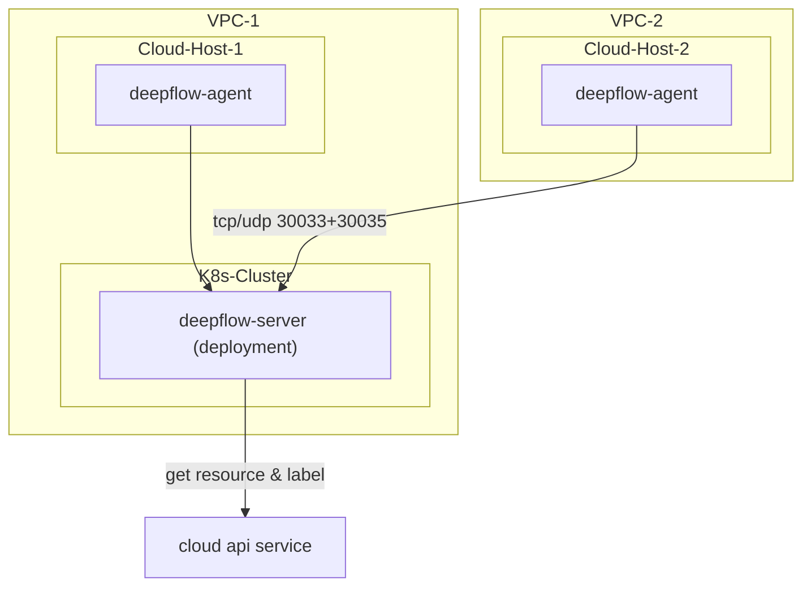

> This document was translated by GPT-4

# Introduction

DeepFlow supports monitoring cloud servers, retrieving cloud resource data via the cloud vendor's API, and injecting this data automatically into all observable data sets (AutoTagging). Note that DeepFlow Server must run on K8s. If you do not have a Kubernates cluster, you can first deploy DeepFlow Server according to the [All-in-One Quick Deployment](./all-in-one/) section.

# Deployment Topology



# Create Public Cloud Domain

Currently, DeepFlow supports synchronizing resource information from the following public clouds (those labeled as 'TBD' are being coded):

| Cloud Service Provider (English) | Cloud Service Provider (Chinese) | Type Identifier Used in DeepFlow |
| -------------------------------- | -------------------------------- | -------------------------------- |
| AWS                              | AWS                              | aws                              |
| Aliyun                           | Aliyun                           | aliyun                           |
| Baidu Cloud                      | Baidu Cloud                      | baidu_bce                        |
| Huawei Cloud                     | Huawei Cloud                     | huawei                           |
| Microsoft Azure                  | Microsoft Azure                  | `TBD`                            |
| QingCloud                        | QingCloud                        | qingcloud                        |
| Tencent Cloud                    | Tencent Cloud                    | tencent                          |

You can use the `deepflow-ctl domain example <domain_type>` command to access the configuration file template to create a public cloud Domain.
Taking Aliyun as an example:

```bash
deepflow-ctl domain example aliyun > aliyun.yaml
```

Modify the `aliyun.yaml` configuration file, filling in AK/SK (requires read-only permissions for cloud resources) and Region information:

```yaml
name: aliyun
type: aliyun
config:
  # AccessKey Id
  secret_id: xxxxxxxx ## FIXME: your secret_id
  # AccessKey Secret
  secret_key: xxxxxxx ## FIXME: your secret_key
  include_regions: 北京华北2 ## The region where deepflow is hosted, if left blank it indicates all regions, and the regions are separated by commas
```

Use the modified configuration file to create a public cloud Domain:

```bash
deepflow-ctl domain create -f aliyun.yaml
```

# Deploy DeepFlow Agent

Download deepflow-agent:

::: code-tabs#shell

@tab rpm

```bash
curl -O https://deepflow-ce.oss-cn-beijing.aliyuncs.com/rpm/agent/stable/linux/$(arch | sed 's|x86_64|amd64|' | sed 's|aarch64|arm64|')/deepflow-agent-rpm.zip
unzip deepflow-agent-rpm.zip
yum -y localinstall x86_64/deepflow-agent-1.0*.rpm
```

@tab deb

```bash
curl -O https://deepflow-ce.oss-cn-beijing.aliyuncs.com/deb/agent/stable/linux/$(arch | sed 's|x86_64|amd64|' | sed 's|aarch64|arm64|')/deepflow-agent-deb.zip
unzip deepflow-agent-deb.zip
dpkg -i x86_64/deepflow-agent-1.0*.systemd.deb
```

@tab binary file

```bash
curl -O https://deepflow-ce.oss-cn-beijing.aliyuncs.com/bin/agent/stable/linux/$(arch | sed 's|x86_64|amd64|' | sed 's|aarch64|arm64|')/deepflow-agent.tar.gz
tar -zxvf deepflow-agent.tar.gz -C /usr/sbin/

cat << EOF > /etc/systemd/system/deepflow-agent.service
[Unit]
Description=deepflow-agent.service
After=syslog.target network-online.target

[Service]
Environment=GOTRACEBACK=single
LimitCORE=1G
ExecStart=/usr/sbin/deepflow-agent
Restart=always
RestartSec=10
LimitNOFILE=1024:4096

[Install]
WantedBy=multi-user.target
EOF

systemctl daemon-reload
```

:::

Modify the `deepflow-agent` configuration file `/etc/deepflow-agent.yaml`:

```yaml
controller-ips:
  - 10.1.2.3 # FIXME: K8s Node IPs
```

Start `deepflow-agent`:

```bash
systemctl enable deepflow-agent
systemctl restart deepflow-agent
```

**Note**:

If `deepflow-agent` cannot start normally due to lack of dependency libraries, you can download `deepflow-agent` compiled with static link. Please note that `deepflow-agent` compiled with static link has serious performance issues under multi-threading:

::: code-tabs#shell

@tab rpm

```bash
curl -O https://deepflow-ce.oss-cn-beijing.aliyuncs.com/rpm/agent/stable/linux/static-link/$(arch | sed 's|x86_64|amd64|' | sed 's|aarch64|arm64|')/deepflow-agent-rpm.zip
unzip deepflow-agent-rpm.zip
yum -y localinstall x86_64/deepflow-agent-1.0*.rpm
```

@tab deb

```bash
curl -O https://deepflow-ce.oss-cn-beijing.aliyuncs.com/deb/agent/stable/linux/static-link/$(arch | sed 's|x86_64|amd64|' | sed 's|aarch64|arm64|')/deepflow-agent-deb.zip
unzip deepflow-agent-deb.zip
dpkg -i x86_64/deepflow-agent-1.0*.systemd.deb
```

@tab binary file

```bash
curl -O https://deepflow-ce.oss-cn-beijing.aliyuncs.com/bin/agent/stable/linux/static-link/$(arch | sed 's|x86_64|amd64|' | sed 's|aarch64|arm64|')/deepflow-agent.tar.gz
tar -zxvf deepflow-agent.tar.gz -C /usr/sbin/

cat << EOF > /etc/systemd/system/deepflow-agent.service
[Unit]
Description=deepflow-agent.service
After=syslog.target network-online.target

[Service]
Environment=GOTRACEBACK=single
LimitCORE=1G
ExecStart=/usr/sbin/deepflow-agent
Restart=always
RestartSec=10
LimitNOFILE=1024:4096

[Install]
WantedBy=multi-user.target
EOF

systemctl daemon-reload
```

:::

# Next Steps

- [Universal Service Map - Experience DeepFlow's AutoMetrics capabilities](../features/universal-map/auto-metrics/)
- [Distributed Tracing - Experience DeepFlow's AutoTracing capabilities](../features/distributed-tracing/auto-tracing/)
- [Eliminate Data Islands - Understand DeepFlow's AutoTagging and SmartEncoding capabilities](../features/auto-tagging/eliminate-data-silos/)
- [Say Goodbye to High Cardinality Woes - Integrate Prometheus and other metrics data](../integration/input/metrics/metrics-auto-tagging/)
- [Full Stack Distributed Tracing - Integrate OpenTelemetry and other tracing data](../integration/input/tracing/full-stack-distributed-tracing/)
